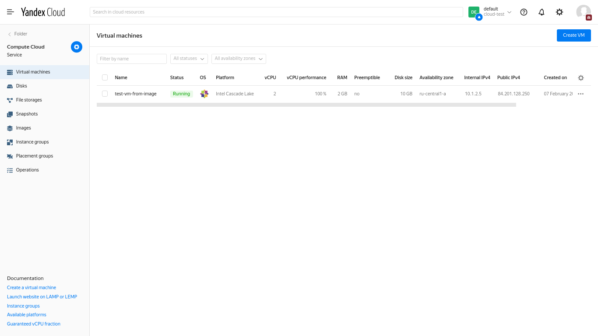
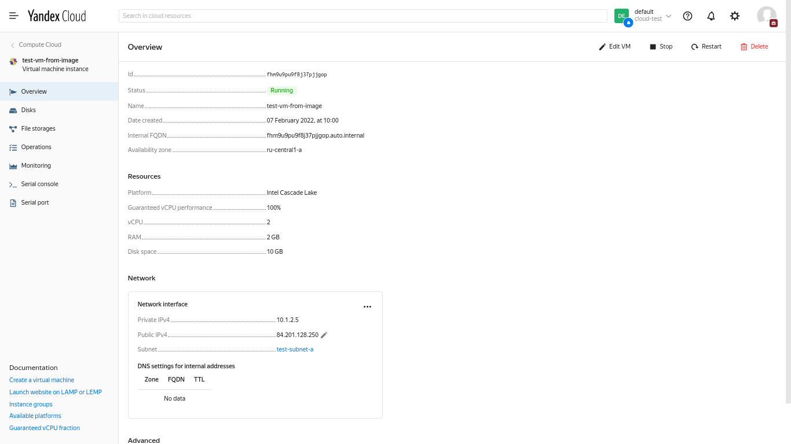
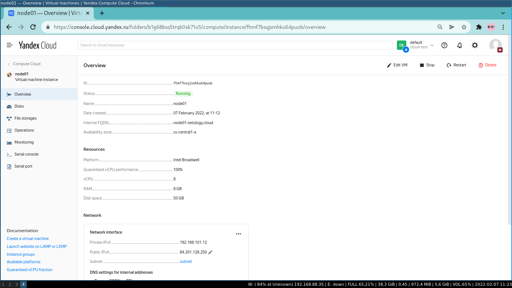
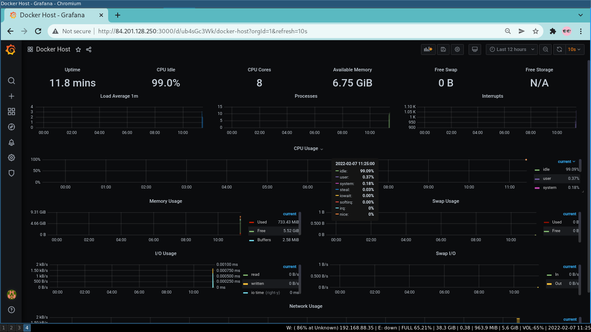

*** Edit homework 5.4

# Task 2

Создам виртуальную облачную сеть:
```
[alexvk@archbox ~]$ yc vpc network create --name testnet --labels my-label=netology \
  --description "my first test network"
id: enpifbjm20jcmbdc4062
folder_id: b1g68bss5trqk0sk71o5
created_at: "2022-02-07T06:12:45Z"
name: testnet
description: my first test network
labels:
  my-label: netology

[alexvk@archbox ~]$ yc vpc network list
+----------------------+---------+
|          ID          |  NAME   |
+----------------------+---------+
| enpifbjm20jcmbdc4062 | testnet |
+----------------------+---------+
```

Резервирую статический ip-адрес для виртуальной машины:
```
[alexvk@archbox ~]$ yc vpc address create --external-ipv4 zone=ru-central1-a
id: e9b2kr6uhlqkqskg0nsg
folder_id: b1g68bss5trqk0sk71o5
created_at: "2022-02-07T06:25:53Z"
external_ipv4_address:
  address: 84.201.128.250
  zone_id: ru-central1-a
  requirements: {}
reserved: true
type: EXTERNAL
ip_version: IPV4

[alexvk@archbox ~]$ yc vpc address list
+----------------------+------+----------------+----------+-------+
|          ID          | NAME |    ADDRESS     | RESERVED | USED  |
+----------------------+------+----------------+----------+-------+
| e9b2kr6uhlqkqskg0nsg |      | 84.201.128.250 | true     | false |
+----------------------+------+----------------+----------+-------+

```

Создаю подсеть в сети testnet:
```
[alexvk@archbox ~]$ yc vpc subnet create --name test-subnet-a --zone ru-central1-a \
  --range 10.1.2.0/24 --network-name testnet --description "first test subnet" 
id: e9bafhsv1s66nqlafhm0
folder_id: b1g68bss5trqk0sk71o5
created_at: "2022-02-07T06:31:36Z"
name: test-subnet-a
description: first test subnet
network_id: enpifbjm20jcmbdc4062
zone_id: ru-central1-a
v4_cidr_blocks:
- 10.1.2.0/24
```


Создаю ВМ без публичного ip-адреса из собранного ранее образа centos:
```
[alexvk@archbox ~]$ yc compute instance create --name test-vm-from-image --zone ru-central1-a \
  --create-boot-disk name=disk1,size=10,image-id=fd8jt4i54r12uvrsheh1 --ssh-key ~/.ssh/id_rsa.pub

done (45s)
id: fhm9u9pu9f8j37pjjgop
folder_id: b1g68bss5trqk0sk71o5
created_at: "2022-02-07T07:00:38Z"
name: test-vm-from-image
zone_id: ru-central1-a
platform_id: standard-v2
resources:
  memory: "2147483648"
  cores: "2"
  core_fraction: "100"
status: RUNNING
boot_disk:
  mode: READ_WRITE
  device_name: fhma2vmr2ddsrf8d9oj4
  auto_delete: true
  disk_id: fhma2vmr2ddsrf8d9oj4
network_interfaces:
- index: "0"
  mac_address: d0:0d:9f:27:3e:4b
  subnet_id: e9bafhsv1s66nqlafhm0
  primary_v4_address:
    address: 10.1.2.5
fqdn: fhm9u9pu9f8j37pjjgop.auto.internal
scheduling_policy: {}
network_settings:
  type: STANDARD
placement_policy: {}

```
Привязываю зарезервированный ранее статический ip-адрес к интерфейсу созданной ВМ согласно документации
по ссылке https://cloud.yandex.ru/docs/compute/operations/vm-control/vm-attach-public-ip и делаю
попытку логина. К сожалению, не нашел в документации, как привязать статику  с помощью утилиты **yc**.
```
[alexvk@archbox ~]$ yc compute instance list
+----------------------+--------------------+---------------+---------+----------------+-------------+
|          ID          |        NAME        |    ZONE ID    | STATUS  |  EXTERNAL IP   | INTERNAL IP |
+----------------------+--------------------+---------------+---------+----------------+-------------+
| fhm9u9pu9f8j37pjjgop | test-vm-from-image | ru-central1-a | RUNNING | 84.201.128.250 | 10.1.2.5    |
+----------------------+--------------------+---------------+---------+----------------+-------------+
```

Собственно логин:
```
[alexvk@archbox ~]$ ssh yc-user@84.201.128.250
The authenticity of host '84.201.128.250 (84.201.128.250)' can't be established.
ED25519 key fingerprint is SHA256:x32vaV43QcKKMZw38Ljm7ku8ANPk3+T3O07HEEFeBiM.
This key is not known by any other names
Are you sure you want to continue connecting (yes/no/[fingerprint])? yes
Warning: Permanently added '84.201.128.250' (ED25519) to the list of known hosts.
Enter passphrase for key '/home/alexvk/.ssh/id_rsa': 
[yc-user@fhm9u9pu9f8j37pjjgop ~]$ uname -a
Linux fhm9u9pu9f8j37pjjgop.auto.internal 3.10.0-1160.53.1.el7.x86_64 #1 SMP Fri Jan 14 13:59:45 UTC 2022 x86_64 x86_64 x86_64 GNU/Linux
```
Листинг ВМ:

И свойства выбранной ВМ:


# Task 3

Выполняю terraform init, terraform plan, terraform apply -auto-approve.  
Со внешним ip-адресом для созданной ВМ поступаю аналогично заданию 2.
```
[alexvk@archbox ansible]$ ansible-playbook provision.yml 

PLAY [nodes] ****************************************************************************************************************************************

TASK [Gathering Facts] ******************************************************************************************************************************
The authenticity of host '84.201.128.250 (84.201.128.250)' can't be established.
ED25519 key fingerprint is SHA256:sZzMm6JYlAdkIaVlSyDCnW+2Hiaz9qUyefKF9Rr4m0E.
This key is not known by any other names
Are you sure you want to continue connecting (yes/no/[fingerprint])? yes
Enter passphrase for key '/home/alexvk/.ssh/id_rsa': 
ok: [node01.netology.cloud]

TASK [Create directory for ssh-keys] ****************************************************************************************************************
ok: [node01.netology.cloud]

TASK [Adding rsa-key in /root/.ssh/authorized_keys] *************************************************************************************************
changed: [node01.netology.cloud]

TASK [Checking DNS] *********************************************************************************************************************************
changed: [node01.netology.cloud]

TASK [Installing tools] *****************************************************************************************************************************
changed: [node01.netology.cloud] => (item=git)
ok: [node01.netology.cloud] => (item=curl)

TASK [Add docker repository] ************************************************************************************************************************
changed: [node01.netology.cloud]

TASK [Installing docker package] ********************************************************************************************************************
changed: [node01.netology.cloud] => (item=docker-ce)
ok: [node01.netology.cloud] => (item=docker-ce-cli)
ok: [node01.netology.cloud] => (item=containerd.io)

TASK [Enable docker daemon] *************************************************************************************************************************
changed: [node01.netology.cloud]

TASK [Install docker-compose] ***********************************************************************************************************************
changed: [node01.netology.cloud]

TASK [Synchronization] ******************************************************************************************************************************
changed: [node01.netology.cloud]

TASK [Pull all images in compose] *******************************************************************************************************************
changed: [node01.netology.cloud]

TASK [Up all services in compose] *******************************************************************************************************************
changed: [node01.netology.cloud]

PLAY RECAP ******************************************************************************************************************************************
node01.netology.cloud      : ok=12   changed=10   unreachable=0    failed=0    skipped=0    rescued=0    ignored=0   
```
Проверяю состояние инстансов:
```
[alexvk@archbox ~]$ yc compute instance list
+----------------------+--------------------+---------------+---------+----------------+----------------+
|          ID          |        NAME        |    ZONE ID    | STATUS  |  EXTERNAL IP   |  INTERNAL IP   |
+----------------------+--------------------+---------------+---------+----------------+----------------+
| fhm9u9pu9f8j37pjjgop | test-vm-from-image | ru-central1-a | STOPPED |                | 10.1.2.5       |
| fhmf7bsqjsmhku64puob | node01             | ru-central1-a | RUNNING | 84.201.128.250 | 192.168.101.12 |
+----------------------+--------------------+---------------+---------+----------------+----------------+
```
В браузере перехожу по адресу http://84.201.128.250:3000/



