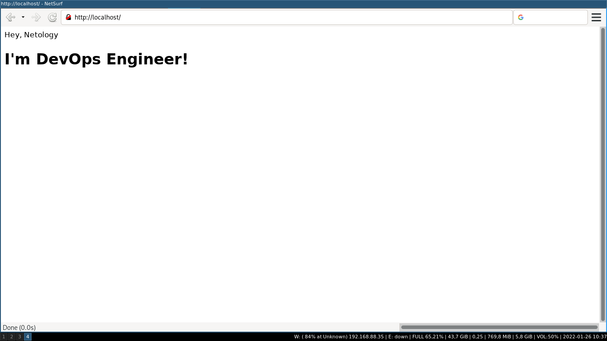

# Task 1

*Сценарий выполнения задачи:*

* *создайте свой репозиторий на https://hub.docker.com;*
* *выберите любой образ, который содержит веб-сервер Nginx;*
* *создайте свой fork образа;*
* *реализуйте функциональность:*

*запуск веб-сервера в фоне с индекс-страницей, содержащей HTML-код ниже:*
```
<html>
<head>
Hey, Netology
</head>
<body>
<h1>I’m DevOps Engineer!</h1>
</body>
</html>
```
*Опубликуйте созданный форк в своем репозитории и предоставьте ответ в виде ссылки на https://hub.docker.com/username_repo.*  

**Решение:**  
Регистрация на hub.docker.com тривиальна и не требует особых пояснений. Клиент docker создал в домашнем каталоге ~/.docker/config.json, 
для иллюстрации прикладываю:
```json 
{
	"auths": {
		"https://index.docker.io/v1/": {
			"auth": "XXXXXXXXXXXXXXXXXXXXXXXXXXXXXXXX"
		}
	}
}
```
Далее был найден подходящий официальный образ nginx размером 141 МБ. На его базе и буду делать образ в соответствие с заданием.  
Dockerfile выглядит следующим образом:
```dockerfile
FROM nginx
COPY static-html /usr/share/nginx/html
```
Делаю форк официального образа nginx, копируя свои данные в статический html из каталога static-html. Далее создаю образ по заданию   
``docker build -t alexkrupenya/avk-nginx .``  
Проверяю наличие образа:
```
[alexvk@archbox 5.3]$ docker image list
REPOSITORY               TAG       IMAGE ID       CREATED        SIZE
alexkrupenya/avk-nginx   latest    61d41bda970e   18 hours ago   141MB
nginx                    latest    605c77e624dd   3 weeks ago    141MB
```
Вижу созданный образ avk-nginx и скопированный из docker hub registry образ nginx.  
Запускаю созданный образ:  
``docker run --name avk-nginx -d -p 80:80 alexkrupenya/avk-nginx``  
Проверяю его состояние:  
```
[alexvk@archbox 5.3]$ docker ps
CONTAINER ID   IMAGE                    COMMAND                  CREATED         STATUS         PORTS                               NAMES
c1693f600068   alexkrupenya/avk-nginx   "/docker-entrypoint.…"   6 seconds ago   Up 5 seconds   0.0.0.0:80->80/tcp, :::80->80/tcp   avk-nginx
```
И, наконец, проверяю выход браузером.

После всего образ необходимо поместить в docker hub registry. Для этого использую:  
``docker push  alexkrupenya/avk-nginx:latest``  
Тег latest выбран потому, что образ экспериментально-учебный, в продакшн не нужен.  
Ссылка на образ: https://hub.docker.com/repository/docker/alexkrupenya/avk-nginx .  

# Task 2

*Посмотрите на сценарий ниже и ответьте на вопрос:*
*"Подходит ли в этом сценарии использование Docker контейнеров или лучше подойдет виртуальная машина, физическая машина? Может быть возможны разные варианты?"*

*Детально опишите и обоснуйте свой выбор.*

--

*Сценарий:*

*- Высоконагруженное монолитное java веб-приложение;*  
*- Nodejs веб-приложение;*  
*- Мобильное приложение c версиями для Android и iOS;*  
*- Шина данных на базе Apache Kafka;*  
*- Elasticsearch кластер для реализации логирования продуктивного веб-приложения - три ноды elasticsearch, два logstash и две ноды kibana;*  
*- Мониторинг-стек на базе Prometheus и Grafana;*  
*- MongoDB, как основное хранилище данных для java-приложения;*  
*- Gitlab сервер для реализации CI/CD процессов и приватный (закрытый) Docker Registry.*  

**Решение:**  
1.  Высоконагруженное монолитное java веб-приложение является кросс-платформенным (в основном) приложением, а поэтому не зависит от архитектуры используемой машины.
Поскольку оно высоконагруженное, логично было бы использовать физическую машину; но так оно оно еще и монолитное, то для удобства развертывания и управленияя бы применил 
контейнеризацию. Таким образом, docker мой выбор. Проседание в производительности будет статистически невелико, удобство же управления перекрывает все накладные расходы. Особенно удобство управления памятью, которую так любят java-приложения.
2. Nodejs веб-приложение - только в контейнер. Так будет спокойнее и гораздо безопаснее, чем развертывать веб на физической машине.
3. Мобильное приложение c версиями для Android и iOS. Задача подразумевает разную архитектуру CPU, разные физические устройства, разную исполняемую среду. Контейнеризация на базе docker не может обеспечить такую функциональность, потому придется обратиться к виртуальным машинам. Для задач тестирования придется изыскивать физические устройства, как это ни печально.
4. Шина данных на базе Apache Kafka. Из документации следует, что "Servers: Kafka is run as a cluster of one or more servers that can span multiple datacenters or cloud regions. Some of these servers form the storage layer, called the brokers.". Отсюда напрашивается логичный вывод, что кластер лучше всего организовывать, используя контейнерную архитектуру. Поскольку тема занятия docker, я выбираю docker.
5. Elasticsearch кластер для реализации логирования продуктивного веб-приложения - три ноды elasticsearch, два logstash и две ноды kibana. Как только вижу ключевое слово "кластер", сразу же возникает желание использовать для реализации контейнеризацию. Беглое чтение документации по указанному продукту сразу же показало, что существуют уже готовые для установки docker-образы и elasticsearch, и logstash, и kibana. Потому мой выбор - docker-контейнеры.
6. Мониторинг-стек на базе Prometheus и Grafana. Prometheus занимается сбором метрик, Grafana построена на базе Apache и рисует красивые графики. Лет 10 назад я бы использовал выделенную физическую машину, которая занималась бы только сбором метрик и мониторингом - требуется отказоустойчивость. Но с развитием программных технологий сейчас вполне подойдет контейнеризация - для удобства выделения ресурсов системе мониторинга. Исключительно из-за удобства развертывания и управления выбираю docker.
7. MongoDB, как основное хранилище данных для java-приложения. Java-приложение уже удобно запускать в контейнере, почему бы не запустить в контейнере MongoDB? Таким образом избавлюсь от проблем с зависимостями; контейнер с базой будет включать в себя только необходимое для ее работы. А поскольку MongoDB является nosql базой, то контейнеризация сделает ее ещё и безопаснее. Потому - всё в контейнеры. 
8. Gitlab сервер для реализации CI/CD процессов и приватный (закрытый) Docker Registry. Gitlab представляет собой набор ПО для совместной разработки на базе git. На официальном сайте проекта существует монолитныё образ контейнера docker для быстрого развертывания gitlab. Поскольку бизнес работает всегда по принципу "это нужно было ещё месяц назад", хотя идея стукнула бизнесмена пять минут как прошло времени - все необходимо сделать быстро. В данном случае наш выбор - контейнеры, потому что поднять и запустить необходимый функционал надо как можно быстрее (обычно счет идет на часы). Выбор docker очевиден.  
Для создания частного docker registry экстраординарных шагов не требуется, документация есть по адресу https://docs.docker.com/registry/deploying/ . Прочтя документацию, я не увидел препятствий в размещении docker registry в отдельном контейнере docker, поскольку для работы реестра требуется docker, веб-сервер (nginx, например) и ssh. Удобство масштабирования docker registry - вот что важно в данном случае.

# Task 3

*- Запустите первый контейнер из образа* ***centos*** *c любым тэгом в фоновом режиме, подключив папку ```/data``` из текущей рабочей директории на хостовой машине в ```/data``` контейнера;*  
*- Запустите второй контейнер из образа* ***debian*** *в фоновом режиме, подключив папку ```/data``` из текущей рабочей директории на хостовой машине в ```/data``` контейнера;*  
*- Подключитесь к первому контейнеру с помощью ```docker exec``` и создайте текстовый файл любого содержания в ```/data```;*  
*- Добавьте еще один файл в папку ```/data``` на хостовой машине;*  
*- Подключитесь во второй контейнер и отобразите листинг и содержание файлов в ```/data``` контейнера.*  

**Решение:**
```
[alexvk@archbox 5.3]$ docker pull centos:latest
latest: Pulling from library/centos
a1d0c7532777: Pull complete 
Digest: sha256:a27fd8080b517143cbbbab9dfb7c8571c40d67d534bbdee55bd6c473f432b177
Status: Downloaded newer image for centos:latest
docker.io/library/centos:latest
```
Запускаю контейнер, подключив домашний каталог к контейнеру:
```
[alexvk@archbox 5.3]$  docker run -v /home/alexvk/data:/data --name centos -dt centos 
```
Ключ -t необходим для того, чтобы контейнер не завершал сразу работу, а оставался работать с запущенным в нем процессом bash.
```
[alexvk@archbox 5.3]$ docker ps
CONTAINER ID   IMAGE     COMMAND       CREATED         STATUS         PORTS     NAMES
ce0d48a8a53c   centos    "/bin/bash"   6 seconds ago   Up 5 seconds             centos
```
Загружаю также образ debian:latest ``docker pull debian:latest``. После успешной загрузки следует запуск контейнера:
```
[alexvk@archbox 5.3]$ docker run -v /home/alexvk/data:/data  --name debian -dt debian 
d21557666114118bd4b1c9d353e15c3529e6121ed228d33e3ab4331bde206642
```
В соответствие с заданием, локальный  каталог ~/data также примонтирован к каталогу /data в контейнере debian.  
Проверяю контейнеры:
```
[alexvk@archbox 5.3]$ docker ps
CONTAINER ID   IMAGE     COMMAND       CREATED         STATUS         PORTS     NAMES
d21557666114   debian    "bash"        4 minutes ago   Up 4 minutes             debian
9c378eab43e7   centos    "/bin/bash"   7 minutes ago   Up 7 minutes             centos
```
Создаю в контейнере **centos** по пути ``/data`` текстовый файл ``the_file`` с содержимым "This is the file."
```
[alexvk@archbox 5.3]$ docker exec centos bash -c "echo This is the file. > /data/the_file"
```
Проверяю содержимое файла:
```
[alexvk@archbox 5.3]$ docker exec centos cat /data/the_file
This is the file.
```
It seems to work.  
Добавляю файл с именем file на хосте: ``echo This is another file. > ~/data/file``.  
Продолжаю с контейнером debian. 
Теперь посмотрю содержимое файлов в примонтированном каталоге:
```
[alexvk@archbox 5.3]$ docker exec debian bash -c "grep -H \".*\" /data/* "
/data/file:This is another file.
/data/the_file:This is the file.
```
Вывод в соответствие с заданием, слева имена файлов, справа - их содержимое. Задача решена.

# Task 4

Построю контейнер из лекции. Содержимое Dockerfile взял из каталога src/ для задания 5.3.  
Полный листинг процесса приведен ниже:  
```
[alexvk@archbox ansible]$ docker build -t alexkrupenya/ansible:2.9.24 .
Sending build context to Docker daemon   2.56kB
Step 1/5 : FROM alpine:3.14
3.14: Pulling from library/alpine
97518928ae5f: Pull complete 
Digest: sha256:635f0aa53d99017b38d1a0aa5b2082f7812b03e3cdb299103fe77b5c8a07f1d2
Status: Downloaded newer image for alpine:3.14
 ---> 0a97eee8041e
Step 2/5 : RUN CARGO_NET_GIT_FETCH_WITH_CLI=1 &&     apk --no-cache add         sudo         python3        py3-pip         openssl         ca-certificates         sshpass         openssh-client         rsync         git &&     apk --no-cache add --virtual build-dependencies         python3-dev         libffi-dev         musl-dev         gcc         cargo         openssl-dev         libressl-dev         build-base &&     pip install --upgrade pip wheel &&     pip install --upgrade cryptography cffi &&     pip install ansible==2.9.24 &&     pip install mitogen ansible-lint jmespath &&     pip install --upgrade pywinrm &&     apk del build-dependencies &&     rm -rf /var/cache/apk/* &&     rm -rf /root/.cache/pip &&     rm -rf /root/.cargo
 ---> Running in d75384c9ba38
fetch https://dl-cdn.alpinelinux.org/alpine/v3.14/main/x86_64/APKINDEX.tar.gz
fetch https://dl-cdn.alpinelinux.org/alpine/v3.14/community/x86_64/APKINDEX.tar.gz
(1/55) Installing ca-certificates (20211220-r0)
(2/55) Installing brotli-libs (1.0.9-r5)
(3/55) Installing nghttp2-libs (1.43.0-r0)
(4/55) Installing libcurl (7.79.1-r0)
(5/55) Installing expat (2.4.3-r0)
(6/55) Installing pcre2 (10.36-r0)
(7/55) Installing git (2.32.0-r0)
(8/55) Installing openssh-keygen (8.6_p1-r3)
(9/55) Installing ncurses-terminfo-base (6.2_p20210612-r0)
(10/55) Installing ncurses-libs (6.2_p20210612-r0)
(11/55) Installing libedit (20210216.3.1-r0)
(12/55) Installing openssh-client-common (8.6_p1-r3)
(13/55) Installing openssh-client-default (8.6_p1-r3)
(14/55) Installing openssl (1.1.1l-r0)
(15/55) Installing libbz2 (1.0.8-r1)
(16/55) Installing libffi (3.3-r2)
(17/55) Installing gdbm (1.19-r0)
(18/55) Installing xz-libs (5.2.5-r0)
(19/55) Installing libgcc (10.3.1_git20210424-r2)
(20/55) Installing libstdc++ (10.3.1_git20210424-r2)
(21/55) Installing mpdecimal (2.5.1-r1)
(22/55) Installing readline (8.1.0-r0)
(23/55) Installing sqlite-libs (3.35.5-r0)
(24/55) Installing python3 (3.9.5-r2)
(25/55) Installing py3-appdirs (1.4.4-r2)
(26/55) Installing py3-chardet (4.0.0-r2)
(27/55) Installing py3-idna (3.2-r0)
(28/55) Installing py3-urllib3 (1.26.5-r0)
(29/55) Installing py3-certifi (2020.12.5-r1)
(30/55) Installing py3-requests (2.25.1-r4)
(31/55) Installing py3-msgpack (1.0.2-r1)
(32/55) Installing py3-lockfile (0.12.2-r4)
(33/55) Installing py3-cachecontrol (0.12.6-r1)
(34/55) Installing py3-colorama (0.4.4-r1)
(35/55) Installing py3-contextlib2 (0.6.0-r1)
(36/55) Installing py3-distlib (0.3.1-r3)
(37/55) Installing py3-distro (1.5.0-r3)
(38/55) Installing py3-six (1.15.0-r1)
(39/55) Installing py3-webencodings (0.5.1-r4)
(40/55) Installing py3-html5lib (1.1-r1)
(41/55) Installing py3-parsing (2.4.7-r2)
(42/55) Installing py3-packaging (20.9-r1)
(43/55) Installing py3-toml (0.10.2-r2)
(44/55) Installing py3-pep517 (0.10.0-r2)
(45/55) Installing py3-progress (1.5-r2)
(46/55) Installing py3-retrying (1.3.3-r1)
(47/55) Installing py3-ordered-set (4.0.2-r1)
(48/55) Installing py3-setuptools (52.0.0-r3)
(49/55) Installing py3-pip (20.3.4-r1)
(50/55) Installing libacl (2.2.53-r0)
(51/55) Installing popt (1.18-r0)
(52/55) Installing zstd-libs (1.4.9-r1)
(53/55) Installing rsync (3.2.3-r4)
(54/55) Installing sshpass (1.09-r0)
(55/55) Installing sudo (1.9.7_p1-r1)
Executing busybox-1.33.1-r6.trigger
Executing ca-certificates-20211220-r0.trigger
OK: 98 MiB in 69 packages
fetch https://dl-cdn.alpinelinux.org/alpine/v3.14/main/x86_64/APKINDEX.tar.gz
fetch https://dl-cdn.alpinelinux.org/alpine/v3.14/community/x86_64/APKINDEX.tar.gz
(1/37) Installing pkgconf (1.7.4-r0)
(2/37) Installing python3-dev (3.9.5-r2)
(3/37) Installing linux-headers (5.10.41-r0)
(4/37) Installing libffi-dev (3.3-r2)
(5/37) Installing musl-dev (1.2.2-r3)
(6/37) Installing binutils (2.35.2-r2)
(7/37) Installing libgomp (10.3.1_git20210424-r2)
(8/37) Installing libatomic (10.3.1_git20210424-r2)
(9/37) Installing libgphobos (10.3.1_git20210424-r2)
(10/37) Installing gmp (6.2.1-r0)
(11/37) Installing isl22 (0.22-r0)
(12/37) Installing mpfr4 (4.1.0-r0)
(13/37) Installing mpc1 (1.2.1-r0)
(14/37) Installing gcc (10.3.1_git20210424-r2)
(15/37) Installing rust-stdlib (1.52.1-r1)
(16/37) Installing libxml2 (2.9.12-r1)
(17/37) Installing llvm11-libs (11.1.0-r2)
(18/37) Installing http-parser (2.9.4-r0)
(19/37) Installing pcre (8.44-r0)
(20/37) Installing libssh2 (1.9.0-r1)
(21/37) Installing libgit2 (1.1.0-r2)
(22/37) Installing rust (1.52.1-r1)
(23/37) Installing cargo (1.52.1-r1)
(24/37) Installing openssl-dev (1.1.1l-r0)
(25/37) Installing libressl3.3-libcrypto (3.3.3-r0)
(26/37) Installing libressl3.3-libssl (3.3.3-r0)
(27/37) Installing libressl3.3-libtls (3.3.3-r0)
(28/37) Installing libressl-dev (3.3.3-r0)
(29/37) Installing libmagic (5.40-r1)
(30/37) Installing file (5.40-r1)
(31/37) Installing libc-dev (0.7.2-r3)
(32/37) Installing g++ (10.3.1_git20210424-r2)
(33/37) Installing make (4.3-r0)
(34/37) Installing fortify-headers (1.1-r1)
(35/37) Installing patch (2.7.6-r7)
(36/37) Installing build-base (0.5-r2)
(37/37) Installing build-dependencies (20220126.124515)
Executing busybox-1.33.1-r6.trigger
OK: 1110 MiB in 106 packages
Requirement already satisfied: pip in /usr/lib/python3.9/site-packages (20.3.4)
Collecting pip
  Downloading pip-21.3.1-py3-none-any.whl (1.7 MB)
Collecting wheel
  Downloading wheel-0.37.1-py2.py3-none-any.whl (35 kB)
Installing collected packages: wheel, pip
  Attempting uninstall: pip
    Found existing installation: pip 20.3.4
    Uninstalling pip-20.3.4:
      Successfully uninstalled pip-20.3.4
Successfully installed pip-21.3.1 wheel-0.37.1
Collecting cryptography
  Downloading cryptography-36.0.1-cp36-abi3-musllinux_1_1_x86_64.whl (3.8 MB)
Collecting cffi
  Downloading cffi-1.15.0.tar.gz (484 kB)
  Preparing metadata (setup.py): started
  Preparing metadata (setup.py): finished with status 'done'
Collecting pycparser
  Downloading pycparser-2.21-py2.py3-none-any.whl (118 kB)
Building wheels for collected packages: cffi
  Building wheel for cffi (setup.py): started
  Building wheel for cffi (setup.py): finished with status 'done'
  Created wheel for cffi: filename=cffi-1.15.0-cp39-cp39-linux_x86_64.whl size=429212 sha256=d6dd1f6896d8e33875a9f4add4e0e1cc93b321c16aef60c4145c4e02316d15f3
  Stored in directory: /root/.cache/pip/wheels/8e/0d/16/77c97b85a9f559c5412c85c129a2bae07c771d31e1beb03c40
Successfully built cffi
Installing collected packages: pycparser, cffi, cryptography
Successfully installed cffi-1.15.0 cryptography-36.0.1 pycparser-2.21
WARNING: Running pip as the 'root' user can result in broken permissions and conflicting behaviour with the system package manager. It is recommended to use a virtual environment instead: https://pip.pypa.io/warnings/venv
Collecting ansible==2.9.24
  Downloading ansible-2.9.24.tar.gz (14.3 MB)
  Preparing metadata (setup.py): started
  Preparing metadata (setup.py): finished with status 'done'
Collecting jinja2
  Downloading Jinja2-3.0.3-py3-none-any.whl (133 kB)
Collecting PyYAML
  Downloading PyYAML-6.0.tar.gz (124 kB)
  Installing build dependencies: started
  Installing build dependencies: finished with status 'done'
  Getting requirements to build wheel: started
  Getting requirements to build wheel: finished with status 'done'
  Preparing metadata (pyproject.toml): started
  Preparing metadata (pyproject.toml): finished with status 'done'
Requirement already satisfied: cryptography in /usr/lib/python3.9/site-packages (from ansible==2.9.24) (36.0.1)
Requirement already satisfied: cffi>=1.12 in /usr/lib/python3.9/site-packages (from cryptography->ansible==2.9.24) (1.15.0)
Collecting MarkupSafe>=2.0
  Downloading MarkupSafe-2.0.1-cp39-cp39-musllinux_1_1_x86_64.whl (30 kB)
Requirement already satisfied: pycparser in /usr/lib/python3.9/site-packages (from cffi>=1.12->cryptography->ansible==2.9.24) (2.21)
Building wheels for collected packages: ansible, PyYAML
  Building wheel for ansible (setup.py): started
  Building wheel for ansible (setup.py): finished with status 'done'
  Created wheel for ansible: filename=ansible-2.9.24-py3-none-any.whl size=16205052 sha256=38124ac0bc1657a26f54b20dd72af372c9e83304afb2a281364cbc34f325dd88
  Stored in directory: /root/.cache/pip/wheels/ba/89/f3/df35238037ec8303702ddd8569ce11a807935f96ecb3ff6d52
  Building wheel for PyYAML (pyproject.toml): started
  Building wheel for PyYAML (pyproject.toml): finished with status 'done'
  Created wheel for PyYAML: filename=PyYAML-6.0-cp39-cp39-linux_x86_64.whl size=45332 sha256=f8e0575ee331a51624a3466b21756f03c4cd8ca61be0b49b1466564df16304cd
  Stored in directory: /root/.cache/pip/wheels/b4/0f/9a/d6af48581dda678920fccfb734f5d9f827c6ed5b4074c7eda8
Successfully built ansible PyYAML
Installing collected packages: MarkupSafe, PyYAML, jinja2, ansible
Successfully installed MarkupSafe-2.0.1 PyYAML-6.0 ansible-2.9.24 jinja2-3.0.3
WARNING: Running pip as the 'root' user can result in broken permissions and conflicting behaviour with the system package manager. It is recommended to use a virtual environment instead: https://pip.pypa.io/warnings/venv
Collecting mitogen
  Downloading mitogen-0.3.2-py2.py3-none-any.whl (288 kB)
Collecting ansible-lint
  Downloading ansible_lint-5.3.2-py3-none-any.whl (115 kB)
Collecting jmespath
  Downloading jmespath-0.10.0-py2.py3-none-any.whl (24 kB)
Collecting tenacity
  Downloading tenacity-8.0.1-py3-none-any.whl (24 kB)
Collecting wcmatch>=7.0
  Downloading wcmatch-8.3-py3-none-any.whl (42 kB)
Collecting enrich>=1.2.6
  Downloading enrich-1.2.7-py3-none-any.whl (8.7 kB)
Requirement already satisfied: pyyaml in /usr/lib/python3.9/site-packages (from ansible-lint) (6.0)
Requirement already satisfied: packaging in /usr/lib/python3.9/site-packages (from ansible-lint) (20.9)
Collecting rich>=9.5.1
  Downloading rich-11.0.0-py3-none-any.whl (215 kB)
Collecting ruamel.yaml<1,>=0.15.37
  Downloading ruamel.yaml-0.17.20-py3-none-any.whl (109 kB)
Collecting commonmark<0.10.0,>=0.9.0
  Downloading commonmark-0.9.1-py2.py3-none-any.whl (51 kB)
Collecting pygments<3.0.0,>=2.6.0
  Downloading Pygments-2.11.2-py3-none-any.whl (1.1 MB)
Requirement already satisfied: colorama<0.5.0,>=0.4.0 in /usr/lib/python3.9/site-packages (from rich>=9.5.1->ansible-lint) (0.4.4)
Collecting ruamel.yaml.clib>=0.2.6
  Downloading ruamel.yaml.clib-0.2.6.tar.gz (180 kB)
  Preparing metadata (setup.py): started
  Preparing metadata (setup.py): finished with status 'done'
Collecting bracex>=2.1.1
  Downloading bracex-2.2.1-py3-none-any.whl (12 kB)
Building wheels for collected packages: ruamel.yaml.clib
  Building wheel for ruamel.yaml.clib (setup.py): started
  Building wheel for ruamel.yaml.clib (setup.py): finished with status 'done'
  Created wheel for ruamel.yaml.clib: filename=ruamel.yaml.clib-0.2.6-cp39-cp39-linux_x86_64.whl size=746366 sha256=24c471d0346d42e08d18baaad1666f5c986d5881e7740ad3a31d6ad0976a5499
  Stored in directory: /root/.cache/pip/wheels/b1/c4/5d/d96e5c09189f4d6d2a9ffb0d7af04ee06d11a20f613f5f3496
Successfully built ruamel.yaml.clib
Installing collected packages: pygments, commonmark, ruamel.yaml.clib, rich, bracex, wcmatch, tenacity, ruamel.yaml, enrich, mitogen, jmespath, ansible-lint
Successfully installed ansible-lint-5.3.2 bracex-2.2.1 commonmark-0.9.1 enrich-1.2.7 jmespath-0.10.0 mitogen-0.3.2 pygments-2.11.2 rich-11.0.0 ruamel.yaml-0.17.20 ruamel.yaml.clib-0.2.6 tenacity-8.0.1 wcmatch-8.3
WARNING: Running pip as the 'root' user can result in broken permissions and conflicting behaviour with the system package manager. It is recommended to use a virtual environment instead: https://pip.pypa.io/warnings/venv
Collecting pywinrm
  Downloading pywinrm-0.4.2-py2.py3-none-any.whl (44 kB)
Requirement already satisfied: requests>=2.9.1 in /usr/lib/python3.9/site-packages (from pywinrm) (2.25.1)
Collecting requests-ntlm>=0.3.0
  Downloading requests_ntlm-1.1.0-py2.py3-none-any.whl (5.7 kB)
Collecting xmltodict
  Downloading xmltodict-0.12.0-py2.py3-none-any.whl (9.2 kB)
Requirement already satisfied: six in /usr/lib/python3.9/site-packages (from pywinrm) (1.15.0)
Requirement already satisfied: chardet<5,>=3.0.2 in /usr/lib/python3.9/site-packages (from requests>=2.9.1->pywinrm) (4.0.0)
Requirement already satisfied: idna<3.3,>=2.5 in /usr/lib/python3.9/site-packages (from requests>=2.9.1->pywinrm) (3.2)
Requirement already satisfied: urllib3<1.27,>=1.21.1 in /usr/lib/python3.9/site-packages (from requests>=2.9.1->pywinrm) (1.26.5)
Requirement already satisfied: certifi>=2017.4.17 in /usr/lib/python3.9/site-packages (from requests>=2.9.1->pywinrm) (2020.12.5)
Collecting ntlm-auth>=1.0.2
  Downloading ntlm_auth-1.5.0-py2.py3-none-any.whl (29 kB)
Requirement already satisfied: cryptography>=1.3 in /usr/lib/python3.9/site-packages (from requests-ntlm>=0.3.0->pywinrm) (36.0.1)
Requirement already satisfied: cffi>=1.12 in /usr/lib/python3.9/site-packages (from cryptography>=1.3->requests-ntlm>=0.3.0->pywinrm) (1.15.0)
Requirement already satisfied: pycparser in /usr/lib/python3.9/site-packages (from cffi>=1.12->cryptography>=1.3->requests-ntlm>=0.3.0->pywinrm) (2.21)
Installing collected packages: ntlm-auth, xmltodict, requests-ntlm, pywinrm
Successfully installed ntlm-auth-1.5.0 pywinrm-0.4.2 requests-ntlm-1.1.0 xmltodict-0.12.0
WARNING: Running pip as the 'root' user can result in broken permissions and conflicting behaviour with the system package manager. It is recommended to use a virtual environment instead: https://pip.pypa.io/warnings/venv
WARNING: Ignoring https://dl-cdn.alpinelinux.org/alpine/v3.14/main: No such file or directory
WARNING: Ignoring https://dl-cdn.alpinelinux.org/alpine/v3.14/community: No such file or directory
(1/37) Purging build-dependencies (20220126.124515)
(2/37) Purging python3-dev (3.9.5-r2)
(3/37) Purging libffi-dev (3.3-r2)
(4/37) Purging linux-headers (5.10.41-r0)
(5/37) Purging cargo (1.52.1-r1)
(6/37) Purging rust (1.52.1-r1)
(7/37) Purging rust-stdlib (1.52.1-r1)
(8/37) Purging openssl-dev (1.1.1l-r0)
(9/37) Purging libressl-dev (3.3.3-r0)
(10/37) Purging libressl3.3-libssl (3.3.3-r0)
(11/37) Purging libressl3.3-libtls (3.3.3-r0)
(12/37) Purging build-base (0.5-r2)
(13/37) Purging file (5.40-r1)
(14/37) Purging g++ (10.3.1_git20210424-r2)
(15/37) Purging gcc (10.3.1_git20210424-r2)
(16/37) Purging binutils (2.35.2-r2)
(17/37) Purging libatomic (10.3.1_git20210424-r2)
(18/37) Purging libgomp (10.3.1_git20210424-r2)
(19/37) Purging libgphobos (10.3.1_git20210424-r2)
(20/37) Purging make (4.3-r0)
(21/37) Purging libc-dev (0.7.2-r3)
(22/37) Purging musl-dev (1.2.2-r3)
(23/37) Purging fortify-headers (1.1-r1)
(24/37) Purging patch (2.7.6-r7)
(25/37) Purging pkgconf (1.7.4-r0)
(26/37) Purging mpc1 (1.2.1-r0)
(27/37) Purging mpfr4 (4.1.0-r0)
(28/37) Purging isl22 (0.22-r0)
(29/37) Purging gmp (6.2.1-r0)
(30/37) Purging llvm11-libs (11.1.0-r2)
(31/37) Purging libxml2 (2.9.12-r1)
(32/37) Purging libgit2 (1.1.0-r2)
(33/37) Purging http-parser (2.9.4-r0)
(34/37) Purging pcre (8.44-r0)
(35/37) Purging libssh2 (1.9.0-r1)
(36/37) Purging libressl3.3-libcrypto (3.3.3-r0)
(37/37) Purging libmagic (5.40-r1)
Executing busybox-1.33.1-r6.trigger
OK: 98 MiB in 69 packages
Removing intermediate container d75384c9ba38
 ---> 6b1d87c74828
Step 3/5 : RUN mkdir /ansible &&     mkdir -p /etc/ansible &&     echo 'localhost' > /etc/ansible/hosts
 ---> Running in af518dbc8346
Removing intermediate container af518dbc8346
 ---> 75861ffd8584
Step 4/5 : WORKDIR /ansible
 ---> Running in e5d2a5bc021d
Removing intermediate container e5d2a5bc021d
 ---> d95839c6a581
Step 5/5 : CMD [ "ansible-playbook", "--version" ]
 ---> Running in 82fb5f84db8d
Removing intermediate container 82fb5f84db8d
 ---> a574085000db
Successfully built a574085000db
Successfully tagged alexkrupenya/ansible:2.9.24
```
Запушу образ в docker hub:
```
[alexvk@archbox ansible]$ docker login 
Authenticating with existing credentials...
WARNING! Your password will be stored unencrypted in /home/alexvk/.docker/config.json.
Configure a credential helper to remove this warning. See
https://docs.docker.com/engine/reference/commandline/login/#credentials-store

Login Succeeded
[alexvk@archbox ansible]$ docker image list
REPOSITORY               TAG       IMAGE ID       CREATED         SIZE
alexkrupenya/ansible     2.9.24    a574085000db   3 minutes ago   227MB
debian                   latest    04fbdaf87a6a   11 hours ago    124MB
alexkrupenya/avk-nginx   latest    61d41bda970e   23 hours ago    141MB
nginx                    latest    605c77e624dd   3 weeks ago     141MB
alpine                   3.14      0a97eee8041e   2 months ago    5.6MB
centos                   latest    5d0da3dc9764   4 months ago    231MB
[alexvk@archbox ansible]$ docker push alexkrupenya/ansible:2.9.24
The push refers to repository [docker.io/alexkrupenya/ansible]
8eec5644ae31: Pushed 
3ba6c1dbade4: Pushed 
1a058d5342cc: Mounted from library/alpine 
2.9.24: digest: sha256:58d6e2f827d59d920c05f6e668bfc12c7ffa6fbe25149b4cef93eaa6b57b921a size: 947
```
Образ доступен по ссылке https://hub.docker.com/repository/docker/alexkrupenya/ansible .

