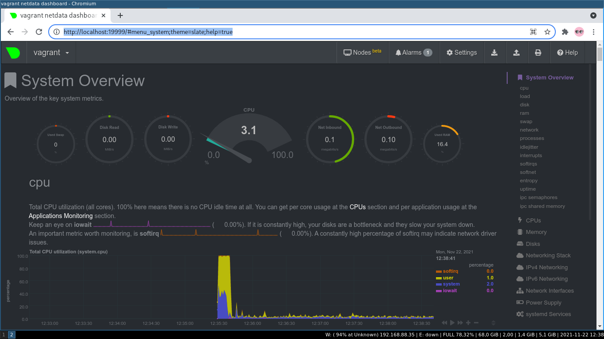

# Task 1

Прежде всего необходимо установить node_exporter. В задании дана ссылка на репозиторий, воспользуюсь ей:  
``mkdir build && cd build && git clone https://github.com/prometheus/node_exporter.git``  
Чтение README и просмотр каталога говорит о том, что ПО написано на языке Go. Установлю  пакет golang и зависимости.  
``apt get golang``. Попробую собрать node_exporter: ``go build``. Утыкаюсь в ошибку сборки, требуется версия golang 1.14 или выше.  
Ставлю ``apt get golang-1.16``, переименовываю старый бинарник *go*, делаю симлинк на версию 1.16 ``ln -s /usr/lib/go-1.16/bin/go /usr/local/bin/go``.  
``go clean && go build``. Получаю исполняемый файл *node_exporter*. С ним и буду работать.  
Добавлю *node_explorer* в автозапуск. Поскольку ubuntu 20.04 использует systemd, необходимо создать unit файл. Создаю *node_exporter.service*:  
<pre>
[Unit]
Description=Node Exporter

[Service]
User=node_exporter
EnvironmentFile=/usr/local/etc/sysconfig/node_exporter
ExecStart=/usr/local/sbin/node_exporter $OPTIONS

[Install]
WantedBy=multi-user.target
</pre>
Файл *node_exporter.service* помещаю в каталог с юнитами */etc/systemd/system/*.  
Дабы поменьше гадить в глобальные зависимости, файлы *node_exporter* перенесу в каталоги /usr/local.  
Файл бинарника  ``usr/local/sbin/node_exporter``, файл для передачи параметров запуска ``/usr/local/etc/sysconfig/node_exporter``.  
Согласно документации создам пользователя и группу для node_exporter. ``groupadd node_exporter ; useradd -G node_exporter -s /usr/sbin/nologin node_exporter``  
Проверяю запуск ПО:  
``sudo systemctl start node_exporter``  
На выходе:
<pre>
vagrant@vagrant:~$ systemctl status node_exporter
● node_exporter.service - Node Exporter
     Loaded: loaded (/etc/systemd/system/node_exporter.service; enabled; vendor preset: enabled)
     Active: active (running) since Sun 2021-11-21 10:59:12 UTC; 8s ago
   Main PID: 1783 (node_exporter)
      Tasks: 5 (limit: 1112)
     Memory: 6.1M
     CGroup: /system.slice/node_exporter.service
             └─1783 /usr/local/sbin/node_exporter

Nov 21 10:59:12 vagrant node_exporter[1783]: ts=2021-11-21T10:59:12.893Z caller=node_exporter.go:115 level=info collector=time
Nov 21 10:59:12 vagrant node_exporter[1783]: ts=2021-11-21T10:59:12.893Z caller=node_exporter.go:115 level=info collector=timex
Nov 21 10:59:12 vagrant node_exporter[1783]: ts=2021-11-21T10:59:12.893Z caller=node_exporter.go:115 level=info collector=udp_queues
Nov 21 10:59:12 vagrant node_exporter[1783]: ts=2021-11-21T10:59:12.893Z caller=node_exporter.go:115 level=info collector=uname
Nov 21 10:59:12 vagrant node_exporter[1783]: ts=2021-11-21T10:59:12.893Z caller=node_exporter.go:115 level=info collector=vmstat
Nov 21 10:59:12 vagrant node_exporter[1783]: ts=2021-11-21T10:59:12.894Z caller=node_exporter.go:115 level=info collector=xfs
Nov 21 10:59:12 vagrant node_exporter[1783]: ts=2021-11-21T10:59:12.894Z caller=node_exporter.go:115 level=info collector=zfs
Nov 21 10:59:12 vagrant node_exporter[1783]: ts=2021-11-21T10:59:12.894Z caller=node_exporter.go:199 level=info msg="Listening on" address=:9100
Nov 21 10:59:12 vagrant node_exporter[1783]: ts=2021-11-21T10:59:12.899Z caller=tls_config.go:195 level=info msg="TLS is disabled." http2=false
</pre>
Для теста запущу *lynx http://localhost:9100/metrics*. Вижу поступающий от node_exporter поток данных. Если перечитать страницу, то данные  меняются.  
Пример части вывода:  
<pre>
# HELP go_gc_duration_seconds A summary of the pause duration of garbage collection cycles.
# TYPE go_gc_duration_seconds summary
go_gc_duration_seconds{quantile="0"} 7.3816e-05
go_gc_duration_seconds{quantile="0.25"} 0.000111304
go_gc_duration_seconds{quantile="0.5"} 0.00011701
go_gc_duration_seconds{quantile="0.75"} 0.000141207
go_gc_duration_seconds{quantile="1"} 0.000433917
go_gc_duration_seconds_sum 0.003744252
go_gc_duration_seconds_count 28
</pre>
Далее - передам параметр в *node_exporter*. Для этого действия был предусмотрен файл *EnvironmentFile=/usr/local/etc/sysconfig/node_exporter*  
Передам осмысленный параметр "--collector-wifi" для сбора данных о беспроводных подключениях.  
Редактирую файл */usr/local/etc/sysconfig/node_exporter*, добавлю строку *OPTIONS="--collector.wifi"*.  
Перезапускаю процесс ``sudo systemctl restart node_exporter``. Проверю статус:
<pre>
vagrant@vagrant:~$ systemctl status node_exporter
● node_exporter.service - Node Exporter
     Loaded: loaded (/etc/systemd/system/node_exporter.service; enabled; vendor preset: enabled)
     Active: active (running) since Sun 2021-11-21 11:14:12 UTC; 1min 8s ago
   Main PID: 1875 (node_exporter)
      Tasks: 5 (limit: 1112)
     Memory: 6.9M
     CGroup: /system.slice/node_exporter.service
             └─1875 /usr/local/sbin/node_exporter --collector.wifi

Nov 21 11:14:12 vagrant node_exporter[1875]: ts=2021-11-21T11:14:12.223Z caller=node_exporter.go:115 level=info collector=time
Nov 21 11:14:12 vagrant node_exporter[1875]: ts=2021-11-21T11:14:12.223Z caller=node_exporter.go:115 level=info collector=timex
Nov 21 11:14:12 vagrant node_exporter[1875]: ts=2021-11-21T11:14:12.224Z caller=node_exporter.go:115 level=info collector=udp_queues
Nov 21 11:14:12 vagrant node_exporter[1875]: ts=2021-11-21T11:14:12.224Z caller=node_exporter.go:115 level=info collector=uname
Nov 21 11:14:12 vagrant node_exporter[1875]: ts=2021-11-21T11:14:12.224Z caller=node_exporter.go:115 level=info collector=vmstat
Nov 21 11:14:12 vagrant node_exporter[1875]: ts=2021-11-21T11:14:12.224Z caller=node_exporter.go:115 level=info collector=wifi
Nov 21 11:14:12 vagrant node_exporter[1875]: ts=2021-11-21T11:14:12.224Z caller=node_exporter.go:115 level=info collector=xfs
Nov 21 11:14:12 vagrant node_exporter[1875]: ts=2021-11-21T11:14:12.224Z caller=node_exporter.go:115 level=info collector=zfs
Nov 21 11:14:12 vagrant node_exporter[1875]: ts=2021-11-21T11:14:12.229Z caller=node_exporter.go:199 level=info msg="Listening on" address=:9100
Nov 21 11:14:12 vagrant node_exporter[1875]: ts=2021-11-21T11:14:12.231Z caller=tls_config.go:195 level=info msg="TLS is disabled." http2=false
</pre>
Очевидно, что теперь *node_exporter* получил параметр --collector-wifi, и это также заметно в списке коллекторов.  
Последний штрих -- reboot виртуальной машины. Выполняю. ``sudo reboot``. Делаю login.
<pre>
vagrant@vagrant:~$ systemctl status node_exporter
● node_exporter.service - Node Exporter
     Loaded: loaded (/etc/systemd/system/node_exporter.service; enabled; vendor preset: enabled)
     Active: active (running) since Sun 2021-11-21 11:23:44 UTC; 1min 10s ago
   Main PID: 598 (node_exporter)
      Tasks: 4 (limit: 1112)
     Memory: 20.4M
     CGroup: /system.slice/node_exporter.service
             └─598 /usr/local/sbin/node_exporter --collector.wifi
</pre>
*node_exporter* успешно поднялся и функционирует properly.  

# Task 2
Для выяснения того, что хочется видеть в этом задании, стоит обратиться к собственно выводу  node_exporter-а.  
Для мониторинга CPU можно использовать:  
``# TYPE node_cpu_seconds_total counter``  
``node_cpu_seconds_total{cpu="0",mode="idle"}`` айдлинг CPU;  
``node_cpu_seconds_total{cpu="0",mode="system"}`` системная нагрузка;  
``node_cpu_seconds_total{cpu="0",mode="user"}`` пользовательская нагрузка;  
``# TYPE node_pressure_cpu_waiting_seconds_total counter``  
``node_pressure_cpu_waiting_seconds_total`` psi - сбои из-за конфликтов в системе и перегрузка ресурсов;  
``# TYPE process_cpu_seconds_total counter``  
``process_cpu_seconds_total`` потраченное время CPU  системными и пользовательскими процессами вместе.  
Для мониторинга памяти:  
``# TYPE node_memory_MemAvailable_bytes gauge``  
``node_memory_MemAvailable_bytes`` общая доступная память ;  
``# TYPE node_memory_MemFree_bytes gauge``  
``node_memory_MemFree_bytes`` свободная память;  
``# TYPE node_memory_MemTotal_bytes gauge``  
``node_memory_MemTotal_bytes`` общая память в системе (итого).  
Для мониторинга диска(ов):  
``# TYPE node_disk_io_time_seconds_total counter``  
``node_disk_io_time_seconds_total{device="sda"}`` общее время операций с диском;  
``# TYPE node_disk_read_bytes_total counter``  
``node_disk_read_bytes_total{device="sda"}`` прочитанный объем данных с диска;  
``# TYPE node_disk_read_time_seconds_total counter``  
``node_disk_read_time_seconds_total{device="sda"}`` время операций чтения с диска;  
``# TYPE node_disk_write_time_seconds_total counter``  
``node_disk_write_time_seconds_total{device="sda"}`` время операций записи на диск;  
``# TYPE node_disk_written_bytes_total counter``  
``node_disk_written_bytes_total{device="sda"}`` записанный на диск объем данных;  
*sda* соответственно имя устройства. Если устройств много, то список увеличивается кратно.  
Для мониторинга сети:  
для каждого сетевого интерфейса (в том числе в down state):  
``# TYPE node_network_info gauge``  
``node_network_info{address="00:00:00:00:00:00",broadcast="00:00:00:00:00:00",device="lo",duplex="",ifalias="",operstate="unknown"} 1`` общая информация об интерфейсе;  
``# TYPE node_network_receive_bytes_total counter``  
``node_network_receive_bytes_total{device="lo"}`` всего получено байт на интерфейсе;  
``# TYPE node_network_receive_drop_total counter``  
``node_network_receive_drop_total`` количество сбоев при приеме;  
``# TYPE node_network_speed_bytes gauge``
``node_network_speed_bytes{device="eth0"}`` скорость работы сети на интерфейсе;  
``# TYPE node_network_transmit_bytes_total counter``   
``node_network_transmit_bytes_total{device="lo"}`` всего передано байт на интерфейсе;   
``# TYPE node_network_up gauge``  
``node_network_up{device="lo"} 0``  состояние интерфейса (up or down).  
Практически же количество проверяемых параметров состояния системы очень зависит от поставленной задачи и выполняемых системой функций.   

# Task 3

Устанавливаю пакет *netdata* из репозитория ubuntu. Редактирую файл */etc/netdata/netdata.conf* в соответствие с заданием, чтобы демон *netdata* слушал все интерфейсы.  
Выполняю перенаправление порта 19999 с гостевой VM на порт 19999 хоста.  
Запускаю ``sudo systemctl netdata``.   
На машине-хосте запускаю chromium и открываю адрес http://localhost:19999/  

Что имею в итоге на гостевой VM:  
<pre>
vagrant@vagrant:~$ sudo lsof -r -i :19999
=======
COMMAND PID    USER   FD   TYPE DEVICE SIZE/OFF NODE NAME
netdata 652 netdata    4u  IPv4  22467      0t0  TCP *:19999 (LISTEN)
netdata 652 netdata   29u  IPv4  34679      0t0  TCP vagrant:19999->_gateway:48982 (ESTABLISHED)
netdata 652 netdata   33u  IPv4  34681      0t0  TCP vagrant:19999->_gateway:48984 (ESTABLISHED)
netdata 652 netdata   37u  IPv4  34683      0t0  TCP vagrant:19999->_gateway:48986 (ESTABLISHED)
netdata 652 netdata   59u  IPv4  34685      0t0  TCP vagrant:19999->_gateway:48988 (ESTABLISHED)
netdata 652 netdata   60u  IPv4  34686      0t0  TCP vagrant:19999->_gateway:48990 (ESTABLISHED)
netdata 652 netdata   61u  IPv4  34687      0t0  TCP vagrant:19999->_gateway:48992 (ESTABLISHED)
=======
</pre>
Демон *netdata* работает по TCP и слушает на порту 19999.  
Посмотрю, как таблицы процессов и дескрипторов файлов выглядят на физической машине-хосте.  
<pre>
[alexvk@archbox ~]$ sudo lsof -P -i :19999
COMMAND    PID   USER   FD   TYPE DEVICE SIZE/OFF NODE NAME
chromium   919 alexvk   42u  IPv4  55737      0t0  TCP localhost:49048->localhost:19999 (ESTABLISHED)
VBoxHeadl 2088 alexvk   21u  IPv4  27358      0t0  TCP *:19999 (LISTEN)
VBoxHeadl 2088 alexvk   27u  IPv4  55738      0t0  TCP localhost:19999->localhost:49048 (ESTABLISHED)
</pre>
Список метрик в браузере на странице вверху справа.  

# Task 4
В решении задания поможет простая визуальная проверка вывода *dmesg*.  
Выполню: ``sudo dmesg | grep -n . > dmesg.txt``  
Просмотр файла dmesg.txt покажет интересные строки.  
``26:[    0.000000] DMI: innotek GmbH VirtualBox/VirtualBox, BIOS VirtualBox 12/01/2006``  
``27:[    0.000000] Hypervisor detected: KVM``  
``40:[    0.005614] CPU MTRRs all blank - virtualized system.``  
</pre> 
DMI намекает прямым текстом на виртуальный BIOS от Virtualbox. Также видно тип используемого гипервизора, KVM.  
Смотрю далее.  
``95:[    0.141628] Booting paravirtualized kernel on KVM``  
Эта строка говорит о том, что ядро распознало систему, на которой оно загружается.   
``451:[    4.830927] systemd[1]: Detected virtualization oracle.``  
Systemd тоже в курсе происходящего.  
Ядро осведомлено о том, что его запустили на виртуальной машине.  
Для сравнения - dmesg на физической машине имеет в выводе строку:  
``133:[    0.054664] Booting paravirtualized kernel on bare hardware``  
то есть ядро распознало как раз "голый хардвейр" -- физическую машину.

# Task 5
``vagrant@vagrant:~$ sysctl fs.nr_open``  
``fs.nr_open = 1048576``  
Переменная *fs.nr_open* отвечает за количество открытых файловых дескрипторов для процесса. При изменении *fs.nr_open* необходимо проверить, что значение переменной *fs.file_max* значительно больше числа в *fs.nr_open*.  
Дефолтное значение *fs.nr_open=1024*1024*.  
``vagrant@vagrant:~$ sysctl fs.file-max``  
``fs.file-max = 9223372036854775807``  
*fs.file-max* определяет верхний предел для *fs.nr_open*.  
Переменная *fs.nr_open* устанавливает  верхний предел для *ulimit -H number*, где number определяет количество файлов, которые системы может открывать. Т.н. hard limit  пользовательский процесс может только уменьшать; процессы с правами root могут таже увеличивать предел. Для пользовательских процессов доступен к изменению в обе стороны предел, установленный при помощи *ulimit -S number*. И hard, и soft лимиты не могут быть больше значение в fs.nr_open.

# Task 6
<pre>
[root@archbox ~]# screen
[root@archbox ~]# unshare -f --pid --mount-proc /bin/ksh
# ps aux      
USER         PID %CPU %MEM    VSZ   RSS TTY      STAT START   TIME COMMAND
root           1  0.0  0.0   8452  3880 pts/3    S    10:54   0:00 /bin/ksh
root           5  0.0  0.0  10436  3408 pts/3    R+   10:56   0:00 ps aux
# 
</pre>
Korn shell - запущен в отдельном пространстве имен и имеет PID=1.  
Отрываю сессию screen, проверяю список процессов:  
<pre>
root@archbox ~]# ps axuf
USER         PID %CPU %MEM    VSZ   RSS TTY      STAT START   TIME COMMAND
...skipped...
root        6766  0.0  0.0   7292  2308 ?        Ss   10:54   0:00 SCREEN
root        6767  0.0  0.0   7748  4368 pts/3    Ss   10:54   0:00  \_ /bin/bash
root        6768  0.0  0.0   5376   688 pts/3    S    10:54   0:00      \_ unshare -f --pid --mount-proc /bin/ksh
root        6769  0.0  0.0   8452  3880 pts/3    S+   10:54   0:00          \_ /bin/ksh
</pre>
Видно, что для ksh PID процесса  = 6769.  
Пытаюсь приконнектиться к процессу с хоста:  
``[root@archbox ~]# nsenter --target 6769 --pid --mount``  
Проверяю:
<pre>
[root@archbox /]# ps ax
    PID TTY      STAT   TIME COMMAND
      1 pts/3    S+     0:00 /bin/ksh
      6 pts/1    S      0:00 -bash
     13 pts/1    R+     0:00 ps ax
</pre>

# Task 7

Поскольку строка :(){ :|:& };: выполняется в командном интепретаторе, то она содержит команды. С помощью man bash и книги Advanced bash programming попробую разобраться.  
:() - определение функции :, без аргументов.  
Тело функции в скобках {}:  
:|: -  вызов функции и перенаправление вывода через пайп в другой вызов функции :, что называется рекурсией. То есть функций вызывается дважды.  
& - вызов функции помещается в фон, таким образом, процессы-потомки не умирают и потребляют все больше ресурсов системы.  
; - конец определения функции.  
: - вызов функции.  
Такие штуки хорошо подходят для применения в DOS-атаках.  
Дабы обезопаситься от таких скриптов, нужно установить разумный лимит с помощью команды ulimit -u (макс. число пользовательских процессов).  

