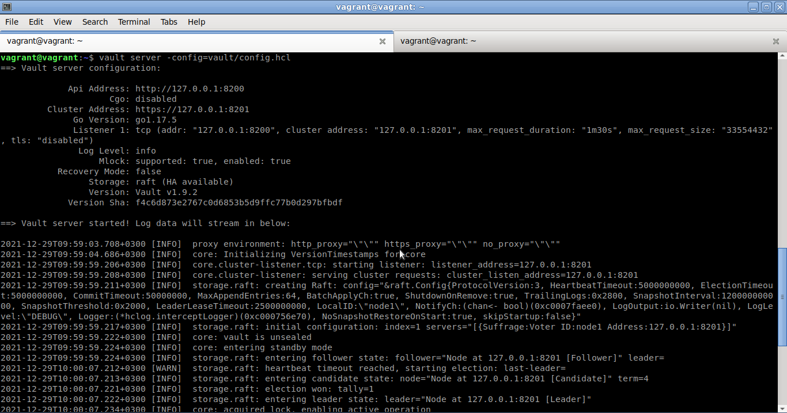
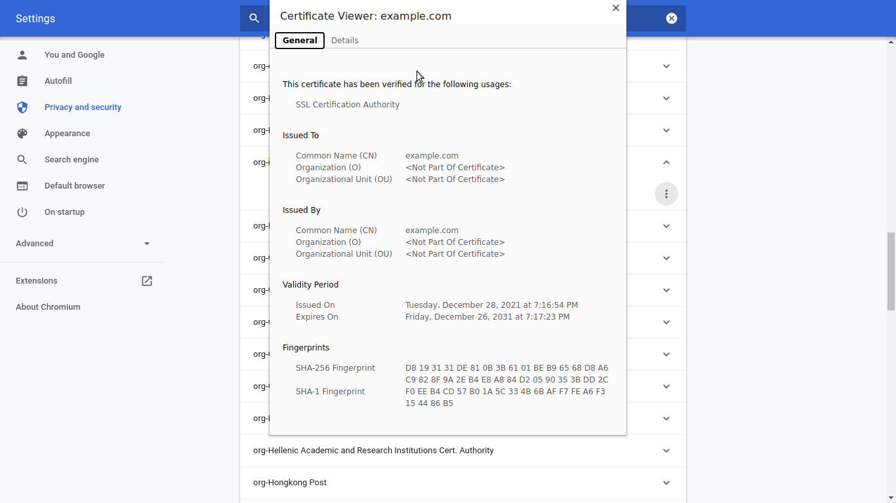
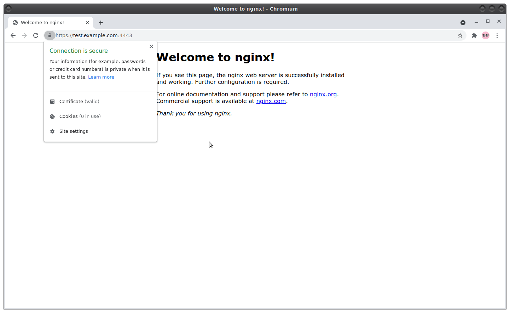
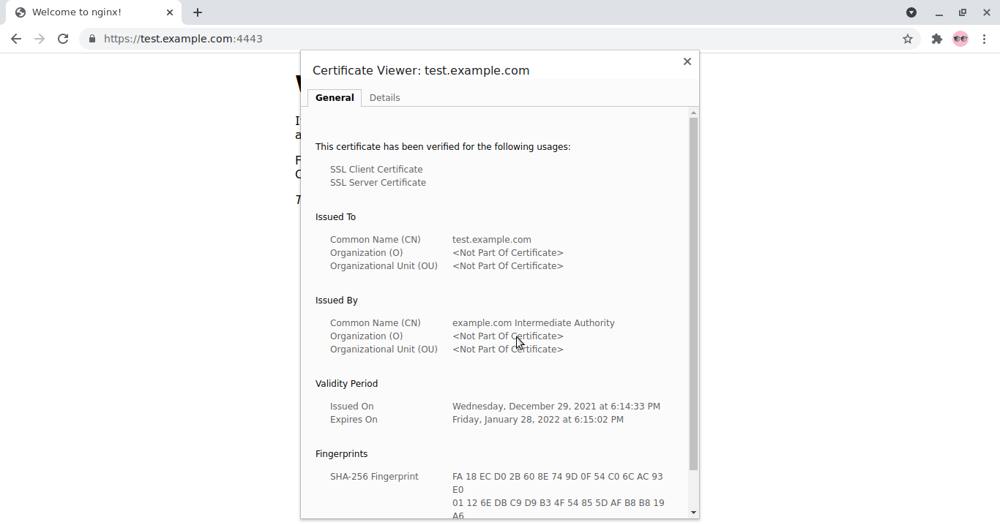

# Task 1
*Создайте виртуальную машину Linux.*  
Содержимое Vagrantfile вполне подходит из предыдущего задания по vagrant:
```
[alexvk@archbox ~]$ cat learn/devops/vagrant/Vagrantfile
Vagrant.configure("2") do |config|
  config.vm.box = "bento/ubuntu-20.04"
    config.vm.provider "virtualbox" do |v|
    v.gui = false
    v.memory = 1024
    v.cpus = 1
    config.vm.network "forwarded_port", guest: 443, host: 4443
  end
end

```
Форвад порта 443 с гостевой машины сделаю на порт 4443 хостовой машины.  
После установки образа VM запускаю созданную виртуальную машину:
```
[alexvk@archbox vagrant]$ vagrant up
Bringing machine 'default' up with 'virtualbox' provider...
==> default: Checking if box 'bento/ubuntu-20.04' version '202112.19.0' is up to date...
==> default: Clearing any previously set forwarded ports...
==> default: Clearing any previously set network interfaces...
==> default: Preparing network interfaces based on configuration...
    default: Adapter 1: nat
==> default: Forwarding ports...
    default: 443 (guest) => 4443 (host) (adapter 1)
    default: 22 (guest) => 2222 (host) (adapter 1)
==> default: Running 'pre-boot' VM customizations...
==> default: Booting VM...
==> default: Waiting for machine to boot. This may take a few minutes...
    default: SSH address: 127.0.0.1:2222
    default: SSH username: vagrant
    default: SSH auth method: private key
    default: Warning: Connection reset. Retrying...
    default: Warning: Remote connection disconnect. Retrying...
==> default: Machine booted and ready!
==> default: Checking for guest additions in VM...
==> default: Mounting shared folders...
    default: /vagrant => /home/alexvk/learn/devops/vagrant
==> default: Machine already provisioned. Run `vagrant provision` or use the `--
==> default: flag to force provisioning. Provisioners marked to run always will 
[alexvk@archbox vagrant]$ vagrant ssh
Welcome to Ubuntu 20.04.2 LTS (GNU/Linux 5.4.0-80-generic x86_64)

 * Documentation:  https://help.ubuntu.com
 * Management:     https://landscape.canonical.com
 * Support:        https://ubuntu.com/advantage

 System information disabled due to load higher than 1.0


This system is built by the Bento project by Chef Software
More information can be found at https://github.com/chef/bento
```
Логин прошел успешно, можно пользоваться созданной VM.

# Task 2
*Установите ufw и разрешите к этой машине сессии на порты 22 и 443, при этом трафик на интерфейсе localhost (lo) должен ходить свободно на все порты.*  
```
vagrant@vagrant:~$ sudo apt-get install ufw
Reading package lists... Done
Building dependency tree       
Reading state information... Done
ufw is already the newest version (0.36-6ubuntu1).
0 upgraded, 0 newly installed, 0 to remove and 0 not upgraded.
```
ufw уже установлен, никаких дополнительных действий производить не нужно.  
Разрешаю входящий траффик на портах 22, 443 и на loopback (исходящий по политике уже разрешен):
```
vagrant@vagrant:~$ sudo ufw status
Status: inactive
vagrant@vagrant:~$ sudo ufw allow ssh 
Rules updated
Rules updated (v6)
vagrant@vagrant:~$ sudo ufw allow https
Rules updated
Rules updated (v6)
vagrant@vagrant:~$ sudo ufw allow in to 127.0.0.0/8
Rule added
```
Запускаю ufw.
```
vagrant@vagrant:~$ sudo ufw enable
Command may disrupt existing ssh connections. Proceed with operation (y|n)? y
Firewall is active and enabled on system startup
vagrant@vagrant:~$ sudo ufw status verbose
Status: active
Logging: on (low)
Default: deny (incoming), allow (outgoing), disabled (routed)
New profiles: skip

To                         Action      From
--                         ------      ----
22/tcp                     ALLOW IN    Anywhere                  
443/tcp                    ALLOW IN    Anywhere                  
127.0.0.0/8                ALLOW IN    Anywhere                  
22/tcp (v6)                ALLOW IN    Anywhere (v6)             
443/tcp (v6)               ALLOW IN    Anywhere (v6) 

vagrant@vagrant:~$ systemctl status ufw
● ufw.service - Uncomplicated firewall
     Loaded: loaded (/lib/systemd/system/ufw.service; enabled; vendor preset: enabled)
     Active: active (exited) since Mon 2021-12-27 11:41:33 MSK; 59min ago
       Docs: man:ufw(8)
   Main PID: 367 (code=exited, status=0/SUCCESS)
      Tasks: 0 (limit: 1112)
     Memory: 0B
     CGroup: /system.slice/ufw.service

Dec 27 11:41:33 vagrant systemd[1]: Finished Uncomplicated firewall.
Warning: journal has been rotated since unit was started, output may be incomplete.
```
Файрволл поднят и настроен согласно задания.

# Task 3
*Установите hashicorp vault (инструкция по ссылке).*  

Выполняю шаги по установке из инструкции:
```
vagrant@vagrant:~$ curl -fsSL https://apt.releases.hashicorp.com/gpg | sudo apt-key add -
OK
vagrant@vagrant:~$ sudo apt-add-repository "deb [arch=amd64] https://apt.releases.hashicorp.com $(lsb_release -cs) main"
Hit:1 http://security.ubuntu.com/ubuntu focal-security InRelease
Hit:2 http://archive.ubuntu.com/ubuntu focal InRelease
Get:3 https://apt.releases.hashicorp.com focal InRelease [9,495 B]
Hit:4 http://archive.ubuntu.com/ubuntu focal-updates InRelease
Hit:5 http://archive.ubuntu.com/ubuntu focal-backports InRelease
Get:6 https://apt.releases.hashicorp.com focal/main amd64 Packages [41.1 kB]
Fetched 50.6 kB in 1s (34.7 kB/s)
Reading package lists... Done
vagrant@vagrant:~$ sudo apt-get update && sudo apt-get install vault
Hit:1 http://archive.ubuntu.com/ubuntu focal InRelease
Hit:2 http://archive.ubuntu.com/ubuntu focal-updates InRelease                 
Hit:3 http://security.ubuntu.com/ubuntu focal-security InRelease               
Hit:4 http://archive.ubuntu.com/ubuntu focal-backports InRelease               
Hit:5 https://apt.releases.hashicorp.com focal InRelease
Reading package lists... Done
Reading package lists... Done
Building dependency tree       
Reading state information... Done
The following NEW packages will be installed:
  vault
0 upgraded, 1 newly installed, 0 to remove and 0 not upgraded.
Need to get 69.4 MB of archives.
After this operation, 188 MB of additional disk space will be used.
Get:1 https://apt.releases.hashicorp.com focal/main amd64 vault amd64 1.9.2 [69.4 MB]
Fetched 69.4 MB in 40s (1,714 kB/s)                                            
Selecting previously unselected package vault.
(Reading database ... 48324 files and directories currently installed.)
Preparing to unpack .../archives/vault_1.9.2_amd64.deb ...
Unpacking vault (1.9.2) ...
Setting up vault (1.9.2) ...
Generating Vault TLS key and self-signed certificate...
Generating a RSA private key
.........................................................................................++++
.................................++++
writing new private key to 'tls.key'
-----
Vault TLS key and self-signed certificate have been generated in '/opt/vault/tls'.
```
Проверяю правильность инсталляции.
```
vagrant@vagrant:~$ vault
Usage: vault <command> [args]

Common commands:
    read        Read data and retrieves secrets
    write       Write data, configuration, and secrets
    delete      Delete secrets and configuration
    list        List data or secrets
    login       Authenticate locally
    agent       Start a Vault agent
    server      Start a Vault server
    status      Print seal and HA status
    unwrap      Unwrap a wrapped secret

Other commands:
    audit          Interact with audit devices
    auth           Interact with auth methods
    debug          Runs the debug command
    kv             Interact with Vault's Key-Value storage
    lease          Interact with leases
    monitor        Stream log messages from a Vault server
    namespace      Interact with namespaces
    operator       Perform operator-specific tasks
    path-help      Retrieve API help for paths
    plugin         Interact with Vault plugins and catalog
    policy         Interact with policies
    print          Prints runtime configurations
    secrets        Interact with secrets engines
    ssh            Initiate an SSH session
    token          Interact with tokens
```
Далее следует деплой сервера vault.  
Создаю конфиг:
```
vagrant@vagrant:~$ cat vault/config.hcl 
storage "raft" {
  path    = "./vault/data"
  node_id = "node1"
}

listener "tcp" {
  address     = "127.0.0.1:8200"
  tls_disable = "true"
}

api_addr = "http://127.0.0.1:8200"
cluster_addr = "https://127.0.0.1:8201"
ui = true
```
В каталоге vault создаю подкаталог data.  
Теперь необходимо инициализировать vault:  
```
vagrant@vagrant:~$ vault operator init
Unseal Key 1: mQoQGOl3THjHd4O4gOMjePJhzwg+otEnlvYSumyPIFbQ
Unseal Key 2: rsoMWLGVRer3ys8IgXiMkhPpXGFBYJBvvpZFp1OGILGX
Unseal Key 3: RRY4QABeJcRBlPO7I0hHhxgFYQcojePEEzm2SVfmIDTP
Unseal Key 4: y/WbLntBzUfBWUXB93cnRb/x6KptYNfIWrJpbtMOIBe5
Unseal Key 5: BdrfwUhbAV7LVdAGhUzP3fkLflHl2oW6HyURavbCIMR9

Initial Root Token: s.V73pcLZIxHT2L8QsAbpWiSog

Vault initialized with 5 key shares and a key threshold of 3. Please securely
distribute the key shares printed above. When the Vault is re-sealed,
restarted, or stopped, you must supply at least 3 of these keys to unseal it
before it can start servicing requests.

Vault does not store the generated master key. Without at least 3 keys to
reconstruct the master key, Vault will remain permanently sealed!

It is possible to generate new unseal keys, provided you have a quorum of
existing unseal keys shares. See "vault operator rekey" for more information.
vagrant@vagrant:~$ 
```
С  помощью ключей "распечатаю" vault. Для это трижды необходимо дать команду `vault operator unseal` и последовательно
ввести три любых ключа (key threshold == 3). Эти действия нужно выполнять каждый раз при перезапуске сервера vault.  
Также в профиле пользователя vagrant в .bashrc добавлю переменную `VAULT_ADDR='http://127.0.0.1:8200'` .  
Теперь можно выполнять логин: `vagrant@vagrant:~$ vault login s.V73pcLZIxHT2L8QsAbpWiSog` - это присвоит переменной окружения VAULT_TOKEN значение, указанное после слова login.  
Скриншот работающего сервера vault.  

Наконец можно создавать сертификат.

# Task 4 
*Cоздайте центр сертификации по инструкции (ссылка) и выпустите сертификат для использования его в настройке веб-сервера nginx (срок жизни сертификата - месяц).*  
Выполняю действия из инструкции:
```
vagrant@vagrant:~$ vault secrets enable pki
Success! Enabled the pki secrets engine at: pki/
vagrant@vagrant:~$ vault secrets tune -max-lease-ttl=87600h pki
Success! Tuned the secrets engine at: pki/
vagrant@vagrant:~$ vault write -field=certificate pki/root/generate/internal \
>      common_name="example.com" \
>      ttl=87600h > CA_cert.crt
vagrant@vagrant:~$ vault write pki/config/urls \
>      issuing_certificates="$VAULT_ADDR/v1/pki/ca" \
>      crl_distribution_points="$VAULT_ADDR/v1/pki/crl"
Success! Data written to: pki/config/urls
vagrant@vagrant:~$ vault secrets enable -path=pki_int pki
Success! Enabled the pki secrets engine at: pki_int/
vagrant@vagrant:~$ vault secrets tune -max-lease-ttl=43800h pki_int
Success! Tuned the secrets engine at: pki_int/
vagrant@vagrant:~$ vault write -format=json pki_int/intermediate/generate/internal \
>      common_name="example.com Intermediate Authority" \
>      | jq -r '.data.csr' > pki_intermediate.csr
vagrant@vagrant:~$ vault write -format=json pki/root/sign-intermediate csr=@pki_intermediate.csr \
>      format=pem_bundle ttl="43800h" \
>      | jq -r '.data.certificate' > intermediate.cert.pem
vagrant@vagrant:~$ vault write pki_int/intermediate/set-signed certificate=@intermediate.cert.pem
Success! Data written to: pki_int/intermediate/set-signed
vagrant@vagrant:~$ vault write pki_int/roles/example-dot-com \
>      allowed_domains="example.com" \
>      allow_subdomains=true \
>      max_ttl="720h"
Success! Data written to: pki_int/roles/example-dot-com 
```
Теперь созданы самоподписанный корневой и промежуточный сертификаты. Корневой сертификат CA_cert.crt нужно добавить в 
браузер.  
Создам сертификаты для nginx. Потребуется приватный ключ, собственно сертификат и промежуточный сертификат удостоверяющего центра.  
```
vagrant@vagrant:~$ vault write -format=json pki_int/issue/example-dot-com common_name="test.example.com" ttl="720h" > cert.crt
vagrant@vagrant:~$ cat cert.crt | jq -r '.data.private_key' > test.example.com.key
vagrant@vagrant:~$ cat cert.crt | jq -r '.data.certificate' > test.example.com.crt
vagrant@vagrant:~$ cat cert.crt | jq -r '.data.ca_chain[]' >> test.example.com.crt
```
На выходе теперь имеется приватный ключ **test.example.com.key** и сертификат **test.example.com.crt** . Их теперь можно
скормить nginx-у.
 
 
# Task 5
*Установите корневой сертификат созданного центра сертификации в доверенные в хостовой системе.*  
Добавляю удостоверяющий сертификат CA в доверенные в браузер Chromium. Для этого выполню шаги: Settings -> Privacy and security -> Security -> Manage certificates -> Authorities -> Import.  


# Task 6
*Установите nginx.*  
```
vagrant@vagrant:~$ sudo apt-get install nginx
[large amount of data skipped]
vagrant@vagrant:~$ apt list nginx
Listing... Done
nginx/focal-updates,focal-updates,focal-security,focal-security,now 1.18.0-0ubuntu1.2 all [installed]

```
nginx установлен. Попытка запуска:  
```
vagrant@vagrant:~$ sudo systemctl start nginx
vagrant@vagrant:~$ sudo systemctl status nginx
● nginx.service - A high performance web server and a reverse proxy server
     Loaded: loaded (/lib/systemd/system/nginx.service; enabled; vendor preset: enabled)
     Active: active (running) since Tue 2021-12-28 20:01:41 MSK; 55s ago
       Docs: man:nginx(8)
    Process: 4678 ExecStartPre=/usr/sbin/nginx -t -q -g daemon on; master_process on; (code=exited, status=0/SUCCESS)
    Process: 4688 ExecStart=/usr/sbin/nginx -g daemon on; master_process on; (code=exited, status=0/SUCCESS)
   Main PID: 4689 (nginx)
      Tasks: 2 (limit: 1112)
     Memory: 2.6M
     CGroup: /system.slice/nginx.service
             ├─4689 nginx: master process /usr/sbin/nginx -g daemon on; master_process on;
             └─4690 nginx: worker process

Dec 28 20:01:40 vagrant systemd[1]: Starting A high performance web server and a reverse proxy server...
Dec 28 20:01:41 vagrant systemd[1]: Started A high performance web server and a reverse proxy server.
vagrant@vagrant:~$ 
```

# Task 7
*По инструкции (ссылка) настройте nginx на https, используя ранее подготовленный сертификат:*  
Для минимизации ошибок воспользуюсь дефолтной настройкой. В каталоге /etc/nginx/sites-enabled есть конфиг default.
Его и буду редактировать (это симлинк на файл /etc/nginx/sites-available/default, поэтому редактируется последний упомянутый файл).  
Собственно конфиг:
```
server {
	listen 443 ssl;
	ssl_certificate		 /home/vagrant/cert/test.example.com.crt;
	ssl_certificate_key  /home/vagrant/cert/test.example.com.key;
	root /var/www/html;
	index index.html index.htm index.nginx-debian.html;
	server_name test.example.com;
	location / {
		try_files $uri $uri/ =404;
	}
}
```
nginx слушает только 443 порт и создает только ssl подключения.  
Созданные файлы сертификатов кладу по путям, указанным в конфиге nginx, после чего рестартую демона.
```
vagrant@vagrant:~$ sudo systemctl restart nginx
vagrant@vagrant:~$ sudo systemctl status nginx
● nginx.service - A high performance web server and a reverse proxy server
     Loaded: loaded (/lib/systemd/system/nginx.service; enabled; vendor preset: enabled)
     Active: active (running) since Wed 2021-12-29 15:15:45 MSK; 9s ago
       Docs: man:nginx(8)
    Process: 2727 ExecStartPre=/usr/sbin/nginx -t -q -g daemon on; master_process on; (code=exited, status=0/SUCCESS)
    Process: 2737 ExecStart=/usr/sbin/nginx -g daemon on; master_process on; (code=exited, status=0/SUCCESS)
   Main PID: 2739 (nginx)
      Tasks: 2 (limit: 1112)
     Memory: 2.5M
     CGroup: /system.slice/nginx.service
             ├─2739 nginx: master process /usr/sbin/nginx -g daemon on; master_process on;
             └─2740 nginx: worker process

Dec 29 15:15:44 vagrant systemd[1]: Starting A high performance web server and a reverse proxy server...
Dec 29 15:15:45 vagrant systemd[1]: Started A high performance web server and a reverse proxy server.
```
Сервер nginx благополучно стартовал и готов обслуживать клиентов. Он использует стандартную страницу приветствия.

# Task 8
*Откройте в браузере на хосте https адрес страницы, которую обслуживает сервер nginx.*  
Для демонстрации полученного на хост-машине в  файле hosts пропишу адрес `127.0.0.1 test.example.com` .  
Порт на гостевой машине для https - 4443. В браузере Chromium уже установлен корневой сертификат. Открываю URL (см. скриншот ниже).

Задача решена.  

# Task 9
*Создайте скрипт, который будет генерировать новый сертификат в vault.*  
Задача - не трогать конфиг nginx. Вариант решения очевиден - необходимо лишь переписывать файлы сертификатов. При перезапуске nginx загрузит новые версии сертфикатов.  
Для решения задачи использую уже готовый вариант выгрузки сертификатов с помощью *vault write -format=json ...*.
```bash
#!/bin/bash


export VAULT_ADDR='http://127.0.0.1:8200'
export VAULT_TOKEN='s.V73pcLZIxHT2L8QsAbpWiSog'
CERT_NAME='test.example.com.crt'
KEY_NAME='test.example.com.key'
FILE_PATH='/home/vagrant/cert/'
CERT_TTL='720h'
cd /home/vagrant
OUTPUT=$($(which vault) write -format=json pki_int/issue/example-dot-com common_name="test.example.com" ttl="$CERT_TTL")
if (($? != 0))
    then
    echo "Error: vault is not available."
    exit 42
fi
`echo $OUTPUT | $(which jq) -r '.data.private_key' > $FILE_PATH$KEY_NAME`
`echo $OUTPUT | $(which jq) -r '.data.certificate' > $FILE_PATH$CERT_NAME`
`echo $OUTPUT | $(which jq) -r '.data.ca_chain[]' >> $FILE_PATH$CERT_NAME`
$(which sudo) $(which systemctl) restart nginx
if (($? != 0))
    then
    echo "Error: nginx restart failed."
    exit 44
fi
exit 0
```
Описание логики: 
1. Устанавливаю переменные окружения для работы vault
2. Определяю переменные с именами файлов и временем жизни сертификата.
3. Перехожу в рабочий каталог.
4. Получаю в переменную вывод из команды vault write в формате JSON (приватный ключ и сертификаты).
5. Если случился неуспех в получении сертификатов, то выход из скрипта.
6. Формирую файлы сертификатов с помощью утилиты jq (JSON parcer).
7. Перезапускаю nginx.
8. Если перезапуск неуспешен, то выйти из скрипта.
9. Конец.

Проверка работы:
```
vagrant@vagrant:~$ ls -la cert
total 16
drwxrwxr-x  2 vagrant vagrant 4096 Dec 28 15:34 .
drwxr-xr-x 11 vagrant vagrant 4096 Dec 29 15:52 ..
-rw-rw-r--  1 vagrant vagrant 2567 Dec 29 15:45 test.example.com.crt
-rw-rw-r--  1 vagrant vagrant 1679 Dec 29 15:45 test.example.com.key
vagrant@vagrant:~$ ./gencrt.sh 
vagrant@vagrant:~$ ls -la cert
total 16
drwxrwxr-x  2 vagrant vagrant 4096 Dec 28 15:34 .
drwxr-xr-x 11 vagrant vagrant 4096 Dec 29 15:54 ..
-rw-rw-r--  1 vagrant vagrant 2567 Dec 29 15:55 test.example.com.crt
-rw-rw-r--  1 vagrant vagrant 1679 Dec 29 15:55 test.example.com.key
```
Очевидно, что файлы сертификатов обновились. Посмотрю на состояние сертификата после обновления в браузере:

Если посмотреть поле *Validity Period*, то время в этом поле совпадает со временем выпуска нового сертификата.  
Вывод: скрипт работает корректно.

# Task 10
*Поместите скрипт в crontab, чтобы сертификат обновлялся какого-то числа каждого месяца в удобное для вас время.*  
Редактирую crontab:
```
vagrant@vagrant:~$ crontab -e
```
Добавляю строчку `0 5 28 * *    /home/vagrant/gencrt.sh`, что приведет к запуску задачи ежемесячно, в 0ч 5м каждого 28 числа.  
Для проверки работы скрипта по крону добавлю в кронтаб также строчку `*/15 * * * * /home/vagrant/gencrt.sh` -- для запуска задания каждые 15 минут.  
```
vagrant@vagrant:~$ ls -la /home/vagrant/cert/
total 16
drwxrwxr-x  2 vagrant vagrant 4096 Dec 28 15:34 .
drwxr-xr-x 12 vagrant vagrant 4096 Dec 29 17:34 ..
-rw-rw-r--  1 vagrant vagrant 2567 Dec 29 18:00 test.example.com.crt
-rw-rw-r--  1 vagrant vagrant 1675 Dec 29 18:00 test.example.com.key
```
Проверяю даты выпуска сертификата в браузере:

И посмотрим на следующую итерацию:
```
vagrant@vagrant:~$ ls -la /home/vagrant/cert/
total 16
drwxrwxr-x  2 vagrant vagrant 4096 Dec 28 15:34 .
drwxr-xr-x 12 vagrant vagrant 4096 Dec 29 17:34 ..
-rw-rw-r--  1 vagrant vagrant 2567 Dec 29 18:15 test.example.com.crt
-rw-rw-r--  1 vagrant vagrant 1675 Dec 29 18:15 test.example.com.key
```

Очевидно, что время создания и время действий сертификата измененились по сравнению с предыдущим шагом.  
Посмотрю системный журнал:
```
Dec 29 18:15:01 vagrant CRON[4885]: pam_unix(cron:session): session opened for user vagrant by (uid=0)
Dec 29 18:15:01 vagrant CRON[4886]: (vagrant) CMD (/home/vagrant/gencrt.sh)
Dec 29 18:15:03 vagrant sudo[4907]:  vagrant : TTY=unknown ; PWD=/home/vagrant ; USER=root ; COMMAND=/usr/bin/systemctl restart nginx
Dec 29 18:15:03 vagrant sudo[4907]: pam_unix(sudo:session): session opened for user root by (uid=0)
Dec 29 18:15:03 vagrant systemd[1]: Stopping A high performance web server and a reverse proxy server...
-- Subject: A stop job for unit nginx.service has begun execution
-- Defined-By: systemd
-- Support: http://www.ubuntu.com/support
-- 
-- A stop job for unit nginx.service has begun execution.
-- 
-- The job identifier is 5869.
Dec 29 18:15:03 vagrant systemd[1]: nginx.service: Succeeded.
-- Subject: Unit succeeded
-- Defined-By: systemd
-- Support: http://www.ubuntu.com/support
-- 
-- 
-- The unit nginx.service has successfully entered the 'dead' state.
Dec 29 18:15:03 vagrant systemd[1]: Stopped A high performance web server and a reverse proxy server.
-- Subject: A stop job for unit nginx.service has finished
-- Defined-By: systemd
-- Support: http://www.ubuntu.com/support
-- 
-- A stop job for unit nginx.service has finished.
-- 
-- The job identifier is 5869 and the job result is done.
Dec 29 18:15:03 vagrant systemd[1]: Starting A high performance web server and a reverse proxy server...
-- Subject: A start job for unit nginx.service has begun execution
-- Defined-By: systemd
-- Support: http://www.ubuntu.com/support
-- 
-- A start job for unit nginx.service has begun execution.
-- 
-- The job identifier is 5869.
Dec 29 18:15:03 vagrant systemd[1]: Started A high performance web server and a reverse proxy server.
-- Subject: A start job for unit nginx.service has finished successfully
-- Defined-By: systemd
-- Support: http://www.ubuntu.com/support
-- 
-- A start job for unit nginx.service has finished successfully.
-- 
-- The job identifier is 5869.
Dec 29 18:15:03 vagrant sudo[4907]: pam_unix(sudo:session): session closed for user root
Dec 29 18:15:03 vagrant CRON[4885]: pam_unix(cron:session): session closed for user vagrant
Dec 29 18:17:02 vagrant CRON[4943]: pam_unix(cron:session): session opened for user root by (uid=0)
Dec 29 18:17:02 vagrant CRON[4944]: (root) CMD (   cd / && run-parts --report /etc/cron.hourly)
Dec 29 18:17:02 vagrant CRON[4943]: pam_unix(cron:session): session closed for user root
Dec 29 18:20:01 vagrant CRON[4951]: pam_unix(cron:session): session opened for user smmsp by (uid=0)
Dec 29 18:20:01 vagrant CRON[4952]: (smmsp) CMD (test -x /etc/init.d/sendmail && test -x /usr/share/sendmail/sendmail && test -x /usr/lib/sm.bin/sen>
Dec 29 18:20:01 vagrant CRON[4951]: pam_unix(cron:session): session closed for user smmsp
lines 64244-64276/64276 (END)
```
Из логов понятно, что генерирующий сертификаты скрипт /home/vagrant/gencrt.sh запустился кроном, отработал корректно, создал сертификаты и перезапустил nginx. Что и требовалось доказать.
 
