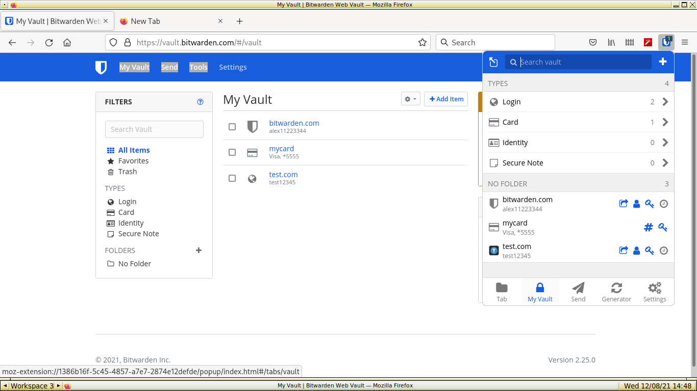
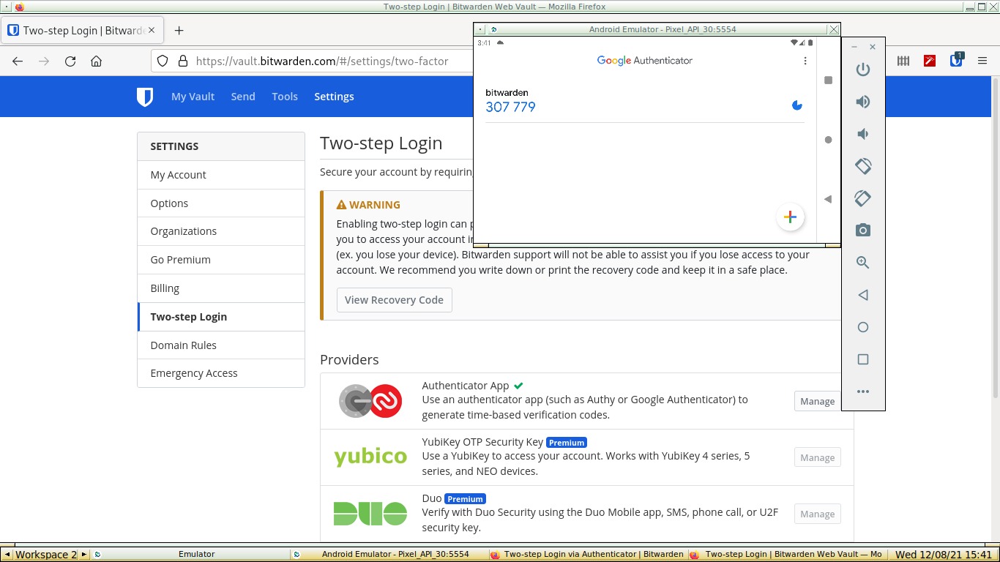
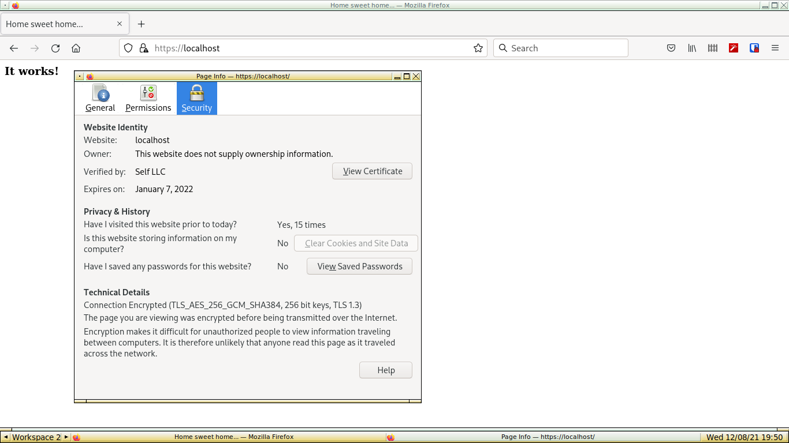
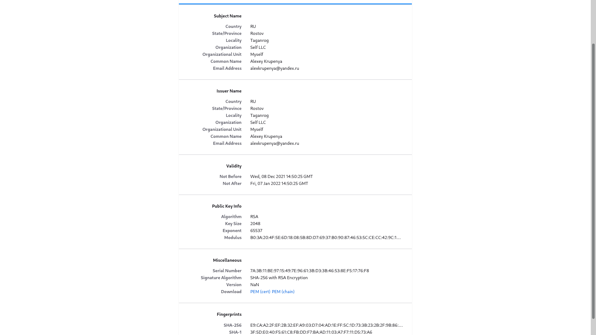
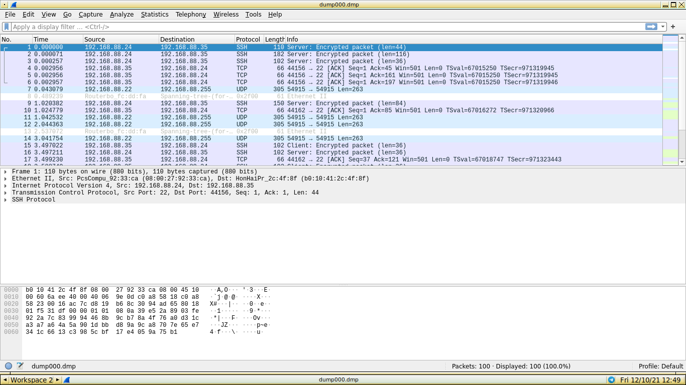
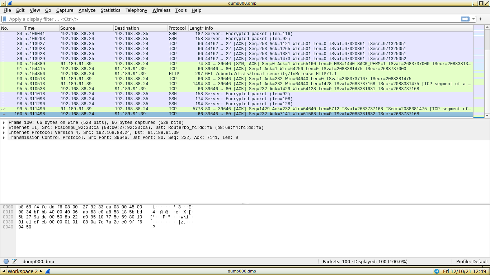

# Task 1
*Установите Bitwarden плагин для браузера. Зарегистрируйтесь и сохраните несколько паролей.*  
Для эксперимента выбираю браузер Firefox. Устанавливаю расширение "Bitwarden - free password manager". 
Далее регистрирую аккаунт. Имя аккаунта - электронная почта. Пароль - предложенный сервисом, сложный по-умолчанию.
Добавляю в список паролей 1 аккаунт - сам bitwarden, и один тестовый аккаунт. Также для наглядности добавлю
платежную карту.  


# Task 2
*Установите Google authenticator на мобильный телефон. Настройте вход в Bitwarden акаунт через Google authenticator OTP.*  
Выполню задание на Android VM из Android Studio.  
Устанавливаю Google Authenticator, после этого запускаю браузер, выполняю логин в Bitwarden vault, и в settings 
устанавливаю two-step login. Выбираю использование Google Authenticator, получаю код, ввожу его в google authenticator,
и все работает - см. скриншот ниже.  
  

# Task 3
*Установите apache2, сгенерируйте самоподписанный сертификат, настройте тестовый сайт для работы по HTTPS.*  
Опускаю установку пакета apache2 и перехожу сразу к созданию сертификата и конфигурированию httpd.  
Сначала необходимо создать CSR (certificate signing request) и заполнить поля запроса своими данными.  
```
[alexvk@archbox conf]$ sudo openssl req -new > mycsr.csr
Generating a RSA private key
...........................................................................+++++
................+++++
writing new private key to 'privkey.pem'
Enter PEM pass phrase:
8<===skipped===
```
Затем приступлю к генерированию собственно сертификата.  
На это шаге генерируется закрытый RSA ключ:
```
 [alexvk@archbox conf]$ sudo openssl rsa -in privkey.pem -out mycert.key
Enter pass phra[alexvk@archbox tmp]$ sudo openssl x509 -in mycsr.csr -out mycert.crt -req -signkey mycert.key -days 30 
Signature ok
subject=C = AU, ST = Some-State, O = Internet Widgits Pty Ltd
Getting Private key
se for privkey.pem:
writing RSA key
```
Далее генерирую собственно сертификат по стандарту открытого ключа x509 ITU-T:
```
[alexvk@archbox conf]$ sudo openssl x509 -in mycsr.csr -out mycert.crt -req -signkey mycert.key -days 30 
Signature ok
subject=C = RU, ST = Rostov, O = Self LLC
Getting Private key
```
Теперь у меня есть ключ mycert.key и PEM сертификат mycert.crt. Можно приступать к конфигурированию apache.  
Скопирую mycert.key в /etc/httpd/conf/server.key и mycert.crt в /etc/httpd/conf/server.crt. Далее раскомментирую
строку LoadModule ssl_module modules/mod_ssl.so в httpd.conf, для включения поддержки ssl; раскомментирую строку 
Include conf/extra/httpd-ssl.conf, чтобы включить опции ssl в чтение конфига демоном httpd.  
Переменные SSLCertificateFile и SSLCertificateKeyFile  в /etc/httpd/conf/extra/httpd-ssl.conf указывают соответственно
на файл сертификата и ключ. В данном задании обойдусь без VirtualHosts.  
Запускаю демона httpd
```
[alexvk@archbox tmp]$ sudo systemctl start httpd
[alexvk@archbox tmp]$ sudo systemctl status httpd
● httpd.service - Apache Web Server
     Loaded: loaded (/usr/lib/systemd/system/httpd.service; disabled; vendor preset: disabled)
     Active: active (running) since Wed 2021-12-08 19:43:37 MSK; 3s ago
   Main PID: 21368 (httpd)
      Tasks: 82 (limit: 8267)
     Memory: 7.3M
        CPU: 80ms
     CGroup: /system.slice/httpd.service
             ├─21368 /usr/bin/httpd -k start -DFOREGROUND
             ├─21369 /usr/bin/httpd -k start -DFOREGROUND
             ├─21370 /usr/bin/httpd -k start -DFOREGROUND
             └─21371 /usr/bin/httpd -k start -DFOREGROUND

Dec 08 19:43:37 archbox systemd[1]: Started Apache Web Server.
Dec 08 19:43:37 archbox httpd[21368]: AH00558: httpd: Could not reliably determine the server's fully qualified domain name, usi>
lines 1-15/15 (END)...skipping...
● httpd.service - Apache Web Server
     Loaded: loaded (/usr/lib/systemd/system/httpd.service; disabled; vendor preset: disabled)
     Active: active (running) since Wed 2021-12-08 19:43:37 MSK; 3s ago
   Main PID: 21368 (httpd)
      Tasks: 82 (limit: 8267)
     Memory: 7.3M
        CPU: 80ms
     CGroup: /system.slice/httpd.service
             ├─21368 /usr/bin/httpd -k start -DFOREGROUND
             ├─21369 /usr/bin/httpd -k start -DFOREGROUND
             ├─21370 /usr/bin/httpd -k start -DFOREGROUND
             └─21371 /usr/bin/httpd -k start -DFOREGROUND

Dec 08 19:43:37 archbox systemd[1]: Started Apache Web Server.
Dec 08 19:43:37 archbox httpd[21368]: AH00558: httpd: Could not reliably determine the server's fully qualified domain name, using fe80::bc20:6932:74c8:143f%wlp1s0. 
```
Статус процесса - running. Запускаю браузер, даю ему адрес https://127.0.0.1/ и проверяю, что получилось:
  
Полная информация по сертификату, полученная из браузера:


# Task 4
*Проверьте на TLS уязвимости произвольный сайт в интернете.*  
Для поиска уязвимостей хорошо подходят сайты учебных заведений, поскольку их часто поднимают и создают любители. Изберу объектом
издевательств сайт Перуанского университета https://www.peru.edu.  
```
[alexvk@archbox ~/testssl.sh]$  ./testssl.sh -U --sneaky https://www.peru.edu >~/stuff.log
```
Получаю файл отчета stuff.log. Делаю strip для ANSI кодов, вывод ниже:
```

###########################################################
    testssl.sh       3.1dev from https://testssl.sh/dev/
    (beac382 2021-12-08 19:29:40 -- )

      This program is free software. Distribution and
             modification under GPLv2 permitted.
      USAGE w/o ANY WARRANTY. USE IT AT YOUR OWN RISK!

       Please file bugs @ https://testssl.sh/bugs/

###########################################################

 Using "OpenSSL 1.0.2-chacha (1.0.2k-dev)" [~183 ciphers]
 on archbox:./bin/openssl.Linux.x86_64
 (built: "Jan 18 17:12:17 2019", platform: "linux-x86_64")


 Start 2021-12-09 12:22:32        -->> 68.169.26.27:443 (www.peru.edu) <<--

 rDNS (68.169.26.27):    perugraduate.oudeve.com. perustudent.oudeve.com. perubobcat.oudeve.com. peru.oudeve.com. s05878.databank.host.
                         perutemplates.oudeve.com.
 Service detected:       HTTP


 Testing vulnerabilities 

 Heartbleed (CVE-2014-0160)                not vulnerable (OK), timed out
 CCS (CVE-2014-0224)                       not vulnerable (OK)
 Ticketbleed (CVE-2016-9244), experiment.  not vulnerable (OK)
 ROBOT                                     Server does not support any cipher suites that use RSA key transport
 Secure Renegotiation (RFC 5746)           supported (OK)
 Secure Client-Initiated Renegotiation     not vulnerable (OK)
 CRIME, TLS (CVE-2012-4929)                not vulnerable (OK)
 BREACH (CVE-2013-3587)                    no gzip/deflate/compress/br HTTP compression (OK)  - only supplied "/" tested
 POODLE, SSL (CVE-2014-3566)               not vulnerable (OK)
 TLS_FALLBACK_SCSV (RFC 7507)              Downgrade attack prevention supported (OK)
 SWEET32 (CVE-2016-2183, CVE-2016-6329)    VULNERABLE, uses 64 bit block ciphers
 FREAK (CVE-2015-0204)                     not vulnerable (OK)
 DROWN (CVE-2016-0800, CVE-2016-0703)      not vulnerable on this host and port (OK)
                                           make sure you don't use this certificate elsewhere with SSLv2 enabled services
                                           https://censys.io/ipv4?q=D52023E3BEA0101ACA61CE8CE74E0A1E32DC2A2EA7CA44E680814D82A5885CB5 could help you to find out
 LOGJAM (CVE-2015-4000), experimental      not vulnerable (OK): no DH EXPORT ciphers, no DH key detected with <= TLS 1.2
 BEAST (CVE-2011-3389)                     TLS1: ECDHE-RSA-AES256-SHA AECDH-AES256-SHA ECDHE-RSA-AES128-SHA AECDH-AES128-SHA ECDHE-RSA-DES-CBC3-SHA
                                                 AECDH-DES-CBC3-SHA 
                                           VULNERABLE -- but also supports higher protocols  TLSv1.1 TLSv1.2 (likely mitigated)
 LUCKY13 (CVE-2013-0169), experimental     potentially VULNERABLE, uses cipher block chaining (CBC) ciphers with TLS. Check patches
 Winshock (CVE-2014-6321), experimental    not vulnerable (OK) - CAMELLIA or ECDHE_RSA GCM ciphers found
 RC4 (CVE-2013-2566, CVE-2015-2808)        VULNERABLE (NOT ok): ECDHE-RSA-RC4-SHA AECDH-RC4-SHA 


 Done 2021-12-09 12:23:45 [  77s] -->> 68.169.26.27:443 (www.peru.edu) <<--
```
Как видно из отчета, утилита testssl.sh нашла уязвимости по адресу 68.168.26.27:443.

# Task 5

*Установите на Ubuntu ssh сервер, сгенерируйте новый приватный ключ. Скопируйте свой публичный ключ на другой сервер. Подключитесь к серверу по SSH-ключу.*  
Генерирую ключ.
```
alexvk@alexvk-VirtualBox:~$ ssh-keygen
Generating public/private rsa key pair.
Enter file in which to save the key (/home/alexvk/.ssh/id_rsa): 
Enter passphrase (empty for no passphrase): 
Enter same passphrase again: 
Your identification has been saved in /home/alexvk/.ssh/id_rsa
Your public key has been saved in /home/alexvk/.ssh/id_rsa.pub
The key fingerprint is:
SHA256:EBIBztn8T+0ggDsNWf2IevEyrqSavXxkgTw/T76kfyg alexvk@alexvk-VirtualBox
The key's randomart image is:
+---[RSA 3072]----+
|  ..=+.          |
| o B ...         |
| .B.+..o         |
|  +++o....       |
|  o+.+o S .      |
|  ..O o+ o       |
|  .= B... .      |
| *  Eo+ .        |
|= =+.ooo         |
+----[SHA256]-----+
```
Копирую ключ на другую  машину:
```
alexvk@alexvk-VirtualBox:~$ ssh-copy-id alexvk@192.168.88.35
/usr/bin/ssh-copy-id: INFO: Source of key(s) to be installed: "/home/alexvk/.ssh/id_rsa.pub"
The authenticity of host '192.168.88.35 (192.168.88.35)' can't be established.
ECDSA key fingerprint is SHA256:uVGO8QXPL9B2YIFhyX4jxKi9SljUIyVUKmew8wQ3uew.
Are you sure you want to continue connecting (yes/no/[fingerprint])? yes
/usr/bin/ssh-copy-id: INFO: attempting to log in with the new key(s), to filter out any that are already installed
/usr/bin/ssh-copy-id: INFO: 1 key(s) remain to be installed -- if you are prompted now it is to install the new keys
alexvk@192.168.88.35's password: 

Number of key(s) added: 1

Now try logging into the machine, with:   "ssh 'alexvk@192.168.88.35'"
and check to make sure that only the key(s) you wanted were added.
```
Выполняю логин:
```
alexvk@alexvk-VirtualBox:~$ ssh alexvk@192.168.88.35
Last login: Thu Dec  9 19:46:48 2021 from 192.168.88.24
[alexvk@archbox ~]$ uname -a
Linux archbox 5.15.6-arch2-1 #1 SMP PREEMPT Thu, 02 Dec 2021 15:47:09 +0000 x86_64 GNU/Linux
[alexvk@archbox ~]$ 
logout
Connection to 192.168.88.35 closed.
alexvk@alexvk-VirtualBox:~$ uname -a
Linux alexvk-VirtualBox 5.11.0-41-generic #45~20.04.1-Ubuntu SMP Wed Nov 10 10:20:10 UTC 2021 x86_64 x86_64 x86_64 GNU/Linux
alexvk@alexvk-VirtualBox:~$ 
```
Задача выполнена.

# Task 6
*Переименуйте файлы ключей из задания 5. Настройте файл конфигурации SSH клиента, так чтобы вход на удаленный сервер осуществлялся по имени сервера.*  
В  каталоге .ssh переименую файлы id_rsa и id_rsa.pub соответственно в id_rsa_server.key и id_rsa_server.pub. После этого в том же каталоге .ssh создам
конфиг для ssh:
```
Host ubuntu_server  
        HostName 192.168.88.24  
        IdentityFile ~/.ssh/id_rsa_server.key  
        User alexvk
        Port 22
        StrictHostKeyChecking yes
        Protocol 2
```
где 192.168.88.24 - адрес сервер ssh, к которому  я намерен подключаться.  
Выполняю логин:
```
[alexvk@archbox .ssh]$ ssh ubuntu_server
alexvk@192.168.88.24's password: 
Welcome to Ubuntu 20.04.3 LTS (GNU/Linux 5.11.0-41-generic x86_64)

 * Documentation:  https://help.ubuntu.com
 * Management:     https://landscape.canonical.com
 * Support:        https://ubuntu.com/advantage

0 updates can be applied immediately.

Your Hardware Enablement Stack (HWE) is supported until April 2025.
Last login: Fri Dec 10 11:58:51 2021 from 192.168.88.35
alexvk@alexvk-VirtualBox:~$ 
```
Таким образом, ssh создал терминальную сессию на удаленном сервере, указанном по имени в конфиге. Задача
решена.

# Task 7

*Соберите дамп трафика утилитой tcpdump в формате pcap, 100 пакетов. Откройте файл pcap в Wireshark.*  
Для коллекционирования пакетов использую tcpdump.
```
alexvk@alexvk-VirtualBox:~$ sudo tcpdump -c 100 -w dump000.dmp
```
После завершения работы утилиты на выходе имеется файл dump000.dmp в формате pcap. В файле содержится 100 пакетов.  
Теперь этот файл можно открыть анализатором траффика wireshark.  

И окончание дампа (пакет 100).


