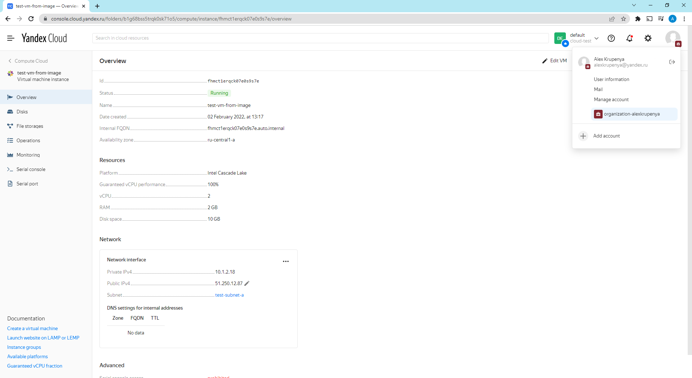
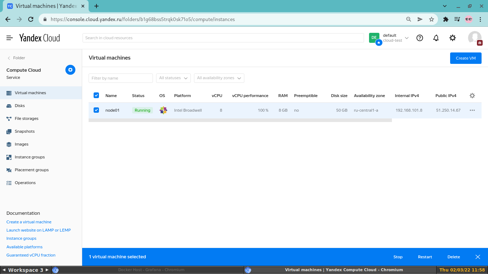
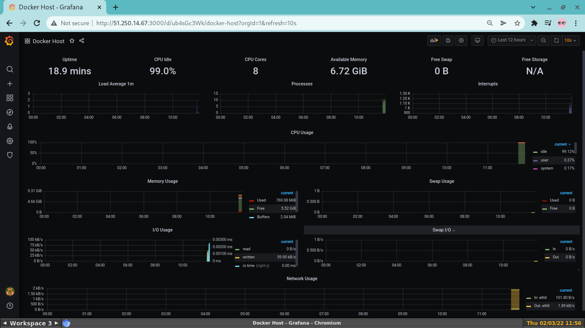

# Task 1

*Создать собственный образ операционной системы с помощью Packer.*

*Для получения зачета, вам необходимо предоставить:*

* *Скриншот страницы, как на слайде из презентации (слайд 37).*

Для выполнения этого задания необходимо воспользоваться yandex cloud. Для получения ресурса использую
уже существующий аккаунт яндекса.  
Работать с облаком придется с помощью консольной утилиты "yc", которую можно получить по указаной на cloud.yandex.ru ссылке.  
После установки "yc" начинаю выполнение задания:
* Получаю OAuth-токен в сервисе Яндекс.OAuth. 
* Запускую команду yc init, чтобы выполнить настройку профиля CLI.
* После настройки профиля проверяю его:
```
[alexvk@archbox ~]$ yc config list
token: AQXXXXXXXXXXXXXXXXXXXXXXXXXXXXXXXXXXXXX
cloud-id: b1g0nrf39i3bjgqgelj6
folder-id: b1gu0p7nfai9neniqsf7
compute-default-zone: ru-central1-a
```

Далее, создаю сеть для облачных ВМ:
```
[alexvk@archbox ~]$ yc vpc network create \
> --name testnet \
> --labels my-label=netology \
> --description "my first test network"
id: enp12n0epinedcff3pt3
folder_id: b1g68bss5trqk0sk71o5
created_at: "2022-02-02T07:13:31Z"
name: testnet
description: my first test network
labels:
  my-label: netology
```

Посмотрю список имеющихся сетей:
```
[alexvk@archbox ~]$ yc vpc network list
+----------------------+---------+
|          ID          |  NAME   |
+----------------------+---------+
| enp12n0epinedcff3pt3 | testnet |
+----------------------+---------+
```

Теперь требуется создать подсеть:
```
[alexvk@archbox ~]$ yc vpc subnet create \
> --name test-subnet-a \
> --zone ru-central1-a \
> --range 10.1.2.0.24 \
> --network-name testnet \
> --description "first test subnet"
id: e9bl8ci4g52d0ftjmla2
folder_id: b1g68bss5trqk0sk71o5
created_at: "2022-02-02T07:39:00Z"
name: test-subnet-a
description: first test subnet
network_id: enp12n0epinedcff3pt3
zone_id: ru-central1-a
v4_cidr_blocks:
- 10.1.2.0/24
```
Проверяю версию packer:
```
[alexvk@archbox ~]$ packer -v
1.7.9
```
Проверяю валидность сборки:
```
[alexvk@archbox ~]$ packer validate centos-7-base.json
The configuration is valid.
```
Провожу сборку:
```
[alexvk@archbox ~]$ packer build centos-7-base.json
yandex: output will be in this color.

==> yandex: Creating temporary RSA SSH key for instance...
==> yandex: Using as source image: fd8aqitd4vl5950ihohp (name: "centos-7-v20220131", family: "centos-7")
==> yandex: Use provided subnet id e9bl8ci4g52d0ftjmla2
==> yandex: Creating disk...
==> yandex: Creating instance...
==> yandex: Waiting for instance with id fhmhe9b3mh0aoj4bg4ia to become active...
    yandex: Detected instance IP: 51.250.7.148
==> yandex: Using SSH communicator to connect: 51.250.7.148
==> yandex: Waiting for SSH to become available...
==> yandex: Connected to SSH!
==> yandex: Provisioning with shell script: /tmp/packer-shell2111298604
    yandex: Loaded plugins: fastestmirror
    yandex: Loading mirror speeds from cached hostfile
    yandex:  * base: mirror.yandex.ru
    yandex:  * extras: mirror.yandex.ru
    yandex:  * updates: mirror.yandex.ru
    yandex: No packages marked for update
    yandex: Loaded plugins: fastestmirror
    yandex: Loading mirror speeds from cached hostfile
    yandex:  * base: mirror.yandex.ru
    yandex:  * extras: mirror.yandex.ru
    yandex:  * updates: mirror.yandex.ru
    yandex: Package iptables-1.4.21-35.el7.x86_64 already installed and latest version
    yandex: Package curl-7.29.0-59.el7_9.1.x86_64 already installed and latest version
    yandex: Package net-tools-2.0-0.25.20131004git.el7.x86_64 already installed and latest version
    yandex: Package rsync-3.1.2-10.el7.x86_64 already installed and latest version
    yandex: Package openssh-server-7.4p1-22.el7_9.x86_64 already installed and latest version
    yandex: Resolving Dependencies
    yandex: --> Running transaction check
    yandex: ---> Package bind-utils.x86_64 32:9.11.4-26.P2.el7_9.8 will be installed
    yandex: --> Processing Dependency: bind-libs-lite(x86-64) = 32:9.11.4-26.P2.el7_9.8 for package: 32:bind-utils-9.11.4-26.P2.el7_9.8.x86_64
    yandex: --> Processing Dependency: bind-libs(x86-64) = 32:9.11.4-26.P2.el7_9.8 for package: 32:bind-utils-9.11.4-26.P2.el7_9.8.x86_64
    yandex: --> Processing Dependency: liblwres.so.160()(64bit) for package: 32:bind-utils-9.11.4-26.P2.el7_9.8.x86_64
    yandex: --> Processing Dependency: libisccfg.so.160()(64bit) for package: 32:bind-utils-9.11.4-26.P2.el7_9.8.x86_64
    yandex: --> Processing Dependency: libisc.so.169()(64bit) for package: 32:bind-utils-9.11.4-26.P2.el7_9.8.x86_64
    yandex: --> Processing Dependency: libirs.so.160()(64bit) for package: 32:bind-utils-9.11.4-26.P2.el7_9.8.x86_64
    yandex: --> Processing Dependency: libdns.so.1102()(64bit) for package: 32:bind-utils-9.11.4-26.P2.el7_9.8.x86_64
    yandex: --> Processing Dependency: libbind9.so.160()(64bit) for package: 32:bind-utils-9.11.4-26.P2.el7_9.8.x86_64
    yandex: --> Processing Dependency: libGeoIP.so.1()(64bit) for package: 32:bind-utils-9.11.4-26.P2.el7_9.8.x86_64
    yandex: ---> Package bridge-utils.x86_64 0:1.5-9.el7 will be installed
    yandex: ---> Package tcpdump.x86_64 14:4.9.2-4.el7_7.1 will be installed
    yandex: --> Processing Dependency: libpcap >= 14:1.5.3-10 for package: 14:tcpdump-4.9.2-4.el7_7.1.x86_64
    yandex: --> Processing Dependency: libpcap.so.1()(64bit) for package: 14:tcpdump-4.9.2-4.el7_7.1.x86_64
    yandex: ---> Package telnet.x86_64 1:0.17-66.el7 will be installed
    yandex: --> Running transaction check
    yandex: ---> Package GeoIP.x86_64 0:1.5.0-14.el7 will be installed
    yandex: --> Processing Dependency: geoipupdate for package: GeoIP-1.5.0-14.el7.x86_64
    yandex: ---> Package bind-libs.x86_64 32:9.11.4-26.P2.el7_9.8 will be installed
    yandex: --> Processing Dependency: bind-license = 32:9.11.4-26.P2.el7_9.8 for package: 32:bind-libs-9.11.4-26.P2.el7_9.8.x86_64
    yandex: ---> Package bind-libs-lite.x86_64 32:9.11.4-26.P2.el7_9.8 will be installed
    yandex: ---> Package libpcap.x86_64 14:1.5.3-12.el7 will be installed
    yandex: --> Running transaction check
    yandex: ---> Package bind-license.noarch 32:9.11.4-26.P2.el7_9.8 will be installed
    yandex: ---> Package geoipupdate.x86_64 0:2.5.0-1.el7 will be installed
    yandex: --> Finished Dependency Resolution
    yandex:
    yandex: Dependencies Resolved
    yandex:
    yandex: ================================================================================
    yandex:  Package            Arch       Version                        Repository   Size
    yandex: ================================================================================
    yandex: Installing:
    yandex:  bind-utils         x86_64     32:9.11.4-26.P2.el7_9.8        updates     261 k
    yandex:  bridge-utils       x86_64     1.5-9.el7                      base         32 k
    yandex:  tcpdump            x86_64     14:4.9.2-4.el7_7.1             base        422 k
    yandex:  telnet             x86_64     1:0.17-66.el7                  updates      64 k
    yandex: Installing for dependencies:
    yandex:  GeoIP              x86_64     1.5.0-14.el7                   base        1.5 M
    yandex:  bind-libs          x86_64     32:9.11.4-26.P2.el7_9.8        updates     157 k
    yandex:  bind-libs-lite     x86_64     32:9.11.4-26.P2.el7_9.8        updates     1.1 M
    yandex:  bind-license       noarch     32:9.11.4-26.P2.el7_9.8        updates      91 k
    yandex:  geoipupdate        x86_64     2.5.0-1.el7                    base         35 k
    yandex:  libpcap            x86_64     14:1.5.3-12.el7                base        139 k
    yandex:
    yandex: Transaction Summary
    yandex: ================================================================================
    yandex: Install  4 Packages (+6 Dependent packages)
    yandex:
    yandex: Total download size: 3.8 M
    yandex: Installed size: 9.0 M
    yandex: Downloading packages:
    yandex: --------------------------------------------------------------------------------
    yandex: Total                                              9.1 MB/s | 3.8 MB  00:00
    yandex: Running transaction check
    yandex: Running transaction test
    yandex: Transaction test succeeded
    yandex: Running transaction
    yandex:   Installing : 32:bind-license-9.11.4-26.P2.el7_9.8.noarch                 1/10
    yandex:   Installing : geoipupdate-2.5.0-1.el7.x86_64                              2/10
    yandex:   Installing : GeoIP-1.5.0-14.el7.x86_64                                   3/10
    yandex:   Installing : 32:bind-libs-lite-9.11.4-26.P2.el7_9.8.x86_64               4/10
    yandex:   Installing : 32:bind-libs-9.11.4-26.P2.el7_9.8.x86_64                    5/10
    yandex:   Installing : 14:libpcap-1.5.3-12.el7.x86_64                              6/10
    yandex: pam_tally2: Error opening /var/log/tallylog for update: Permission denied
    yandex: pam_tally2: Authentication error
    yandex: useradd: failed to reset the tallylog entry of user "tcpdump"
    yandex:   Installing : 14:tcpdump-4.9.2-4.el7_7.1.x86_64                           7/10
    yandex:   Installing : 32:bind-utils-9.11.4-26.P2.el7_9.8.x86_64                   8/10
    yandex:   Installing : bridge-utils-1.5-9.el7.x86_64                               9/10
    yandex:   Installing : 1:telnet-0.17-66.el7.x86_64                                10/10
    yandex:   Verifying  : GeoIP-1.5.0-14.el7.x86_64                                   1/10
    yandex:   Verifying  : 1:telnet-0.17-66.el7.x86_64                                 2/10
    yandex:   Verifying  : 14:libpcap-1.5.3-12.el7.x86_64                              3/10
    yandex:   Verifying  : geoipupdate-2.5.0-1.el7.x86_64                              4/10
    yandex:   Verifying  : 14:tcpdump-4.9.2-4.el7_7.1.x86_64                           5/10
    yandex:   Verifying  : 32:bind-license-9.11.4-26.P2.el7_9.8.noarch                 6/10
    yandex:   Verifying  : 32:bind-libs-lite-9.11.4-26.P2.el7_9.8.x86_64               7/10
    yandex:   Verifying  : 32:bind-utils-9.11.4-26.P2.el7_9.8.x86_64                   8/10
    yandex:   Verifying  : 32:bind-libs-9.11.4-26.P2.el7_9.8.x86_64                    9/10
    yandex:   Verifying  : bridge-utils-1.5-9.el7.x86_64                              10/10
    yandex:
    yandex: Installed:
    yandex:   bind-utils.x86_64 32:9.11.4-26.P2.el7_9.8   bridge-utils.x86_64 0:1.5-9.el7
    yandex:   tcpdump.x86_64 14:4.9.2-4.el7_7.1           telnet.x86_64 1:0.17-66.el7
    yandex:
    yandex: Dependency Installed:
    yandex:   GeoIP.x86_64 0:1.5.0-14.el7
    yandex:   bind-libs.x86_64 32:9.11.4-26.P2.el7_9.8
    yandex:   bind-libs-lite.x86_64 32:9.11.4-26.P2.el7_9.8
    yandex:   bind-license.noarch 32:9.11.4-26.P2.el7_9.8
    yandex:   geoipupdate.x86_64 0:2.5.0-1.el7
    yandex:   libpcap.x86_64 14:1.5.3-12.el7
    yandex:
    yandex: Complete!
==> yandex: Stopping instance...
==> yandex: Deleting instance...
    yandex: Instance has been deleted!
==> yandex: Creating image: centos-7-base
==> yandex: Waiting for image to complete...
==> yandex: Success image create...
==> yandex: Destroying boot disk...
    yandex: Disk has been deleted!
Build 'yandex' finished after 2 minutes 28 seconds.

==> Wait completed after 2 minutes 28 seconds

==> Builds finished. The artifacts of successful builds are:
--> yandex: A disk image was created: centos-7-base (id: fd8jt4i54r12uvrsheh1) with family name centos
```
Далее по заданию нужен листинг образов ОС:
```
[alexvk@archbox ~]$ yc compute image list
+----------------------+---------------+--------+----------------------+--------+
|          ID          |     NAME      | FAMILY |     PRODUCT IDS      | STATUS |
+----------------------+---------------+--------+----------------------+--------+
| fd8jt4i54r12uvrsheh1 | centos-7-base | centos | f2eacrudv331nbat9ehb | READY  |
+----------------------+---------------+--------+----------------------+--------+
```
Задание выполнено.

# Task 2

*Создать вашу первую виртуальную машину в Яндекс.Облаке.*

*Для получения зачета, вам необходимо предоставить:*

* *Скриншот страницы свойств созданной ВМ, как на примере.*

Создам виртуальную машину из собранного образа:
```
[alexvk@archbox devops]$ yc compute instance create\ 
--name test-vm-from-image \
--zone ru-central1-a \ 
--create-boot-disk name=disk1,size=10,image-id=fd8jt4i54r12uvrsheh1 \
--public-ip \ 
--ssh-key ~/.ssh/id_rsa.pub

done (27s)
id: fhmct1erqck07e0s9s7e
folder_id: b1g68bss5trqk0sk71o5
created_at: "2022-02-02T10:17:01Z"
name: test-vm-from-image
zone_id: ru-central1-a
platform_id: standard-v2
resources:
  memory: "2147483648"
  cores: "2"
  core_fraction: "100"
status: RUNNING
boot_disk:
  mode: READ_WRITE
  device_name: fhmpqmkit14o4km70vqv
  auto_delete: true
  disk_id: fhmpqmkit14o4km70vqv
network_interfaces:
- index: "0"
  mac_address: d0:0d:ce:85:db:d3
  subnet_id: e9bl8ci4g52d0ftjmla2
  primary_v4_address:
    address: 10.1.2.18
    one_to_one_nat:
      address: 51.250.12.87
      ip_version: IPV4
fqdn: fhmct1erqck07e0s9s7e.auto.internal
scheduling_policy: {}
network_settings:
  type: STANDARD
placement_policy: {}
```
Проверяю состояние VM:
```
[alexvk@archbox devops]$ yc compute instance list
+----------------------+--------------------+---------------+---------+--------------+-------------+
|          ID          |        NAME        |    ZONE ID    | STATUS  | EXTERNAL IP  | INTERNAL IP |
+----------------------+--------------------+---------------+---------+--------------+-------------+
| fhmct1erqck07e0s9s7e | test-vm-from-image | ru-central1-a | RUNNING | 51.250.12.87 | 10.1.2.18   |
+----------------------+--------------------+---------------+---------+--------------+-------------+
```



# Task 3

*Создать ваш первый готовый к боевой эксплуатации компонент мониторинга, состоящий из стека микросервисов.*

*Для получения зачета, вам необходимо предоставить:*

* *Скриншот работающего веб-интерфейса Grafana с текущими метриками, как на примере ниже*

Для выполнения задания используется Terraform и Ansible.  
Прежде всего необходимо создать сеервисный аккаунт для облака.  
Создаю аккаунт *operator* с соответствующими правами.
```
[alexvk@archbox ~]$ yc iam key create --service-account-name default-sa --output key.json
id: aje83v701b1un777sh40
service_account_id: aje3932acd0c5ur7dagp
created_at: "2019-08-26T12:31:25Z"
key_algorithm: RSA_2048
```
Далее создаю профиль в соответствие с документацией к яндекс-облаку, ссылка https://cloud.yandex.ru/docs/cli/operations/authentication/service-account .
Вывод не привожу, все действии тривиальны, выполнены пошагово по инструкции.  
Файл key.json перемещаю в каталог с конфигурационными файлами Terraform. Редактирую файл *variables.tf*,
присваивая переменным необходимые значения для работы в моем облаке. Далее инициализирую Terraform.
```
[alexvk@archbox terraform]$ terraform init

Initializing the backend...

Initializing provider plugins...
- Finding latest version of yandex-cloud/yandex...
- Installing yandex-cloud/yandex v0.70.0...
- Installed yandex-cloud/yandex v0.70.0 (self-signed, key ID E40F590B50BB8E40)

Partner and community providers are signed by their developers.
If you'd like to know more about provider signing, you can read about it here:
https://www.terraform.io/docs/cli/plugins/signing.html

Terraform has created a lock file .terraform.lock.hcl to record the provider
selections it made above. Include this file in your version control repository
so that Terraform can guarantee to make the same selections by default when
you run "terraform init" in the future.

Terraform has been successfully initialized!

You may now begin working with Terraform. Try running "terraform plan" to see
any changes that are required for your infrastructure. All Terraform commands
should now work.

If you ever set or change modules or backend configuration for Terraform,
rerun this command to reinitialize your working directory. If you forget, other
commands will detect it and remind you to do so if necessary.
```

Выполняю  команду terraform plan .
```
[alexvk@archbox terraform]$ terraform plan

Terraform used the selected providers to generate the following execution plan. Resource actions are indicated with the following symbols:
  + create

Terraform will perform the following actions:

  # yandex_compute_instance.node01 will be created
  + resource "yandex_compute_instance" "node01" {
      + allow_stopping_for_update = true
      + created_at                = (known after apply)
      + folder_id                 = (known after apply)
      + fqdn                      = (known after apply)
      + hostname                  = "node01.netology.cloud"
      + id                        = (known after apply)
      + metadata                  = {
          + "ssh-keys" = <<-EOT
                centos:ssh-rsa [key skipped] alexvk@archbox
            EOT
        }
      + name                      = "node01"
      + network_acceleration_type = "standard"
      + platform_id               = "standard-v1"
      + service_account_id        = (known after apply)
      + status                    = (known after apply)
      + zone                      = "ru-central1-a"

      + boot_disk {
          + auto_delete = true
          + device_name = (known after apply)
          + disk_id     = (known after apply)
          + mode        = (known after apply)

          + initialize_params {
              + block_size  = (known after apply)
              + description = (known after apply)
              + image_id    = "fd8jt4i54r12uvrsheh1"
              + name        = "root-node01"
              + size        = 50
              + snapshot_id = (known after apply)
              + type        = "network-nvme"
            }
        }

      + network_interface {
          + index              = (known after apply)
          + ip_address         = (known after apply)
          + ipv4               = true
          + ipv6               = (known after apply)
          + ipv6_address       = (known after apply)
          + mac_address        = (known after apply)
          + nat                = true
          + nat_ip_address     = (known after apply)
          + nat_ip_version     = (known after apply)
          + security_group_ids = (known after apply)
          + subnet_id          = (known after apply)
        }

      + placement_policy {
          + placement_group_id = (known after apply)
        }

      + resources {
          + core_fraction = 100
          + cores         = 8
          + memory        = 8
        }

      + scheduling_policy {
          + preemptible = (known after apply)
        }
    }

  # yandex_vpc_network.default will be created
  + resource "yandex_vpc_network" "default" {
      + created_at                = (known after apply)
      + default_security_group_id = (known after apply)
      + folder_id                 = (known after apply)
      + id                        = (known after apply)
      + labels                    = (known after apply)
      + name                      = "net"
      + subnet_ids                = (known after apply)
    }

  # yandex_vpc_subnet.default will be created
  + resource "yandex_vpc_subnet" "default" {
      + created_at     = (known after apply)
      + folder_id      = (known after apply)
      + id             = (known after apply)
      + labels         = (known after apply)
      + name           = "subnet"
      + network_id     = (known after apply)
      + v4_cidr_blocks = [
          + "192.168.101.0/24",
        ]
      + v6_cidr_blocks = (known after apply)
      + zone           = "ru-central1-a"
    }

Plan: 3 to add, 0 to change, 0 to destroy.

Changes to Outputs:
  + external_ip_address_node01_yandex_cloud = (known after apply)
  + internal_ip_address_node01_yandex_cloud = (known after apply)

─────────────────────────────────────────────────────────────────────────────────────────────────────────────────────────────────────────────────────────────────────────

Note: You didn't use the -out option to save this plan, so Terraform can't guarantee to take exactly these actions if you run "terraform apply" now.
```
Применяю план Terraform:
```
[alexvk@archbox terraform]$ terraform apply -auto-approve

Terraform used the selected providers to generate the following execution plan. Resource actions are indicated with the following symbols:
  + create

Terraform will perform the following actions:

  # yandex_compute_instance.node01 will be created
  + resource "yandex_compute_instance" "node01" {
      + allow_stopping_for_update = true
      + created_at                = (known after apply)
      + folder_id                 = (known after apply)
      + fqdn                      = (known after apply)
      + hostname                  = "node01.netology.cloud"
      + id                        = (known after apply)
      + metadata                  = {
          + "ssh-keys" = <<-EOT
                centos:ssh-rsa [keys skipped] alexvk@archbox
            EOT
        }
      + name                      = "node01"
      + network_acceleration_type = "standard"
      + platform_id               = "standard-v1"
      + service_account_id        = (known after apply)
      + status                    = (known after apply)
      + zone                      = "ru-central1-a"

      + boot_disk {
          + auto_delete = true
          + device_name = (known after apply)
          + disk_id     = (known after apply)
          + mode        = (known after apply)

          + initialize_params {
              + block_size  = (known after apply)
              + description = (known after apply)
              + image_id    = "fd8jt4i54r12uvrsheh1"
              + name        = "root-node01"
              + size        = 50
              + snapshot_id = (known after apply)
              + type        = "network-nvme"
            }
        }

      + network_interface {
          + index              = (known after apply)
          + ip_address         = (known after apply)
          + ipv4               = true
          + ipv6               = (known after apply)
          + ipv6_address       = (known after apply)
          + mac_address        = (known after apply)
          + nat                = true
          + nat_ip_address     = (known after apply)
          + nat_ip_version     = (known after apply)
          + security_group_ids = (known after apply)
          + subnet_id          = (known after apply)
        }

      + placement_policy {
          + placement_group_id = (known after apply)
        }

      + resources {
          + core_fraction = 100
          + cores         = 8
          + memory        = 8
        }

      + scheduling_policy {
          + preemptible = (known after apply)
        }
    }

  # yandex_vpc_network.default will be created
  + resource "yandex_vpc_network" "default" {
      + created_at                = (known after apply)
      + default_security_group_id = (known after apply)
      + folder_id                 = (known after apply)
      + id                        = (known after apply)
      + labels                    = (known after apply)
      + name                      = "net"
      + subnet_ids                = (known after apply)
    }

  # yandex_vpc_subnet.default will be created
  + resource "yandex_vpc_subnet" "default" {
      + created_at     = (known after apply)
      + folder_id      = (known after apply)
      + id             = (known after apply)
      + labels         = (known after apply)
      + name           = "subnet"
      + network_id     = (known after apply)
      + v4_cidr_blocks = [
          + "192.168.101.0/24",
        ]
      + v6_cidr_blocks = (known after apply)
      + zone           = "ru-central1-a"
    }

Plan: 3 to add, 0 to change, 0 to destroy.

Changes to Outputs:
  + external_ip_address_node01_yandex_cloud = (known after apply)
  + internal_ip_address_node01_yandex_cloud = (known after apply)
yandex_vpc_network.default: Creating...
yandex_vpc_network.default: Creation complete after 2s [id=enper2mic8b24kcov6p5]
yandex_vpc_subnet.default: Creating...
yandex_vpc_subnet.default: Creation complete after 1s [id=e9bks8ag1pgvlv7uvqal]
yandex_compute_instance.node01: Creating...
yandex_compute_instance.node01: Still creating... [10s elapsed]
yandex_compute_instance.node01: Still creating... [20s elapsed]
yandex_compute_instance.node01: Still creating... [30s elapsed]
yandex_compute_instance.node01: Still creating... [40s elapsed]
yandex_compute_instance.node01: Creation complete after 42s [id=fhm1ektvc3i5ac6ihc0r]

Apply complete! Resources: 3 added, 0 changed, 0 destroyed.

Outputs:

external_ip_address_node01_yandex_cloud = "51.250.14.67"
internal_ip_address_node01_yandex_cloud = "192.168.101.8"
```
Запускаю в работу ansible playbook, заменив директиву "package" на "name" в файле *provision.yml*. Также
нужно внести ip-адрес "51.250.14.67" созданной ВМ в файл *inventory*.
```
[alexvk@archbox ansible]$ ansible-playbook provision.yml 

PLAY [nodes] *************************************************************************************************************************************************************

TASK [Gathering Facts] ***************************************************************************************************************************************************
Enter passphrase for key '/home/alexvk/.ssh/id_rsa': 
ok: [node01.netology.cloud]

TASK [Create directory for ssh-keys] *************************************************************************************************************************************
ok: [node01.netology.cloud]

TASK [Adding rsa-key in /root/.ssh/authorized_keys] **********************************************************************************************************************
ok: [node01.netology.cloud]

TASK [Checking DNS] ******************************************************************************************************************************************************
changed: [node01.netology.cloud]

TASK [Installing tools] **************************************************************************************************************************************************
changed: [node01.netology.cloud] => (item=git)
ok: [node01.netology.cloud] => (item=curl)

TASK [Add docker repository] *********************************************************************************************************************************************
changed: [node01.netology.cloud]

TASK [Installing docker package] *****************************************************************************************************************************************
changed: [node01.netology.cloud] => (item=docker-ce)
ok: [node01.netology.cloud] => (item=docker-ce-cli)
ok: [node01.netology.cloud] => (item=containerd.io)

TASK [Enable docker daemon] **********************************************************************************************************************************************
changed: [node01.netology.cloud]

TASK [Install docker-compose] ********************************************************************************************************************************************
changed: [node01.netology.cloud]

TASK [Synchronization] ***************************************************************************************************************************************************
changed: [node01.netology.cloud]

TASK [Pull all images in compose] ****************************************************************************************************************************************
changed: [node01.netology.cloud]

TASK [Up all services in compose] ****************************************************************************************************************************************
changed: [node01.netology.cloud]

PLAY RECAP ***************************************************************************************************************************************************************
node01.netology.cloud      : ok=12   changed=9    unreachable=0    failed=0    skipped=0    rescued=0    ignored=0   
```

Пакеты установлены успешно, и инстанс готов обслуживать запросы. Ниже приведены скриншоты из веб-консоли яндекс-облака и собственно Grafana:  


Задание выполнено.


