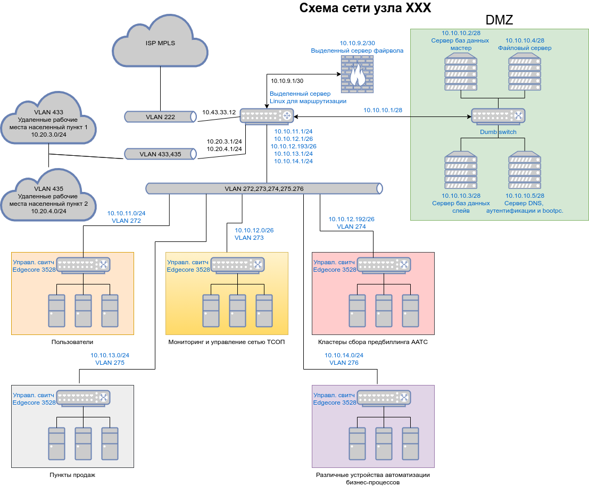

# Task 1
*Подключитесь к публичному маршрутизатору в интернет. Найдите маршрут к вашему публичному IP.*  
Определю адрес, с которого ISP выпускает меня в Интернет:
```
[alexvk@archbox ~]$ dig +short myip.opendns.com @resolver1.opendns.com
46.61.62.83
```
Далее выполняю действия согласно инструкции к заданию. Получаю следующий вывод:
```
route-views>show ip route 46.61.62.83                
Routing entry for 46.61.0.0/18
  Known via "bgp 6447", distance 20, metric 0
  Tag 6939, type external
  Last update from 64.71.137.241 5d09h ago
  Routing Descriptor Blocks:
  * 64.71.137.241, from 64.71.137.241, 5d09h ago
      Route metric is 0, traffic share count is 1
      AS Hops 2
      Route tag 6939
      MPLS label: none

route-views>show bgp 46.61.62.83
BGP routing table entry for 46.61.0.0/18, version 1388581066
Paths: (24 available, best #23, table default)
  Not advertised to any peer
  Refresh Epoch 1
  4901 6079 3356 12389
    162.250.137.254 from 162.250.137.254 (162.250.137.254)
      Origin IGP, localpref 100, valid, external
      Community: 65000:10100 65000:10300 65000:10400
      path 7FE1564DD3D8 RPKI State valid
      rx pathid: 0, tx pathid: 0
  Refresh Epoch 3
  3303 12389
    217.192.89.50 from 217.192.89.50 (138.187.128.158)
      Origin IGP, localpref 100, valid, external
      Community: 3303:1004 3303:1006 3303:1030 3303:3056
      path 7FE148406868 RPKI State valid
      rx pathid: 0, tx pathid: 0
  Refresh Epoch 1
  7660 2516 12389
    203.181.248.168 from 203.181.248.168 (203.181.248.168)
      Origin IGP, localpref 100, valid, external
      Community: 2516:1050 7660:9001
      path 7FE0CBC0CA60 RPKI State valid
      rx pathid: 0, tx pathid: 0
  Refresh Epoch 1
  3267 1299 12389
    194.85.40.15 from 194.85.40.15 (185.141.126.1)
      Origin IGP, metric 0, localpref 100, valid, external
      path 7FE09A885400 RPKI State valid
      rx pathid: 0, tx pathid: 0
  Refresh Epoch 1
  57866 3356 12389
    37.139.139.17 from 37.139.139.17 (37.139.139.17)
      Origin IGP, metric 0, localpref 100, valid, external
      Community: 3356:2 3356:22 3356:100 3356:123 3356:501 3356:901 3356:2065
      path 7FE0E50E9BB0 RPKI State valid
      rx pathid: 0, tx pathid: 0
  Refresh Epoch 1
  7018 3356 12389
    12.0.1.63 from 12.0.1.63 (12.0.1.63)
      Origin IGP, localpref 100, valid, external
      Community: 7018:5000 7018:37232
      path 7FE123CCEF18 RPKI State valid
      rx pathid: 0, tx pathid: 0
  Refresh Epoch 1
  3333 1103 12389
    193.0.0.56 from 193.0.0.56 (193.0.0.56)
      Origin IGP, localpref 100, valid, external
      path 7FE0346DED58 RPKI State valid
      rx pathid: 0, tx pathid: 0
  Refresh Epoch 1
  20912 3257 12389 12389 12389 12389
    212.66.96.126 from 212.66.96.126 (212.66.96.126)
      Origin IGP, localpref 100, valid, external
      Community: 3257:4000 3257:8794 3257:50001 3257:50110 3257:54900 3257:54901 20912:65004
      path 7FE0C1F2EF68 RPKI State valid
      rx pathid: 0, tx pathid: 0
  Refresh Epoch 1
  49788 12552 12389
    91.218.184.60 from 91.218.184.60 (91.218.184.60)
      Origin IGP, localpref 100, valid, external
      Community: 12552:12000 12552:12100 12552:12101 12552:22000
      Extended Community: 0x43:100:1
      path 7FE1559B6938 RPKI State valid
      rx pathid: 0, tx pathid: 0
  Refresh Epoch 1
  8283 1299 12389
    94.142.247.3 from 94.142.247.3 (94.142.247.3)
      Origin IGP, metric 0, localpref 100, valid, external
      Community: 1299:30000 8283:1 8283:101 8283:103
      unknown transitive attribute: flag 0xE0 type 0x20 length 0x24
        value 0000 205B 0000 0000 0000 0001 0000 205B
              0000 0005 0000 0001 0000 205B 0000 0005
              0000 0003 
      path 7FE11B8A4F48 RPKI State valid
      rx pathid: 0, tx pathid: 0
  Refresh Epoch 1
  3356 12389
    4.68.4.46 from 4.68.4.46 (4.69.184.201)
      Origin IGP, metric 0, localpref 100, valid, external
      Community: 3356:2 3356:22 3356:100 3356:123 3356:501 3356:901 3356:2065
      path 7FE107B737D0 RPKI State valid
      rx pathid: 0, tx pathid: 0
  Refresh Epoch 1
  1221 4637 12389
    203.62.252.83 from 203.62.252.83 (203.62.252.83)
      Origin IGP, localpref 100, valid, external
      path 7FE0203DFB20 RPKI State valid
      rx pathid: 0, tx pathid: 0
  Refresh Epoch 1
  2497 12389
    202.232.0.2 from 202.232.0.2 (58.138.96.254)
      Origin IGP, localpref 100, valid, external
      path 7FE0F9E2EE10 RPKI State valid
      rx pathid: 0, tx pathid: 0
  Refresh Epoch 1
  852 3356 12389
    154.11.12.212 from 154.11.12.212 (96.1.209.43)
      Origin IGP, metric 0, localpref 100, valid, external
      path 7FE033FADA50 RPKI State valid
      rx pathid: 0, tx pathid: 0
  Refresh Epoch 1
  20130 6939 12389
    140.192.8.16 from 140.192.8.16 (140.192.8.16)
      Origin IGP, localpref 100, valid, external
      path 7FE0358A84E0 RPKI State valid
      rx pathid: 0, tx pathid: 0
  Refresh Epoch 1
  701 1273 12389
    137.39.3.55 from 137.39.3.55 (137.39.3.55)
      Origin IGP, localpref 100, valid, external
      path 7FE0EE1A4AC8 RPKI State valid
      rx pathid: 0, tx pathid: 0
  Refresh Epoch 1
  3257 12389 12389 12389 12389
    89.149.178.10 from 89.149.178.10 (213.200.83.26)
      Origin IGP, metric 10, localpref 100, valid, external
      Community: 3257:4000 3257:8794 3257:50001 3257:50110 3257:54900 3257:54901
      path 7FE10FC6CC30 RPKI State valid
      rx pathid: 0, tx pathid: 0
  Refresh Epoch 1
  3549 3356 12389
    208.51.134.254 from 208.51.134.254 (67.16.168.191)
      Origin IGP, metric 0, localpref 100, valid, external
      Community: 3356:2 3356:22 3356:100 3356:123 3356:501 3356:901 3356:2065 3549:2581 3549:30840
      path 7FE0EF826D18 RPKI State valid
      rx pathid: 0, tx pathid: 0
  Refresh Epoch 1
  53767 14315 6453 6453 3356 12389
    162.251.163.2 from 162.251.163.2 (162.251.162.3)
      Origin IGP, localpref 100, valid, external
      Community: 14315:5000 53767:5000
      path 7FE0A2160708 RPKI State valid
      rx pathid: 0, tx pathid: 0
  Refresh Epoch 1
  101 3356 12389
    209.124.176.223 from 209.124.176.223 (209.124.176.223)
      Origin IGP, localpref 100, valid, external
      Community: 101:20100 101:20110 101:22100 3356:2 3356:22 3356:100 3356:123 3356:501 3356:901 3356:2065
      Extended Community: RT:101:22100
      path 7FE1764ABB88 RPKI State valid
      rx pathid: 0, tx pathid: 0
  Refresh Epoch 1
  3561 3910 3356 12389
    206.24.210.80 from 206.24.210.80 (206.24.210.80)
      Origin IGP, localpref 100, valid, external
      path 7FE038F50400 RPKI State valid
      rx pathid: 0, tx pathid: 0
  Refresh Epoch 1
  1351 6939 12389
    132.198.255.253 from 132.198.255.253 (132.198.255.253)
      Origin IGP, localpref 100, valid, external
      path 7FE11BA757B0 RPKI State valid
      rx pathid: 0, tx pathid: 0
  Refresh Epoch 1
  6939 12389
    64.71.137.241 from 64.71.137.241 (216.218.252.164)
      Origin IGP, localpref 100, valid, external, best
      path 7FE188FEED88 RPKI State valid
      rx pathid: 0, tx pathid: 0x0
  Refresh Epoch 1
  19214 174 3356 12389
    208.74.64.40 from 208.74.64.40 (208.74.64.40)
      Origin IGP, localpref 100, valid, external
      Community: 174:21000 174:22013
      path 7FE09D59A6B8 RPKI State valid
      rx pathid: 0, tx pathid: 0
```
Чтение  соответствующей документации Cisco по выбору наилучшего маршрута BGP https://www.cisco.com/c/ru_ru/support/docs/ip/border-gateway-protocol-bgp/13753-25.html
проясняет вывод. Очевидно, что адрес моего ISP входит в маршрутизируемую подсеть Ростелеком **46.61.0.0/18**. BGP выбрал путь #23 как путь по умолчанию. Этот путь 
помечен тэгом **6939**.  

# Task 2
*Создайте dummy0 интерфейс в Ubuntu. Добавьте несколько статических маршрутов. Проверьте таблицу маршрутизации.*  
Создам dummy интерфейс. Для этого нужен пакет iproute2.
```
[alexvk@archbox ~]$ sudo ip link add dummy0 type dummy
[alexvk@archbox ~]$ ip link 
1: lo: <LOOPBACK,UP,LOWER_UP> mtu 65536 qdisc noqueue state UNKNOWN mode DEFAULT group default qlen 1000
    link/loopback 00:00:00:00:00:00 brd 00:00:00:00:00:00
2: enp2s0: <NO-CARRIER,BROADCAST,MULTICAST,UP> mtu 1500 qdisc fq_codel state DOWN mode DEFAULT group default qlen 1000
    link/ether 28:d2:44:b8:10:d0 brd ff:ff:ff:ff:ff:ff
3: wlp1s0: <BROADCAST,MULTICAST,UP,LOWER_UP> mtu 1500 qdisc mq state UP mode DORMANT group default qlen 1000
    link/ether b0:10:41:2c:4f:8f brd ff:ff:ff:ff:ff:ff
4: dummy0: <BROADCAST,NOARP> mtu 1500 qdisc noop state DOWN mode DEFAULT group default qlen 1000
    link/ether 3e:1c:a0:e6:e1:8a brd ff:ff:ff:ff:ff:ff
```
Как видно, интерфейс dummy0 создан.  
Далее присвою ему адрес и создам подсеть 192.168.1.0/30, чего вполне достаточно для экспериментов.  
```
[alexvk@archbox ~]$ sudo ip addr add 192.168.1.1/30 dev dummy0
[alexvk@archbox ~]$ ip addr s dev dummy0
4: dummy0: <BROADCAST,NOARP> mtu 1500 qdisc noop state DOWN group default qlen 1000
    link/ether 3e:1c:a0:e6:e1:8a brd ff:ff:ff:ff:ff:ff
    inet 192.168.1.1/30 scope global dummy0
       valid_lft forever preferred_lft forever
[alexvk@archbox ~]$ sudo ip link set up dev dummy0
[alexvk@archbox ~]$ ping -c 1 192.168.1.1
PING 192.168.1.1 (192.168.1.1) 56(84) bytes of data.
64 bytes from 192.168.1.1: icmp_seq=1 ttl=64 time=0.054 ms

--- 192.168.1.1 ping statistics ---
1 packets transmitted, 1 received, 0% packet loss, time 0ms
rtt min/avg/max/mdev = 0.054/0.054/0.054/0.000 ms
[alexvk@archbox ~]$ 
```
Интерфейс поднят и отвечает. Создам несколько статических маршрутов.
```
[alexvk@archbox ~]$ sudo ip route add 192.168.1.4/30 via 192.168.1.1
[alexvk@archbox ~]$ sudo ip route add 192.168.1.8/30 via 192.168.1.1
[alexvk@archbox ~]$ ip route s
default via 192.168.88.1 dev wlp1s0 proto dhcp metric 600 
192.168.1.0/30 dev dummy0 proto kernel scope link src 192.168.1.1 
192.168.1.4/30 via 192.168.1.1 dev dummy0 
192.168.1.8/30 via 192.168.1.1 dev dummy0 
192.168.88.0/24 dev wlp1s0 proto kernel scope link src 192.168.88.35 metric 600 
```
Созданные подсети появились в таблице маршрутизации.  

# Task 3
*Проверьте открытые TCP порты в Ubuntu, какие протоколы и приложения используют эти порты? Приведите несколько примеров.*  
Для того, чтобы посмотреть выполнить это задание, воспользуюсь стародавним кошерным *netstat*. Пример вывода:  
```
[alexvk@archbox ~]$ sudo netstat  -l -n -t -p
Active Internet connections (only servers)
Proto Recv-Q Send-Q Local Address           Foreign Address         State       PID/Program name    
tcp        0      0 0.0.0.0:22              0.0.0.0:*               LISTEN      7529/sshd: /usr/bin 
tcp6       0      0 :::80                   :::*                    LISTEN      7548/httpd          
tcp6       0      0 :::22                   :::*                    LISTEN      7529/sshd: /usr/bin 
```
Ключи netstat: -l показывает порты в состоянии LISTEN, -n выводит числовые ip адреса, -t работает только по tcp, -p выводит имена
процессов. Как видно в последней колонке вывода, имя процесса, его PID и параметры его запуска присутствуют.  
Можно воспользоваться утилитой *ss*, которая присутствует также в дистрибутивах на базе FreeBSD.  
```
[alexvk@archbox ~]$ sudo ss -tlpn
State               Recv-Q              Send-Q                           Local Address:Port                           Peer Address:Port              Process                                                                                                                                              
LISTEN              0                   128                                    0.0.0.0:22                                  0.0.0.0:*                  users:(("sshd",pid=7529,fd=3))                                                                                                                      
LISTEN              0                   511                                          *:80                                        *:*                  users:(("httpd",pid=7551,fd=4),("httpd",pid=7550,fd=4),("httpd",pid=7549,fd=4),("httpd",pid=7548,fd=4))                                             
LISTEN              0                   128                                       [::]:22                                     [::]:*                  users:(("sshd",pid=7529,fd=4))      
```
Ключи ss: -t tcp протокол, -l выводит прослушиваемые открытые порты, -p покажет процессы, которые используют открытые сокеты, -n выводит
адреса в числовом формате.  

# Task 4

*Проверьте используемые UDP сокеты в Ubuntu, какие протоколы и приложения используют эти порты?*  
Для решения этой задачи можно воспользоваться решением предыдущей. Необходимо лишь вместо протокола TCP явно указать протокол UDP ключом -u 
и пропустить флаг -l, предназначенный для просмотра прослушиваемых системой портов. Например, утилита netstat по-умолчанию не покажет 
порты в состоянии LISTEN.  
```
[alexvk@archbox ~]$ sudo  netstat  -n -u -p 
Active Internet connections (w/o servers)
Proto Recv-Q Send-Q Local Address           Foreign Address         State       PID/Program name
udp        0      0 192.168.88.35:38311     64.233.164.95:443       ESTABLISHED 2289/chromium --typ
udp        0      0 192.168.88.35:68        192.168.88.1:67         ESTABLISHED 403/NetworkManager
```
В списке процессов можно видеть два процесса, это браузер chromium и менеджер сетевых соединений Network Manager. Браузер обращается к узлу в
сети Интернет по протоколу https, порт по-умолчанию 443. Network Manager обращается к серверу по протоколу bootp (порты 67 сервера и 68 клиентский), 
который предназначен для автоматического выделения адреса в сети.  
Тот же трюк можно повторить с утилитой ss.
```
[alexvk@archbox ~]$ sudo ss -nup
Recv-Q       Send-Q                      Local Address:Port                  Peer Address:Port       Process                                         
0            0                    192.168.88.35%wlp1s0:68                    192.168.88.1:67          users:(("NetworkManager",pid=403,fd=23))       
0            0                           192.168.88.35:37277               64.233.165.104:443         users:(("chromium",pid=2289,fd=27))            
```

# Task 5
*Используя diagrams.net, создайте L3 диаграмму вашей домашней сети или любой другой сети, с которой вы работали.*
В качестве примера создам диаграмму реальной сети, используемой для подключения устройств телефонии, компьютеров для управления этими устройствами, а
также устройств мониторинга состояния сети телефонии и абонентского биллинга.  

Оригинальный drawio файл [доступен по ссылке](misc/3.8_task5_network_diagram.drawio)
