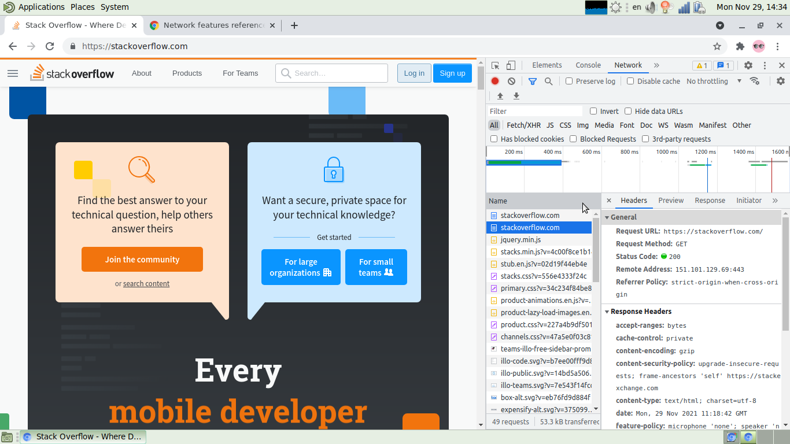

# Task 1

Выполню следующее:  
``telnet stackoverflow.com 80``  
Получаю ответ от хоста:  
```
[alexvk@archbox ~]$ telnet stackoverflow.com 80
Trying 151.101.65.69...
Connected to stackoverflow.com.
Escape character is '^]'.
GET /questions HTTP/1.0
HOST: stackoverflow.com

HTTP/1.1 301 Moved Permanently
cache-control: no-cache, no-store, must-revalidate
location: https://stackoverflow.com/questions
x-request-guid: 7bfe9792-4cdc-4b6a-8aa9-fb8125e622c0
feature-policy: microphone 'none'; speaker 'none'
content-security-policy: upgrade-insecure-requests; frame-ancestors 'self' https://stackexchange.com
Accept-Ranges: bytes
Date: Sun, 28 Nov 2021 12:28:35 GMT
Via: 1.1 varnish
Connection: close
X-Served-By: cache-fra19182-FRA
X-Cache: MISS
X-Cache-Hits: 0
X-Timer: S1638102515.386696,VS0,VE92
Vary: Fastly-SSL
X-DNS-Prefetch-Control: off
Set-Cookie: prov=a847da4e-b10a-eb3a-e973-60f6cf2d0ee3; domain=.stackoverflow.com; expires=Fri, 01-Jan-2055 00:00:00 GMT; path=/; HttpOnly

Connection closed by foreign host.
```
Посмотрю на запрос.  
``GET /questions HTTP/1.0`` -- получить ответ от HTTP сервера методом GET по request-URI "/questions" по протоколу HTTP версии 1.0.  
``HOST: stackoverflow.com`` -- указано целевое имя сервера, который должен выполнять запрос.   

Разберу ответ от HTTP сервера в соответствие с *RFC 2616*.  
``HTTP/1.1 301 Moved Permanently`` означает, что запрошенному ресурсу был назначен новый постоянный URI и в любых следующих
 в будущем ссылках на этот ресурс следует использовать один из возвращенных  URI. Проще говоря, сервер сообщает о редиректе.  
``cache-control: no-cache, no-store, must-revalidate`` -- управление кешем:  запросить новую копию с сервера; не сохранять в  кеш  ни запрос, ни ответ;
включает механизм, позволяющий  серверу-источнику требовать повторной проверки записи кэша при любом последующем использовании -- эта директива
нужна для надежности.  
``location: https://stackoverflow.com/questions`` -- это поле используется для редиректа клиента в местополжение, отличное от запрошенного им в request-URI. Поле состоит из 
единственного абсолютного URL.  
``x-request-guid: `7bfe9792-4cdc-4b6a-8aa9-fb8125e622c0`` -- уникальный идентификатор запроса. Зачем-то нужен именно этому серверу.  
``feature-policy: microphone 'none'; speaker 'none'`` -- этот заголовок  предоставляет механизм, разрешающий или запрещающий использование функций браузера в его собственном фрейме 
и в содержимом любых элементов iframe в документе. Значение -- микрофон и вывод звука не использовать.  
``content-security-policy: upgrade-insecure-requests; frame-ancestors 'self' https://stackexchange.com`` -- директива  upgrade-insecure-requests предписывает пользовательским агентам обрабатывать
 все небезопасные URL-адреса сайта (обслуживаемые через HTTP), как если бы они были заменены безопасными URL-адресами (обслуживаемыми через HTTPS). Эта директива
 предназначена для веб-сайтов с большим количеством небезопасных устаревших URL-адресов, которые необходимо переписать. ``frame-ancestors 'self' https://stackexchange.com`` указывает 
действительных родителей, которые могут встраивать страницу.  
``Accept-Ranges: bytes`` --   это маркер, который использует сервер, чтобы уведомить клиента о поддержке "запросов по частям". Его значение указывает единицу измерения, 
которая может быть использована для определения диапазона чтения. При наличии заголовка Accept-Ranges, браузер может попытаться возобновить прерванную загрузку, 
а не запускать её с самого начала.  
``Date: Sun, 28 Nov 2021 12:28:35 GMT`` -- время создания сообщения. Поле имеется всегда, за исключением 1. При генерации ошибки 100 или 101 время может быть указано, или не указано. 2.
 При возникновении ошибки 500 или 503, при которых невозможно создать текущую дату. 3. Если у сервера нет часов, способных обеспечить  время с достаточной точностью.   
``Via: 1.1 varnish`` -- как указано в RFC 2616, поле общего заголовка Via должно использоваться шлюзами и прокси для  указания промежуточных протоколов и получателей, находящихся между
 клинтом  и сервером при передаче запросов, а также между исходным сервером и  клиентом при приеме ответов. То есть  в данном случае посредником при обмене запросами и ответами
является ПО Varnish cache.  
``Connection: close`` -- HTTP / 1.1 определяет параметр "закрыть" соединение для отправителя  как сигнал о том, что соединение будет закрыто после завершения    ответа.  
``X-Served-By: cache-fra19182-FRA`` -- этот заголовок добавляется различными инструментами, чтобы обычно указать сервер, предоставивший ответ. Сюда входят 
некоторые (но не все) хостинговые компании и сети доставки контента.  
``X-Cache: MISS`` -- результат был получен от сервера, а не от сети доставки контента или кеширующего ПО.  
``X-Timer: S1638102515.386696,VS0,VE92`` -- время, за которое запрос пробежал по кешу Varnish. Три поля - unix-time, начало запроса, конец запроса (в миллисекундах.  
``Vary: Fastly-SSL`` -- если в источнике используются специальные значения (например, заголовки запросов) для выбора содержимого для пользователей или для  перенаправления запросов
 в соответствующие домены, то лучше включить эти значения в заголовок Vary. Это предотвратит случайное кэширование контента в доменах безопасности и предотвратит 
отравление вашего кеша злоумышленниками.   
``X-DNS-Prefetch-Control: off`` -- заголовок HTTP-ответа X-DNS-Prefetch-Control управляет предварительной выборкой DNS, функцией, с помощью которой браузеры заранее
 выполняют разрешение доменного имени для обеих ссылок, которые пользователь может выбрать для перехода, а также URL-адресов для элементов, на которые ссылается 
документ, включая изображения, CSS, JavaScript и так далее. Эта предварительная выборка выполняется в фоновом режиме, так что DNS, вероятно, будет разрешен к тому
 времени, когда требуются элементы, на которые есть ссылка. Это сокращает время ожидания, когда пользователь щелкает ссылку. В данном случае механизм отключен.  
``Set-Cookie: prov=a847da4e-b10a-eb3a-e973-60f6cf2d0ee3; domain=.stackoverflow.com; expires=Fri, 01-Jan-2055 00:00:00 GMT; path=/; HttpOnly`` -- HTTP заголовок Set-Cookie 
используется для отправки cookies с сервера на агент пользователя. Можно видеть перечисление переменных, устанавливаемых у пользователя.  

# Task 2

Повторю задание 1, использую консоль разработчика браузера chromium.  
F12->Network, затем в адресной строке укажу http://stackoverflow.com  

Ответ HTTP сервера:  
General:  
```Request URL: http://stackoverflow.com/
Request Method: GET
Status Code: 307 Internal Redirect
Referrer Policy: strict-origin-when-cross-origin
```
Response headers:  
```HTTP/1.1 307 Internal Redirect
Location: https://stackoverflow.com/
Non-Authoritative-Reason: HSTS
```
Request headers:  
```GET / HTTP/1.1
Upgrade-Insecure-Requests: 1
User-Agent: Mozilla/5.0 (X11; Linux x86_64) AppleWebKit/537.36 (KHTML, like Gecko) Chrome/96.0.4664.45 Safari/537.36
Accept: text/html,application/xhtml+xml,application/xml;q=0.9,image/avif,image/webp,image/apng,*/*;q=0.8,application/signed-exchange;v=b3;q=0.9
```

Дольше всех выполнялся запрос ``Request URL: https://stackoverflow.com/``. Просмотр таймингов показал, что выполнялось ожидание ответа от сервера (Waiting (TTFB))=167мс, и 
затем загрузка контента (Content Downloading)=200мс. Скриншот прилагаю.  


# Task 3

Для выяснения того, какой ip адрес использует ISP в Интернет для своих клиентов, попробую старым добрым traceroute.  
```[alexvk@archbox ~]$  traceroute -An ya.ru
traceroute to ya.ru (87.250.250.242), 30 hops max, 60 byte packets
 1  192.168.88.1 [*]  2.708 ms  2.553 ms  2.462 ms
 2  178.34.128.47 [AS12389]  3.073 ms  3.302 ms  3.154 ms
 3  178.34.130.231 [AS12389]  3.537 ms  12.219 ms 178.34.129.231 [AS12389]  2.827 ms
 4  188.128.126.238 [AS12389]  18.897 ms  19.265 ms  19.172 ms
 5  * * *
 6  rac [AS12389]  35.715 ms  36.787 ms  35.284 ms
 7  * * *
 8  87.250.250.242 [AS13238]  71.205 ms 10.1.1.1 [*]  82.497 ms 87.250.250.242 [AS13238]  71.039 ms

```
1 хоп -- внутренний (частный) адрес, используемый устройством, занимающимся внутренней домашней сетью. 192.168.88.1 - адрес гейта, сеть соотв. 192.168.88.0/24.  
2 хоп - адрес, через который ISP манипулирует клиентом  в своей сети.   
Автономная сеть **AS12389**.  
Но поскольку  реальное положение дел с NAT, кешами и переписанными маршрутами внутри сети ISP никому кроме него неизвестно, воспользуюсь сторонним сервисом.  
 
```
[alexvk@archbox ~]$ dig +short myip.opendns.com @resolver1.opendns.com
46.41.104.22
```
Проверю,  похоже ли это на моего ISP:

```
[alexvk@archbox ~]$ dig +short -x 46.41.104.22
22.104.41.46.donpac.ru.
```
Да, это он и есть.  
Для проверки выполню трейс на указанный адрес:  
```
[alexvk@archbox ~]$ sudo traceroute 46.41.104.22
traceroute to 46.41.104.22 (46.41.104.22), 30 hops max, 60 byte packets
 1  22.104.41.46.donpac.ru (46.41.104.22)  2.116 ms  2.002 ms  1.963 ms
```
Задача выполнена.  

# Task 4

Выясню больше информации об адресе, с которого выпускает клиентов провайдер:  
```
% This is the RIPE Database query service.
% The objects are in RPSL format.
%
% The RIPE Database is subject to Terms and Conditions.
% See http://www.ripe.net/db/support/db-terms-conditions.pdf

% Note: this output has been filtered.
%       To receive output for a database update, use the "-B" flag.

% Information related to '46.41.96.0 - 46.41.127.255'

% Abuse contact for '46.41.96.0 - 46.41.127.255' is 'abuse@rt.ru'

inetnum:        46.41.96.0 - 46.41.127.255
netname:        Macroregional_South
descr:          OJSC Rostelecom Macroregional Branch South
descr:          Rostov, Russia
country:        RU
admin-c:        VAS102-RIPE
tech-c:         VAS102-RIPE
status:         ASSIGNED PA
remarks:        INFRA-AW
mnt-by:         STC-MNT
created:        2012-05-22T07:08:45Z
last-modified:  2012-05-22T07:08:45Z
source:         RIPE

person:         Vladimir A. Sherstnev
address:        wert@donpac.ru
phone:          +7 863 2619163
mnt-by:         ROSTOV-TELEGRAF-MNT
nic-hdl:        VAS102-RIPE
created:        2005-05-25T05:31:56Z
last-modified:  2016-01-13T06:40:41Z
source:         RIPE

% Information related to '46.41.96.0/19AS21479'

route:          46.41.96.0/19
descr:          Routing object of
descr:          Division of JSC "UTK" "Rostovelectrosviaz" and its deport
origin:         AS21479
mnt-routes:     ROSTOV-TELEGRAF-MNT
mnt-by:         ROSTOV-TELEGRAF-MNT
created:        2010-08-31T07:28:04Z
last-modified:  2010-08-31T07:28:04Z
source:         RIPE

% This query was served by the RIPE Database Query Service version 1.101 (HEREFORD)
```
Таким образом, просмотрев данные, полученные whois из базы ripe.net, определяю провайдера как Ростелеком (бывш. ЮТК, бывш. Ростовэлектросвязь, бывш. Ростовский телеграф).  
Автономная система имеет имя (поле origin) **AS21479** и описание *Division of JSC "UTK" "Rostovelectrosviaz" and its deport*.  Интересно, что поле "descr"  не меняли с 31.08. 2010 года.  

# Task 5
Пакеты, отправленные на *8.8.8.8*, проходят по следующему маршруту:
```
[alexvk@archbox ~]$ traceroute -An 8.8.8.8
traceroute to 8.8.8.8 (8.8.8.8), 30 hops max, 60 byte packets
 1  192.168.88.1 [*]  4.795 ms  4.675 ms  4.615 ms
 2  178.34.128.47 [AS12389]  4.741 ms  4.925 ms  5.126 ms
 3  178.34.129.231 [AS12389]  4.450 ms  4.391 ms 178.34.130.231 [AS12389]  4.306 ms
 4  87.226.181.89 [AS12389]  51.653 ms 87.226.183.89 [AS12389]  50.837 ms  50.644 ms
 5  5.143.253.245 [AS12389]  50.858 ms 74.125.51.172 [AS15169]  51.165 ms  50.977 ms
 6  108.170.250.83 [AS15169]  51.811 ms 108.170.250.130 [AS15169]  35.318 ms 108.170.250.113 [AS15169]  37.578 ms
 7  172.253.66.116 [AS15169]  52.849 ms 142.251.49.24 [AS15169]  49.884 ms *
 8  108.170.235.204 [AS15169]  49.769 ms 172.253.65.82 [AS15169]  46.574 ms 216.239.48.224 [AS15169]  35.396 ms
 9  172.253.79.237 [AS15169]  43.442 ms 216.239.54.201 [AS15169]  45.455 ms 172.253.70.47 [AS15169]  43.521 ms
10  * * *
11  * * *
12  * * *
13  * * *
14  * * *
15  * * *
16  * * *
17  * * *
18  * * *
19  8.8.8.8 [AS15169]  49.358 ms  45.482 ms  51.699 ms
```
В передаче пакета принимают участие следующие AS:  
**AS12389** и **AS15169** соответственно.  
AS12389:  
```
[alexvk@archbox ~]$ whois AS12389 | more
% This is the RIPE Database query service.
% The objects are in RPSL format.
%
% The RIPE Database is subject to Terms and Conditions.
% See http://www.ripe.net/db/support/db-terms-conditions.pdf

% Note: this output has been filtered.
%       To receive output for a database update, use the "-B" flag.

% Information related to 'AS12288 - AS12454'

as-block:       AS12288 - AS12454
descr:          RIPE NCC ASN block
remarks:        These AS Numbers are assigned to network operators in the RIPE NCC service region.
mnt-by:         RIPE-NCC-HM-MNT
created:        2018-11-22T15:27:24Z
last-modified:  2018-11-22T15:27:24Z
source:         RIPE

% Information related to 'AS12389'

% Abuse contact for 'AS12389' is 'abuse@rt.ru'

aut-num:        AS12389
as-name:        ROSTELECOM-AS
<--skipped-->
```
AS15169.  
```
[alexvk@archbox ~]$ whois AS15169

#
# ARIN WHOIS data and services are subject to the Terms of Use
# available at: https://www.arin.net/resources/registry/whois/tou/
#
# If you see inaccuracies in the results, please report at
# https://www.arin.net/resources/registry/whois/inaccuracy_reporting/
#
# Copyright 1997-2021, American Registry for Internet Numbers, Ltd.
#


ASNumber:       15169
ASName:         GOOGLE
ASHandle:       AS15169
RegDate:        2000-03-30
Updated:        2012-02-24    
Ref:            https://rdap.arin.net/registry/autnum/15169


OrgName:        Google LLC
OrgId:          GOGL
Address:        1600 Amphitheatre Parkway
City:           Mountain View
StateProv:      CA
PostalCode:     94043
Country:        US
RegDate:        2000-03-30
Updated:        2019-10-31
Comment:        Please note that the recommended way to file abuse complaints are located in the following links. 
Comment:        
Comment:        To report abuse and illegal activity: https://www.google.com/contact/
Comment:        
Comment:        For legal requests: http://support.google.com/legal 
Comment:        
Comment:        Regards, 
Comment:        The Google Team
Ref:            https://rdap.arin.net/registry/entity/GOGL


OrgAbuseHandle: ABUSE5250-ARIN
OrgAbuseName:   Abuse
OrgAbusePhone:  +1-650-253-0000 
OrgAbuseEmail:  network-abuse@google.com
OrgAbuseRef:    https://rdap.arin.net/registry/entity/ABUSE5250-ARIN

OrgTechHandle: ZG39-ARIN
OrgTechName:   Google LLC
OrgTechPhone:  +1-650-253-0000 
OrgTechEmail:  arin-contact@google.com
OrgTechRef:    https://rdap.arin.net/registry/entity/ZG39-ARIN

RTechHandle: ZG39-ARIN
RTechName:   Google LLC
RTechPhone:  +1-650-253-0000 
RTechEmail:  arin-contact@google.com
RTechRef:    https://rdap.arin.net/registry/entity/ZG39-ARIN
<--skipped-->
```
# Task 6
Проведу тот же эксперимент с утилитой *mtr*, используя опции -r (отчет), 
-n (не выполнять просмотр DNS), -z (разрешать AS):  
```
[alexvk@archbox ~]$ time mtr -r -n -z 8.8.8.8
Start: 2021-12-01T10:23:56+0300
HOST: archbox                     Loss%   Snt   Last   Avg  Best  Wrst StDev
  1. AS???    192.168.88.1         0.0%    10    3.8  10.1   0.9  73.4  22.3
  2. AS12389  178.34.128.47        0.0%    10    4.9  27.0   3.0  92.1  33.1
  3. AS12389  178.34.129.231       0.0%    10    2.8  18.7   2.8  90.7  28.5
  4. AS???    ???                 100.0    10    0.0   0.0   0.0   0.0   0.0
  5. AS15169  74.125.51.172        0.0%    10   36.2  37.3  34.8  42.3   2.2
  6. AS15169  108.170.250.130      0.0%    10   35.5  45.7  35.2 126.4  28.4
  7. AS15169  209.85.255.136       0.0%    10   54.6  79.2  54.1 151.0  38.9
  8. AS15169  209.85.254.20        0.0%    10   54.2  84.2  54.2 153.8  42.9
  9. AS15169  216.239.63.27        0.0%    10   56.3  72.5  54.0 156.4  33.5
 10. AS???    ???                 100.0    10    0.0   0.0   0.0   0.0   0.0
 11. AS???    ???                 100.0    10    0.0   0.0   0.0   0.0   0.0
 12. AS???    ???                 100.0    10    0.0   0.0   0.0   0.0   0.0
 13. AS???    ???                 100.0    10    0.0   0.0   0.0   0.0   0.0
 14. AS???    ???                 100.0    10    0.0   0.0   0.0   0.0   0.0
 15. AS???    ???                 100.0    10    0.0   0.0   0.0   0.0   0.0
 16. AS???    ???                 100.0    10    0.0   0.0   0.0   0.0   0.0
 17. AS???    ???                 100.0    10    0.0   0.0   0.0   0.0   0.0
 18. AS???    ???                 100.0    10    0.0   0.0   0.0   0.0   0.0
 19. AS15169  8.8.8.8             40.0%    10   53.1  60.9  41.7 124.6  31.6

real	0m16,684s
user	0m0,033s
sys	0m0,096s
```
Наибольшая задержка наблюдается на узле ``8. AS15169  209.85.254.20``.  
Время задержки выясняю по полю Avg. Также поле стандартной девиации StDev подтверждает выводы.  

# Task 7
Выясню, какие серверы отвечают за доменное имя dns.google. Для этого можно воспользоваться утилитой nslookup:  
```
 [alexvk@archbox ~]$ nslookup
> dns.google
Server:		192.168.88.1
Address:	192.168.88.1#53

Non-authoritative answer:
Name:	dns.google
Address: 8.8.8.8
Name:	dns.google
Address: 8.8.4.4
Name:	dns.google
> 
```
Либо утилитой dig:  
```
[alexvk@archbox ~]$ dig +short dns.google
8.8.8.8
8.8.4.4
```
Очевидно, что имя "dns.google" в пространстве IPV4 имеет адреса 8.8.8.8 и 8.8.4.4, что и является в DNS искомымиA-записями (адресами).  
Для более наглядного пояснения уберу опцию +short в вызове dig:
```
[alexvk@archbox ~]$ dig dns.google.

; <<>> DiG 9.16.23 <<>> dns.google.
;; global options: +cmd
;; Got answer:
;; ->>HEADER<<- opcode: QUERY, status: NOERROR, id: 33609
;; flags: qr rd ra; QUERY: 1, ANSWER: 2, AUTHORITY: 0, ADDITIONAL: 0

;; QUESTION SECTION:
;dns.google.			IN	A

;; ANSWER SECTION:
dns.google.		704	IN	A	8.8.8.8
dns.google.		704	IN	A	8.8.4.4

;; Query time: 3 msec
;; SERVER: 192.168.88.1#53(192.168.88.1)
;; WHEN: Wed Dec 01 10:46:30 MSK 2021
;; MSG SIZE  rcvd: 60
```
Секция ANSWER и содержит A записи.  

# Task 7
Для проверки записи PTR для адреса 8.8.8.8 также использую dig, но выполняю reverse search:  
```
[alexvk@archbox ~]$ dig  @8.8.4.4  -x 8.8.8.8

; <<>> DiG 9.16.23 <<>> @8.8.4.4 -x 8.8.8.8
; (1 server found)
;; global options: +cmd
;; Got answer:
;; ->>HEADER<<- opcode: QUERY, status: NOERROR, id: 12725
;; flags: qr rd ra; QUERY: 1, ANSWER: 1, AUTHORITY: 0, ADDITIONAL: 1

;; OPT PSEUDOSECTION:
; EDNS: version: 0, flags:; udp: 512
;; QUESTION SECTION:
;8.8.8.8.in-addr.arpa.		IN	PTR

;; ANSWER SECTION:
8.8.8.8.in-addr.arpa.	12992	IN	PTR	dns.google.

;; Query time: 43 msec
;; SERVER: 8.8.4.4#53(8.8.4.4)
;; WHEN: Wed Dec 01 10:49:34 MSK 2021
;; MSG SIZE  rcvd: 73
```
Для сокращения вывода можно использовать опцию +short.  
Искомая строка в секции ANSWER: ``8.8.8.8.in-addr.arpa.	12992	IN	PTR	dns.google.``  


