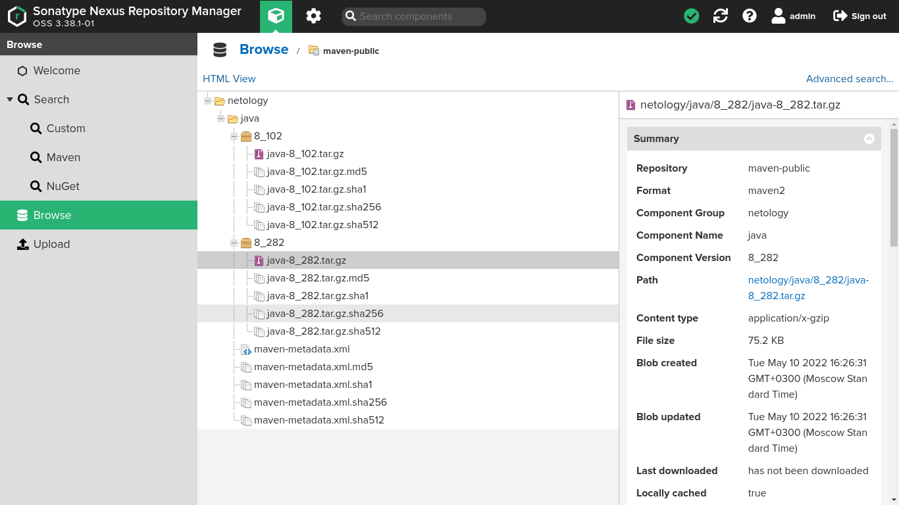

# Домашнее задание к занятию "09.02 CI\CD"

## Знакомоство с SonarQube

### Подготовка к выполнению

1. Выполняем `docker pull sonarqube:8.7-community`
2. Выполняем `docker run -d --name sonarqube -e SONAR_ES_BOOTSTRAP_CHECKS_DISABLE=true -p 9000:9000 sonarqube:8.7-community`
3. Ждём запуск, смотрим логи через `docker logs -f sonarqube`
4. Проверяем готовность сервиса через [браузер](http://localhost:9000)
5. Заходим под admin\admin, меняем пароль на свой

В целом, в [этой статье](https://docs.sonarqube.org/latest/setup/install-server/) описаны все варианты установки, включая и docker, но так как нам он нужен разово, то достаточно того набора действий, который я указал выше.

## Решение:
Выполняю по шагам инструкцию:
1. Скачиваю образ sonarqube для docker:

```[alexvk@archbox ~]$ docker pull sonarqube:8.7-community
8.7-community: Pulling from library/sonarqube
22599d3e9e25: Pull complete 
00bb4d95f2aa: Pull complete 
3ef8cf8a60c8: Pull complete 
928990dd1bda: Pull complete 
07cca701c22e: Pull complete 
Digest: sha256:70496f44067bea15514f0a275ee898a7e4a3fedaaa6766e7874d24a39be336dc
Status: Downloaded newer image for sonarqube:8.7-community
docker.io/library/sonarqube:8.7-community
```
Образ успешно загружен.

2. Запускаю образ.

3. По логам запуск произошел успешно (без критических ошибок). tail логов:

```
[..skipped..]
 2022.05.10 08:21:41 INFO  app[][o.s.a.ProcessLauncherImpl] Launch process[[key='ce', ipcIndex=3, logFilenamePrefix=ce]] from [/opt/sonarqube]: /opt/java/openjdk/bin/java -Djava.awt.headless=true -Dfile.encoding=UTF-8 -Djava.io.tmpdir=/opt/sonarqube/temp -XX:-OmitStackTraceInFastThrow --add-opens=java.base/java.util=ALL-UNNAMED -Xmx512m -Xms128m -XX:+HeapDumpOnOutOfMemoryError -Dhttp.nonProxyHosts=localhost|127.*|[::1] -cp ./lib/common/*:/opt/sonarqube/lib/jdbc/h2/h2-1.4.199.jar org.sonar.ce.app.CeServer /opt/sonarqube/temp/sq-process18228564003885852789properties
2022.05.10 08:21:42 INFO  ce[][o.s.p.ProcessEntryPoint] Starting ce
2022.05.10 08:21:42 INFO  ce[][o.s.ce.app.CeServer] Compute Engine starting up...
2022.05.10 08:21:43 INFO  ce[][o.s.s.e.EsClientProvider] Connected to local Elasticsearch: [http://localhost:9001]
2022.05.10 08:21:44 INFO  ce[][o.sonar.db.Database] Create JDBC data source for jdbc:h2:tcp://127.0.0.1:9092/sonar
2022.05.10 08:21:45 WARN  ce[][o.s.db.dialect.H2] H2 database should be used for evaluation purpose only.
2022.05.10 08:21:47 INFO  ce[][o.s.s.p.ServerFileSystemImpl] SonarQube home: /opt/sonarqube
2022.05.10 08:21:47 INFO  ce[][o.s.c.c.CePluginRepository] Load plugins
2022.05.10 08:21:49 INFO  ce[][o.s.c.c.ComputeEngineContainerImpl] Running Community edition
2022.05.10 08:21:50 INFO  ce[][o.s.ce.app.CeServer] Compute Engine is operational
2022.05.10 08:21:50 INFO  app[][o.s.a.SchedulerImpl] Process[ce] is up
2022.05.10 08:21:50 INFO  app[][o.s.a.SchedulerImpl] SonarQube is up
2022.05.10 08:21:52 INFO  ce[][o.s.c.t.CeWorkerImpl] worker AYCtD2j1YCVhAzBY-l_v found no pending task (including indexation task). Disabling indexation task lookup for this worker until next SonarQube restart.
```
4. Проверка готовности сервиса на скриншоте:


### Основная часть

1. Создаём новый проект, название произвольное
2. Скачиваем пакет sonar-scanner, который нам предлагает скачать сам sonarqube
3. Делаем так, чтобы binary был доступен через вызов в shell (или меняем переменную PATH или любой другой удобный вам способ)
4. Проверяем `sonar-scanner --version`
5. Запускаем анализатор против кода из директории [example](./example) с дополнительным ключом `-Dsonar.coverage.exclusions=fail.py`
6. Смотрим результат в интерфейсе
7. Исправляем ошибки, которые он выявил(включая warnings)
8. Запускаем анализатор повторно - проверяем, что QG пройдены успешно
9. Делаем скриншот успешного прохождения анализа, прикладываем к решению ДЗ

## Решение:
1. Создаю проект test-netology.
2. Скачиваю пакет sonar-scanner.
3. Исполняемый файл делаю доступным через переменную PATH.
4. Проверка версии:
```
bash-5.0# sonar-scanner --version
INFO: Scanner configuration file: /sonar-scanner/conf/sonar-scanner.properties
INFO: Project root configuration file: NONE
INFO: SonarScanner 4.7.0.2747
INFO: Java 11.0.14.1 Eclipse Adoptium (64-bit)
INFO: Linux 5.17.5-arch1-1 amd64
```
5. Запускаю анализатор кода:
```
INFO: Scanner configuration file: /sonar-scanner/conf/sonar-scanner.properties
INFO: Project root configuration file: NONE
INFO: SonarScanner 4.7.0.2747
INFO: Java 11.0.14.1 Eclipse Adoptium (64-bit)
INFO: Linux 5.17.5-arch1-1 amd64
INFO: User cache: /root/.sonar/cache
INFO: Scanner configuration file: /sonar-scanner/conf/sonar-scanner.properties
INFO: Project root configuration file: NONE
INFO: Analyzing on SonarQube server 8.7.1
INFO: Default locale: "en_US", source code encoding: "UTF-8" (analysis is platform dependent)
INFO: Load global settings
INFO: Load global settings (done) | time=177ms
INFO: Server id: BF41A1F2-AYCtDlq0rbJOB9qD1cAA
INFO: User cache: /root/.sonar/cache
INFO: Load/download plugins
INFO: Load plugins index
INFO: Load plugins index (done) | time=84ms
INFO: Load/download plugins (done) | time=256ms
INFO: Process project properties
INFO: Process project properties (done) | time=26ms
INFO: Execute project builders
INFO: Execute project builders (done) | time=4ms
INFO: Project key: test-netology
INFO: Base dir: /root
INFO: Working dir: /root/.scannerwork
INFO: Load project settings for component key: 'test-netology'
INFO: Load project settings for component key: 'test-netology' (done) | time=48ms
INFO: Load quality profiles
INFO: Load quality profiles (done) | time=113ms
INFO: Load active rules
INFO: Load active rules (done) | time=3553ms
INFO: Indexing files...
INFO: Project configuration:
INFO: 1 file indexed
INFO: Quality profile for py: Sonar way
INFO: ------------- Run sensors on module test-netology
INFO: Load metrics repository
INFO: Load metrics repository (done) | time=56ms
INFO: Sensor Python Sensor [python]
INFO: Starting global symbols computation
INFO: 1 source files to be analyzed
INFO: Load project repositories
INFO: Load project repositories (done) | time=57ms
INFO: 0/1 files analyzed, current file: example/fail.py
INFO: 1/1 source files have been analyzed
INFO: Starting rules execution
INFO: 1 source files to be analyzed
INFO: Sensor Python Sensor [python] (done) | time=16862ms
INFO: 1/1 source files have been analyzed
INFO: Sensor Cobertura Sensor for Python coverage [python]
INFO: Sensor Cobertura Sensor for Python coverage [python] (done) | time=24ms
INFO: Sensor PythonXUnitSensor [python]
INFO: Sensor PythonXUnitSensor [python] (done) | time=5ms
INFO: Sensor CSS Rules [cssfamily]
INFO: No CSS, PHP, HTML or VueJS files are found in the project. CSS analysis is skipped.
INFO: Sensor CSS Rules [cssfamily] (done) | time=2ms
INFO: Sensor JaCoCo XML Report Importer [jacoco]
INFO: 'sonar.coverage.jacoco.xmlReportPaths' is not defined. Using default locations: target/site/jacoco/jacoco.xml,target/site/jacoco-it/jacoco.xml,build/reports/jacoco/test/jacocoTestReport.xml
INFO: No report imported, no coverage information will be imported by JaCoCo XML Report Importer
INFO: Sensor JaCoCo XML Report Importer [jacoco] (done) | time=8ms
INFO: Sensor C# Properties [csharp]
INFO: Sensor C# Properties [csharp] (done) | time=2ms
INFO: Sensor JavaXmlSensor [java]
INFO: Sensor JavaXmlSensor [java] (done) | time=3ms
INFO: Sensor HTML [web]
INFO: Sensor HTML [web] (done) | time=7ms
INFO: Sensor VB.NET Properties [vbnet]
INFO: Sensor VB.NET Properties [vbnet] (done) | time=3ms
INFO: ------------- Run sensors on project
INFO: Sensor Zero Coverage Sensor
INFO: Sensor Zero Coverage Sensor (done) | time=17ms
INFO: SCM Publisher is disabled
INFO: CPD Executor Calculating CPD for 1 file
INFO: CPD Executor CPD calculation finished (done) | time=24ms
INFO: Analysis report generated in 247ms, dir size=91 KB
INFO: Analysis report compressed in 60ms, zip size=12 KB
INFO: Analysis report uploaded in 43ms
INFO: ANALYSIS SUCCESSFUL, you can browse http://localhost:9000/dashboard?id=test-netology
INFO: Note that you will be able to access the updated dashboard once the server has processed the submitted analysis report
INFO: More about the report processing at http://localhost:9000/api/ce/task?id=AYCtg2h9rbJOB9qD1g_P
INFO: Analysis total time: 24.926 s
INFO: ------------------------------------------------------------------------
INFO: EXECUTION SUCCESS
INFO: ------------------------------------------------------------------------
INFO: Total time: 27.582s
INFO: Final Memory: 7M/27M
INFO: ------------------------------------------------------------------------
```
6. В интерфейсе выявлены ошибки в коде и один Warning: SCM. 
7. Исправляю ошибки в скрипте ``fail.py`` согласно предложенному плану. Warning по поводу **SCM** исправляю отключением SCM в Settings.
8. Запускаю анализатор повторно. Лог прохождения:
```
INFO: Scanner configuration file: /sonar-scanner/conf/sonar-scanner.properties
INFO: Project root configuration file: NONE
INFO: SonarScanner 4.7.0.2747
INFO: Java 11.0.14.1 Eclipse Adoptium (64-bit)
INFO: Linux 5.17.5-arch1-1 amd64
INFO: User cache: /root/.sonar/cache
INFO: Scanner configuration file: /sonar-scanner/conf/sonar-scanner.properties
INFO: Project root configuration file: NONE
INFO: Analyzing on SonarQube server 8.7.1
INFO: Default locale: "en_US", source code encoding: "UTF-8" (analysis is platform dependent)
INFO: Load global settings
INFO: Load global settings (done) | time=174ms
INFO: Server id: BF41A1F2-AYCtDlq0rbJOB9qD1cAA
INFO: User cache: /root/.sonar/cache
INFO: Load/download plugins
INFO: Load plugins index
INFO: Load plugins index (done) | time=93ms
INFO: Load/download plugins (done) | time=266ms
INFO: Process project properties
INFO: Process project properties (done) | time=22ms
INFO: Execute project builders
INFO: Execute project builders (done) | time=22ms
INFO: Project key: test-netology
INFO: Base dir: /root
INFO: Working dir: /root/.scannerwork
INFO: Load project settings for component key: 'test-netology'
INFO: Load project settings for component key: 'test-netology' (done) | time=39ms
INFO: Load quality profiles
INFO: Load quality profiles (done) | time=123ms
INFO: Load active rules
INFO: Load active rules (done) | time=3155ms
INFO: Indexing files...
INFO: Project configuration:
INFO: 1 file indexed
INFO: Quality profile for py: Sonar way
INFO: ------------- Run sensors on module test-netology
INFO: Load metrics repository
INFO: Load metrics repository (done) | time=55ms
INFO: Sensor Python Sensor [python]
INFO: Starting global symbols computation
INFO: 1 source files to be analyzed
INFO: Load project repositories
INFO: Load project repositories (done) | time=36ms
INFO: 0/1 files analyzed, current file: example/fail.py
INFO: 1/1 source files have been analyzed
INFO: Starting rules execution
INFO: 1 source files to be analyzed
INFO: 1/1 source files have been analyzed
INFO: Sensor Python Sensor [python] (done) | time=15899ms
INFO: Sensor Cobertura Sensor for Python coverage [python]
INFO: Sensor Cobertura Sensor for Python coverage [python] (done) | time=32ms
INFO: Sensor PythonXUnitSensor [python]
INFO: Sensor PythonXUnitSensor [python] (done) | time=7ms
INFO: Sensor CSS Rules [cssfamily]
INFO: No CSS, PHP, HTML or VueJS files are found in the project. CSS analysis is skipped.
INFO: Sensor CSS Rules [cssfamily] (done) | time=2ms
INFO: Sensor JaCoCo XML Report Importer [jacoco]
INFO: 'sonar.coverage.jacoco.xmlReportPaths' is not defined. Using default locations: target/site/jacoco/jacoco.xml,target/site/jacoco-it/jacoco.xml,build/reports/jacoco/test/jacocoTestReport.xml
INFO: No report imported, no coverage information will be imported by JaCoCo XML Report Importer
INFO: Sensor JaCoCo XML Report Importer [jacoco] (done) | time=9ms
INFO: Sensor C# Properties [csharp]
INFO: Sensor C# Properties [csharp] (done) | time=3ms
INFO: Sensor JavaXmlSensor [java]
INFO: Sensor JavaXmlSensor [java] (done) | time=3ms
INFO: Sensor HTML [web]
INFO: Sensor HTML [web] (done) | time=8ms
INFO: Sensor VB.NET Properties [vbnet]
INFO: Sensor VB.NET Properties [vbnet] (done) | time=3ms
INFO: ------------- Run sensors on project
INFO: Sensor Zero Coverage Sensor
INFO: Sensor Zero Coverage Sensor (done) | time=22ms
INFO: SCM Publisher is disabled
INFO: CPD Executor Calculating CPD for 1 file
INFO: CPD Executor CPD calculation finished (done) | time=20ms
INFO: Analysis report generated in 208ms, dir size=91 KB
INFO: Analysis report compressed in 53ms, zip size=12 KB
INFO: Analysis report uploaded in 83ms
INFO: ANALYSIS SUCCESSFUL, you can browse http://localhost:9000/dashboard?id=test-netology
INFO: Note that you will be able to access the updated dashboard once the server has processed the submitted analysis report
INFO: More about the report processing at http://localhost:9000/api/ce/task?id=AYCtj6HwrbJOB9qD1g_Q
INFO: Analysis total time: 23.595 s
INFO: ------------------------------------------------------------------------
INFO: EXECUTION SUCCESS
INFO: ------------------------------------------------------------------------
INFO: Total time: 26.276s
INFO: Final Memory: 69M/240M
INFO: ------------------------------------------------------------------------
```
9. Скриншот интерфейса:


## Знакомство с Nexus

### Подготовка к выполнению

1. Выполняем `docker pull sonatype/nexus3`
2. Выполняем `docker run -d -p 8081:8081 --name nexus sonatype/nexus3`
3. Ждём запуск, смотрим логи через `docker logs -f nexus`
4. Проверяем готовность сервиса через [бразуер](http://localhost:8081)
5. Узнаём пароль от admin через `docker exec -it nexus /bin/bash`
6. Подключаемся под админом, меняем пароль, сохраняем анонимный доступ

## Решение:

1. Забираю образ sonatype/nexus3.
2. Запускаю образ nexus3.
3. Логи докера - tail:
```
[..skipped..]
2022-05-10 11:03:01,561+0000 INFO  [jetty-main-1] *SYSTEM org.eclipse.jetty.server.AbstractConnector - Started ServerConnector@c019012{HTTP/1.1, (http/1.1)}{0.0.0.0:8081}
2022-05-10 11:03:01,562+0000 INFO  [jetty-main-1] *SYSTEM org.eclipse.jetty.server.Server - Started @100135ms
2022-05-10 11:03:01,563+0000 INFO  [jetty-main-1] *SYSTEM org.sonatype.nexus.bootstrap.jetty.JettyServer - Started Sonatype Nexus OSS 3.38.1-01
```
Контейнер успешно выполняется.

4. Скриншот Nexus:

5. Узнаю пароль пользователя admin:
```
[alexvk@archbox ~]$ docker exec -it nexus bash
bash-4.4$ cat /nexus-data/admin.password 
ec48ed0e-4c9e-40a8-9b35-03eeb105511c
```
6. Выполняю логин для admin с дефолтным паролем, меняю пароль. Предоставляю анонимный доступ.

### Основная часть

1. В репозиторий `maven-public` загружаем артефакт с GAV параметрами:
   1. groupId: netology
   2. artifactId: java
   3. version: 8_282
   4. classifier: distrib
   5. type: tar.gz
2. В него же загружаем такой же артефакт, но с version: 8_102
3. Проверяем, что все файлы загрузились успешно
4. В ответе присылаем файл `maven-metadata.xml` для этого артефекта


## Решение:
1. Загружаю файл java-8_282.tar.gz с заданными GAV параметрами в репозиторий. Файл представляет собой случайный набор байтов.
2. Загружаю файл java-8_102.tar.gz с заданными GAV параметрами в репозиторий. Файл представляет собой случайный набор байтов.
3. Проверяю успешную загрузку файлов. Скриншот репозитория:

4. Файл ``maven-medata.xml``:
```xml
<metadata modelVersion="1.1.0">
<groupId>netology</groupId>
<artifactId>java</artifactId>
<versioning>
<latest>8_282</latest>
<release>8_282</release>
<versions>
<version>8_102</version>
<version>8_282</version>
</versions>
<lastUpdated>20220510132655</lastUpdated>
</versioning>
</metadata>
```

### Знакомство с Maven

### Подготовка к выполнению

1. Скачиваем дистрибутив с [maven](https://maven.apache.org/download.cgi)
2. Разархивируем, делаем так, чтобы binary был доступен через вызов в shell (или меняем переменную PATH или любой другой удобный вам способ)
3. Проверяем `mvn --version`
4. Забираем директорию [mvn](./mvn) с pom

### Решение:
1. Получаю дистрибутив:

```
alexvk@archbox ~]$ wget https://dlcdn.apache.org/maven/maven-3/3.8.5/binaries/apache-maven-3.8.5-bin.tar.gz
--2022-05-10 17:06:18--  https://dlcdn.apache.org/maven/maven-3/3.8.5/binaries/apache-maven-3.8.5-bin.tar.gz
Loaded CA certificate '/etc/ssl/certs/ca-certificates.crt'
Resolving dlcdn.apache.org (dlcdn.apache.org)... 151.101.2.132, 2a04:4e42::644
Connecting to dlcdn.apache.org (dlcdn.apache.org)|151.101.2.132|:443... connected.
HTTP request sent, awaiting response... 200 OK
Length: 8673123 (8,3M) [application/x-gzip]
Saving to: ‘apache-maven-3.8.5-bin.tar.gz’

apache-maven-3.8.5-bin.tar.gz             100%[=====================================================================================>]   8,27M  6,20MB/s    in 1,3s    

2022-05-10 17:06:19 (6,20 MB/s) - ‘apache-maven-3.8.5-bin.tar.gz’ saved [8673123/8673123]

[alexvk@archbox ~]$ wget https://downloads.apache.org/maven/maven-3/3.8.5/binaries/apache-maven-3.8.5-bin.tar.gz.sha512
--2022-05-10 17:06:41--  https://downloads.apache.org/maven/maven-3/3.8.5/binaries/apache-maven-3.8.5-bin.tar.gz.sha512
Loaded CA certificate '/etc/ssl/certs/ca-certificates.crt'
Resolving downloads.apache.org (downloads.apache.org)... 88.99.95.219, 135.181.214.104, 2a01:4f8:10a:201a::2, ...
Connecting to downloads.apache.org (downloads.apache.org)|88.99.95.219|:443... connected.
HTTP request sent, awaiting response... 200 OK
Length: 128 [text/plain]
Saving to: ‘apache-maven-3.8.5-bin.tar.gz.sha512’

apache-maven-3.8.5-bin.tar.gz.sha512      100%[=====================================================================================>]     128  --.-KB/s    in 0s      

2022-05-10 17:06:41 (61,3 MB/s) - ‘apache-maven-3.8.5-bin.tar.gz.sha512’ saved [128/128]
[alexvk@archbox ~]$ sha512sum -c apache-maven-3.8.5-bin.tar.gz.sha512 
apache-maven-3.8.5-bin.tar.gz: OK
```
2. Распаковываю полученный архив в каталог /opt/maven, добавляю каталог ``/opt/maven/bin`` в переменную ``PATH``.
```
[alexvk@archbox ~]$ export PATH=/opt/maven/bin:$PATH
```
3. Проверка версии maven:
```
[alexvk@archbox ~]$ mvn --version
Apache Maven 3.8.5 (3599d3414f046de2324203b78ddcf9b5e4388aa0)
Maven home: /opt/maven
Java version: 18.0.1.1, vendor: N/A, runtime: /usr/lib/jvm/java-18-openjdk
Default locale: en_US, platform encoding: UTF-8
OS name: "linux", version: "5.17.5-arch1-1", arch: "amd64", family: "unix"
[alexvk@archbox ~]$ 
```

### Основная часть

1. Меняем в `pom.xml` блок с зависимостями под наш артефакт из первого пункта задания для Nexus (java с версией 8_282)
2. Запускаем команду `mvn package` в директории с `pom.xml`, ожидаем успешного окончания
3. Проверяем директорию `~/.m2/repository/`, находим наш артефакт
4. В ответе присылаем исправленный файл `pom.xml`

### Решение:

1. Меняю блок с зависимостями, предварительно раскомментировав его, для файла java версии 8_282 из Nexus.
2. Запускаю команду `mvn package` в директории с `pom.xml`. Листинг вывода ниже:
```
[alexvk@archbox tmp]$ mvn package
[INFO] Scanning for projects...
[INFO] 
[INFO] --------------------< com.netology.app:simple-app >---------------------
[INFO] Building simple-app 1.0-SNAPSHOT
[INFO] --------------------------------[ jar ]---------------------------------
[WARNING] The POM for netology:java:tar.gz:8_282 is missing, no dependency information available
Downloading from my-repo: http://localhost:8081/repository/maven-public/netology/java/8_282/java-8_282.tar.gz
Downloaded from my-repo: http://localhost:8081/repository/maven-public/netology/java/8_282/java-8_282.tar.gz (77 kB at 124 kB/s)
[INFO] 
[INFO] --- maven-resources-plugin:2.6:resources (default-resources) @ simple-app ---
[WARNING] Using platform encoding (UTF-8 actually) to copy filtered resources, i.e. build is platform dependent!
[INFO] skip non existing resourceDirectory /home/alexvk/tmp/src/main/resources
[INFO] 
[INFO] --- maven-compiler-plugin:3.1:compile (default-compile) @ simple-app ---
[INFO] No sources to compile
[INFO] 
[INFO] --- maven-resources-plugin:2.6:testResources (default-testResources) @ simple-app ---
[WARNING] Using platform encoding (UTF-8 actually) to copy filtered resources, i.e. build is platform dependent!
[INFO] skip non existing resourceDirectory /home/alexvk/tmp/src/test/resources
[INFO] 
[INFO] --- maven-compiler-plugin:3.1:testCompile (default-testCompile) @ simple-app ---
[INFO] No sources to compile
[INFO] 
[INFO] --- maven-surefire-plugin:2.12.4:test (default-test) @ simple-app ---
[INFO] No tests to run.
[INFO] 
[INFO] --- maven-jar-plugin:2.4:jar (default-jar) @ simple-app ---
[WARNING] JAR will be empty - no content was marked for inclusion!
[INFO] Building jar: /home/alexvk/tmp/target/simple-app-1.0-SNAPSHOT.jar
[INFO] ------------------------------------------------------------------------
[INFO] BUILD SUCCESS
[INFO] ------------------------------------------------------------------------
[INFO] Total time:  7.522 s
[INFO] Finished at: 2022-05-11T15:58:09+03:00
[INFO] ------------------------------------------------------------------------
```
3. Проверка директории ~/.m2 на наличие артефакта из Nexus:

```
[alexvk@archbox ~]$ ls -la ~/.m2/repository/netology/java/8_282/
total 104
drwxr-xr-x 2 alexvk alexvk  4096 May 11 15:58 .
drwxr-xr-x 3 alexvk alexvk  4096 May 11 15:48 ..
-rw-r--r-- 1 alexvk alexvk   382 May 11 15:48 java-8_282.pom.lastUpdated
-rw-r--r-- 1 alexvk alexvk 77028 May 11 15:58 java-8_282.tar.gz
-rw-r--r-- 1 alexvk alexvk   382 May 11 15:57 java-8_282-tar.gz.archive.lastUpdated
-rw-r--r-- 1 alexvk alexvk   382 May 11 15:48 java-8_282-tar.gz.arch.lastUpdated
-rw-r--r-- 1 alexvk alexvk    40 May 11 15:58 java-8_282.tar.gz.sha1
-rw-r--r-- 1 alexvk alexvk   167 May 11 15:58 _remote.repositories
```

Файл ``java-8_282.tar.gz`` имеется в наличии.

4. Исправленный ``pom.xml``:
```xml
<project xmlns="http://maven.apache.org/POM/4.0.0" xmlns:xsi="http://www.w3.org/2001/XMLSchema-instance"
  xsi:schemaLocation="http://maven.apache.org/POM/4.0.0 http://maven.apache.org/xsd/maven-4.0.0.xsd">
  <modelVersion>4.0.0</modelVersion>
 
  <groupId>com.netology.app</groupId>
  <artifactId>simple-app</artifactId>
  <version>1.0-SNAPSHOT</version>
   <repositories>
    <repository>
      <id>my-repo</id>
      <name>maven-public</name>
      <url>http://localhost:8081/repository/maven-public/</url>
    </repository>
  </repositories>
  <dependencies>
    <dependency>
      <groupId>netology</groupId>
      <artifactId>java</artifactId>
      <version>8_282</version>
      <classifier></classifier>
      <type>tar.gz</type>
    </dependency>
  </dependencies>
</project>
```

### Как оформить ДЗ?

Выполненное домашнее задание пришлите ссылкой на .md-файл в вашем репозитории.

---
