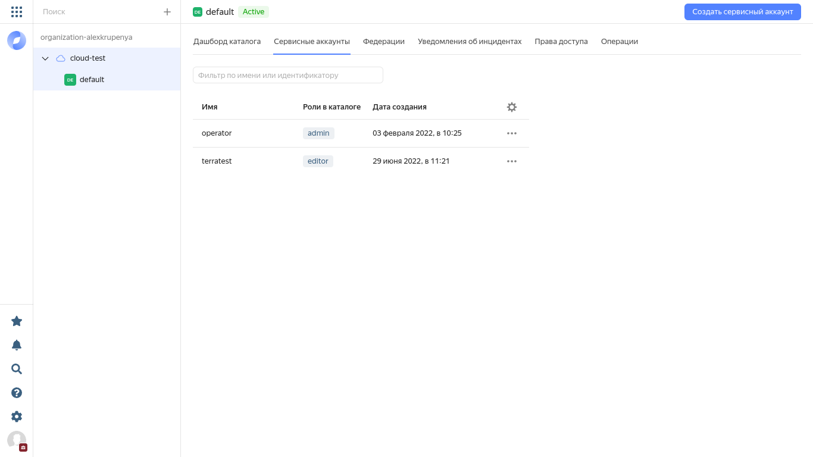
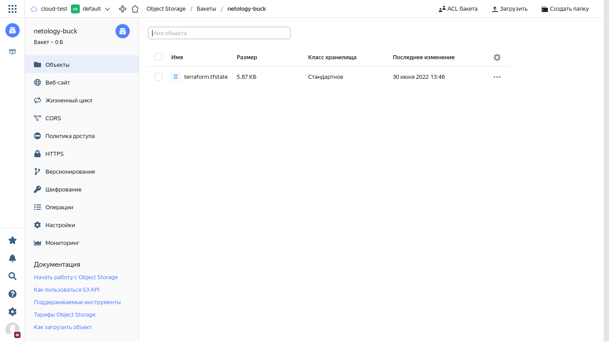
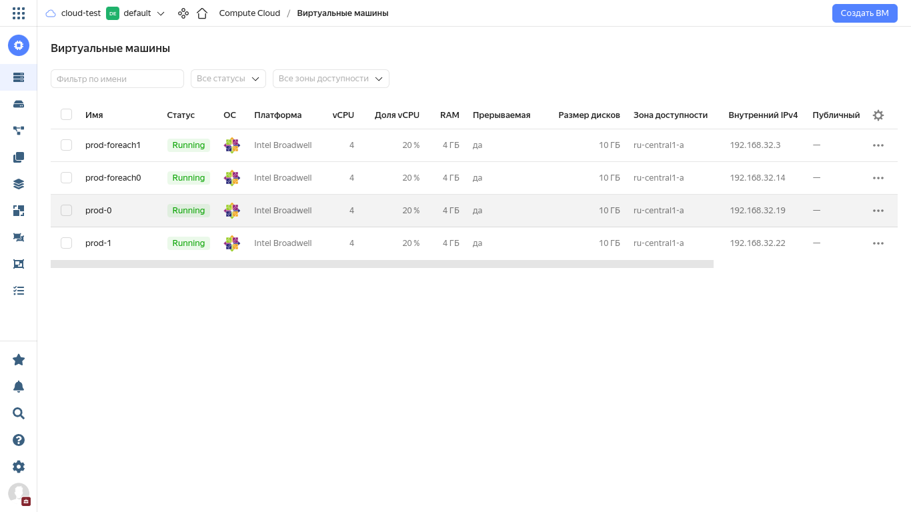
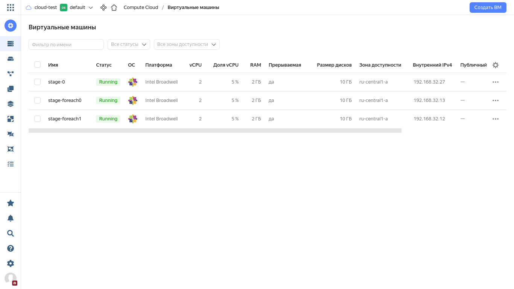
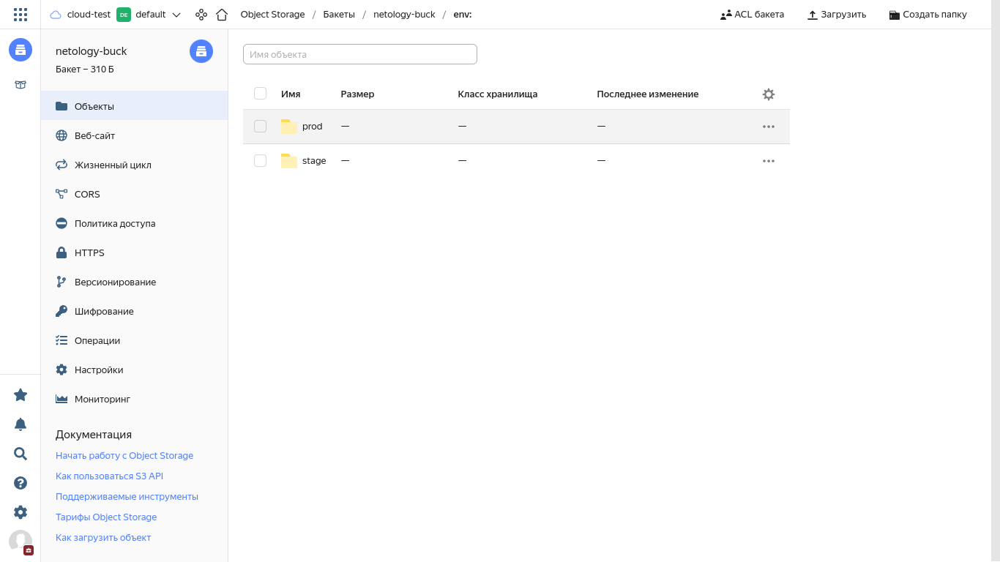

# Домашнее задание к занятию "7.3. Основы и принцип работы Терраформ"

## Задача 1. Создадим бэкэнд в S3 (необязательно, но крайне желательно).

*Если в рамках предыдущего задания у вас уже есть аккаунт AWS, то давайте продолжим знакомство со взаимодействием
терраформа и aws.*

1. *Создайте s3 бакет, iam роль и пользователя от которого будет работать терраформ. Можно создать отдельного пользователя,
а можно использовать созданного в рамках предыдущего задания, просто добавьте ему необходимы права, как описано 
[здесь](https://www.terraform.io/docs/backends/types/s3.html).*
1. *Зарегистрируйте бэкэнд в терраформ проекте как описано по ссылке выше.* 


## Задача 2. Инициализируем проект и создаем воркспейсы. 

1. Выполните `terraform init`:
    * если был создан бэкэнд в S3, то терраформ создат файл стейтов в S3 и запись в таблице 
dynamodb.
    * иначе будет создан локальный файл со стейтами.  
1. Создайте два воркспейса `stage` и `prod`.
1. В уже созданный `aws_instance` добавьте зависимость типа инстанса от вокспейса, что бы в разных ворскспейсах 
использовались разные `instance_type`.
1. Добавим `count`. Для `stage` должен создаться один экземпляр `ec2`, а для `prod` два. 
1. Создайте рядом еще один `aws_instance`, но теперь определите их количество при помощи `for_each`, а не `count`.
1. Что бы при изменении типа инстанса не возникло ситуации, когда не будет ни одного инстанса добавьте параметр
жизненного цикла `create_before_destroy = true` в один из рессурсов `aws_instance`.
1. При желании поэкспериментируйте с другими параметрами и рессурсами.

В виде результата работы пришлите:
* Вывод команды `terraform workspace list`.
* Вывод команды `terraform plan` для воркспейса `prod`.  

### Как cдавать задание

Выполненное домашнее задание пришлите ссылкой на .md-файл в вашем репозитории.

---
## Задача 1

### Решение

Поскольку как работать с AWS из России совершенно непонятно, то обе задачи пришлось творчески объединить в одно решение.  
[По заветам Яндекс-а](https://cloud.yandex.ru/docs/tutorials/infrastructure-management/terraform-state-storage) добавлю указанный блок в main.tf. Сам текст здесь
не привожу, его можно посмотреть в исходниках для terraform на github.com.  
Прежде всего, создам пользователя "terratest" и iam роль для работы Terraform. Для этого использую: `yc iam service-account create --name terratest`
```
[alexvk@archbox ~]$ yc iam service-account create --name terratest
id: ajet[skipped]
folder_id: b1g68bss5trqk0sk71o5
created_at: "2022-06-29T08:21:37.395384970Z"
name: terratest
```

Теперь назначу роль editor для соданноого сервисного аккаунта:
```
[alexvk@archbox ~]$  yc resource-manager folder add-access-binding b1g68bss5trqk0sk71o5 --role editor --subject serviceAccount:ajet[skipped]
done (1s)
```

Теперь необходимо создать ключ доступа для сервисного аккаунта:
```
[alexvk@archbox ~]$ yc iam access-key create --service-account-name terratest
access_key:
  id: ajep[skipped]
  service_account_id: ajet[skipped]
  created_at: "2022-06-29T09:50:08.112344213Z"
  key_id: YCAJEY[skpped]
secret: YCOM4MU[skipped]
```
Для регистрации бэкенд-а нееобходимо по документации добавить в файл [versions.tf](../7.3/versions.tf) соответствующие строки и выполнить инициализацию ``terraform init``; исходный текст
приведен в моём репозитории на github.com. 
```
[alexvk@archbox 7.3]$ vi ~/.terraformrc
```
Вышеприведенное - регистрация репозитория провайдеров от Яндекс, дабы миновать проблемы с hashicorp. [Инструкция по решению проблемы](https://cloud.yandex.ru/docs/tutorials/infrastructure-management/terraform-state-storage#configure-provider).  
Создаю хранилище объектов as Object storage "netology-buck". Выполняю инициализацию terraform:
```
[alexvk@archbox 7.3]$ terraform init

Initializing the backend...

Successfully configured the backend "s3"! Terraform will automatically
use this backend unless the backend configuration changes.

Initializing provider plugins...
- Finding yandex-cloud/yandex versions matching "0.75.0"...
- Installing yandex-cloud/yandex v0.75.0...
- Installed yandex-cloud/yandex v0.75.0 (unauthenticated)

Terraform has created a lock file .terraform.lock.hcl to record the provider
selections it made above. Include this file in your version control repository
so that Terraform can guarantee to make the same selections by default when
you run "terraform init" in the future.

Terraform has been successfully initialized!

You may now begin working with Terraform. Try running "terraform plan" to see
any changes that are required for your infrastructure. All Terraform commands
should now work.

If you ever set or change modules or backend configuration for Terraform,
rerun this command to reinitialize your working directory. If you forget, other
commands will detect it and remind you to do so if necessary.
```
После успешной инициализации - terraform plan.
```
[alexvk@archbox 7.3]$ terraform plan

Terraform used the selected providers to generate the following execution plan. Resource actions are indicated with the following symbols:
  + create

Terraform will perform the following actions:

  # yandex_compute_instance.vmtest01 will be created
  + resource "yandex_compute_instance" "vmtest01" {
      + allow_stopping_for_update = true
      + created_at                = (known after apply)
      + folder_id                 = (known after apply)
      + fqdn                      = (known after apply)
      + hostname                  = "vmtest01.netology.test"
      + id                        = (known after apply)
      + metadata                  = {
          + "ssh-keys" = <<-EOT
                cloud-user:ssh-rsa AAAAB3N4I0Es= alexvk@archbox
            EOT
        }
      + name                      = "vmtest01"
      + network_acceleration_type = "standard"
      + platform_id               = "standard-v3"
      + service_account_id        = (known after apply)
      + status                    = (known after apply)
      + zone                      = "ru-central1-a"

      + boot_disk {
          + auto_delete = true
          + device_name = (known after apply)
          + disk_id     = (known after apply)
          + mode        = (known after apply)

          + initialize_params {
              + block_size  = (known after apply)
              + description = (known after apply)
              + image_id    = "fd80s5atj1quloqfr00f"
              + name        = "disk00"
              + size        = 10
              + snapshot_id = (known after apply)
              + type        = "network-nvme"
            }
        }

      + network_interface {
          + index              = (known after apply)
          + ip_address         = "192.168.32.32"
          + ipv4               = true
          + ipv6               = (known after apply)
          + ipv6_address       = (known after apply)
          + mac_address        = (known after apply)
          + nat                = true
          + nat_ip_address     = (known after apply)
          + nat_ip_version     = (known after apply)
          + security_group_ids = (known after apply)
          + subnet_id          = (known after apply)
        }

      + placement_policy {
          + host_affinity_rules = (known after apply)
          + placement_group_id  = (known after apply)
        }

      + resources {
          + core_fraction = 100
          + cores         = 2
          + memory        = 2
        }

      + scheduling_policy {
          + preemptible = true
        }
    }

  # yandex_vpc_network.default will be created
  + resource "yandex_vpc_network" "default" {
      + created_at                = (known after apply)
      + default_security_group_id = (known after apply)
      + folder_id                 = (known after apply)
      + id                        = (known after apply)
      + labels                    = (known after apply)
      + name                      = "netnet"
      + subnet_ids                = (known after apply)
    }

  # yandex_vpc_subnet.default will be created
  + resource "yandex_vpc_subnet" "default" {
      + created_at     = (known after apply)
      + folder_id      = (known after apply)
      + id             = (known after apply)
      + labels         = (known after apply)
      + name           = "subnetnet"
      + network_id     = (known after apply)
      + v4_cidr_blocks = [
          + "192.168.32.0/24",
        ]
      + v6_cidr_blocks = (known after apply)
      + zone           = "ru-central1-a"
    }

Plan: 3 to add, 0 to change, 0 to destroy.

Changes to Outputs:
  + external_ip_address_vmtest01 = (known after apply)
  + internal_ip_address_vmtest01 = "192.168.32.32"

───────────────────────────────────────────────────────────────────────────────────────────────────────────────────────────────────────────────────────────────────────

Note: You didn't use the -out option to save this plan, so Terraform can't guarantee to take exactly these actions if you run "terraform apply" now.
```
После успешного планирования развертываем инфраструктуру:
```
[alexvk@archbox 7.3]$ terraform apply

Terraform used the selected providers to generate the following execution plan. Resource actions are indicated with the following symbols:
  + create

Terraform will perform the following actions:

  # yandex_compute_instance.vmtest01 will be created
  + resource "yandex_compute_instance" "vmtest01" {
      + allow_stopping_for_update = true
      + created_at                = (known after apply)
      + folder_id                 = (known after apply)
      + fqdn                      = (known after apply)
      + hostname                  = "vmtest01.netology.test"
      + id                        = (known after apply)
      + metadata                  = {
          + "ssh-keys" = <<-EOT
                cloud-user:ssh-rsa AAAAB3NI0Es= alexvk@archbox
            EOT
        }
      + name                      = "vmtest01"
      + network_acceleration_type = "standard"
      + platform_id               = "standard-v3"
      + service_account_id        = (known after apply)
      + status                    = (known after apply)
      + zone                      = "ru-central1-a"

      + boot_disk {
          + auto_delete = true
          + device_name = (known after apply)
          + disk_id     = (known after apply)
          + mode        = (known after apply)

          + initialize_params {
              + block_size  = (known after apply)
              + description = (known after apply)
              + image_id    = "fd80s5atj1quloqfr00f"
              + name        = "disk00"
              + size        = 10
              + snapshot_id = (known after apply)
              + type        = "network-nvme"
            }
        }

      + network_interface {
          + index              = (known after apply)
          + ip_address         = "192.168.32.32"
          + ipv4               = true
          + ipv6               = (known after apply)
          + ipv6_address       = (known after apply)
          + mac_address        = (known after apply)
          + nat                = true
          + nat_ip_address     = (known after apply)
          + nat_ip_version     = (known after apply)
          + security_group_ids = (known after apply)
          + subnet_id          = (known after apply)
        }

      + placement_policy {
          + host_affinity_rules = (known after apply)
          + placement_group_id  = (known after apply)
        }

      + resources {
          + core_fraction = 100
          + cores         = 2
          + memory        = 2
        }

      + scheduling_policy {
          + preemptible = true
        }
    }

  # yandex_vpc_network.default will be created
  + resource "yandex_vpc_network" "default" {
      + created_at                = (known after apply)
      + default_security_group_id = (known after apply)
      + folder_id                 = (known after apply)
      + id                        = (known after apply)
      + labels                    = (known after apply)
      + name                      = "netnet"
      + subnet_ids                = (known after apply)
    }

  # yandex_vpc_subnet.default will be created
  + resource "yandex_vpc_subnet" "default" {
      + created_at     = (known after apply)
      + folder_id      = (known after apply)
      + id             = (known after apply)
      + labels         = (known after apply)
      + name           = "subnetnet"
      + network_id     = (known after apply)
      + v4_cidr_blocks = [
          + "192.168.32.0/24",
        ]
      + v6_cidr_blocks = (known after apply)
      + zone           = "ru-central1-a"
    }

Plan: 3 to add, 0 to change, 0 to destroy.

Changes to Outputs:
  + external_ip_address_vmtest01 = (known after apply)
  + internal_ip_address_vmtest01 = "192.168.32.32"

Do you want to perform these actions?
  Terraform will perform the actions described above.
  nly 'yes' will be accepted to approve.

  Enter a value: yes

yandex_vpc_network.default: Creating...
yandex_vpc_network.default: Creation complete after 1s [id=enp7t2hueaksv1nkjd70]
yandex_vpc_subnet.default: Creating...
yandex_vpc_subnet.default: Creation complete after 1s [id=e9bgkt6e62ng3jd4ns8a]
yandex_compute_instance.vmtest01: Creating...
yandex_compute_instance.vmtest01: Still creating... [10s elapsed]
yandex_compute_instance.vmtest01: Still creating... [20s elapsed]
yandex_compute_instance.vmtest01: Still creating... [30s elapsed]
yandex_compute_instance.vmtest01: Creation complete after 33s [id=fhmenjpji09cnifn8n36]

Apply complete! Resources: 3 added, 0 changed, 0 destroyed.

Outputs:

external_ip_address_vmtest01 = "51.250.80.52"
internal_ip_address_vmtest01 = "192.168.32.32"
```
В веб-интерфейсе консоли Яндекс-облака проконтролирую файл состояние terraform:

Как видно, файл состояния создан. 

## Задача 2

### Решение

В условиях тотального цейтнота удалось, как мне кажется, разобраться с решением задания  в ЯО.  
Выполняю terraform init:
```
[alexvk@archbox 7.3]$ terraform init

Initializing the backend...

Successfully configured the backend "s3"! Terraform will automatically
use this backend unless the backend configuration changes.

Initializing provider plugins...
- Finding yandex-cloud/yandex versions matching ">= 0.75.0"...
- Installing yandex-cloud/yandex v0.76.0...
- Installed yandex-cloud/yandex v0.76.0 (unauthenticated)

Terraform has created a lock file .terraform.lock.hcl to record the provider
selections it made above. Include this file in your version control repository
so that Terraform can guarantee to make the same selections by default when
you run "terraform init" in the future.

Terraform has been successfully initialized!

You may now begin working with Terraform. Try running "terraform plan" to see
any changes that are required for your infrastructure. All Terraform commands
should now work.

If you ever set or change modules or backend configuration for Terraform,
rerun this command to reinitialize your working directory. If you forget, other
commands will detect it and remind you to do so if necessary.
```
Успешно. Теперь вручную с помощью ``terraform workspace new [name]`` создаю указанные в задании workspaces 'prod' и  'stage'. 
Посмотрю список workspaces:
```
[alexvk@archbox 7.3]$ terraform workspace list
  default
  prod
* stage
```
Далее написаны конфигурационные файлы для решения задачи. Прогоню terraform plan по workspace 'prod':
```
[alexvk@archbox 7.3]$ terraform workspace select prod
Switched to workspace "prod".
[alexvk@archbox 7.3]$ terraform plan

Terraform used the selected providers to generate the following execution plan. Resource actions are indicated with the following symbols:
  + create

Terraform will perform the following actions:

  # yandex_compute_instance.test0[0] will be created
  + resource "yandex_compute_instance" "test0" {
      + created_at                = (known after apply)
      + folder_id                 = (known after apply)
      + fqdn                      = (known after apply)
      + hostname                  = (known after apply)
      + id                        = (known after apply)
      + name                      = "prod-0"
      + network_acceleration_type = "standard"
      + platform_id               = "standard-v1"
      + service_account_id        = (known after apply)
      + status                    = (known after apply)
      + zone                      = "ru-central1-a"

      + boot_disk {
          + auto_delete = true
          + device_name = (known after apply)
          + disk_id     = (known after apply)
          + mode        = (known after apply)

          + initialize_params {
              + block_size  = (known after apply)
              + description = (known after apply)
              + image_id    = "fd80s5atj1quloqfr00f"
              + name        = (known after apply)
              + size        = 10
              + snapshot_id = (known after apply)
              + type        = "network-nvme"
            }
        }

      + network_interface {
          + index              = (known after apply)
          + ip_address         = (known after apply)
          + ipv4               = true
          + ipv6               = (known after apply)
          + ipv6_address       = (known after apply)
          + mac_address        = (known after apply)
          + nat                = (known after apply)
          + nat_ip_address     = (known after apply)
          + nat_ip_version     = (known after apply)
          + security_group_ids = (known after apply)
          + subnet_id          = (known after apply)
        }

      + placement_policy {
          + host_affinity_rules = (known after apply)
          + placement_group_id  = (known after apply)
        }

      + resources {
          + core_fraction = 20
          + cores         = 4
          + memory        = 4
        }

      + scheduling_policy {
          + preemptible = true
        }
    }

  # yandex_compute_instance.test0[1] will be created
  + resource "yandex_compute_instance" "test0" {
      + created_at                = (known after apply)
      + folder_id                 = (known after apply)
      + fqdn                      = (known after apply)
      + hostname                  = (known after apply)
      + id                        = (known after apply)
      + name                      = "prod-1"
      + network_acceleration_type = "standard"
      + platform_id               = "standard-v1"
      + service_account_id        = (known after apply)
      + status                    = (known after apply)
      + zone                      = "ru-central1-a"

      + boot_disk {
          + auto_delete = true
          + device_name = (known after apply)
          + disk_id     = (known after apply)
          + mode        = (known after apply)

          + initialize_params {
              + block_size  = (known after apply)
              + description = (known after apply)
              + image_id    = "fd80s5atj1quloqfr00f"
              + name        = (known after apply)
              + size        = 10
              + snapshot_id = (known after apply)
              + type        = "network-nvme"
            }
        }

      + network_interface {
          + index              = (known after apply)
          + ip_address         = (known after apply)
          + ipv4               = true
          + ipv6               = (known after apply)
          + ipv6_address       = (known after apply)
          + mac_address        = (known after apply)
          + nat                = (known after apply)
          + nat_ip_address     = (known after apply)
          + nat_ip_version     = (known after apply)
          + security_group_ids = (known after apply)
          + subnet_id          = (known after apply)
        }

      + placement_policy {
          + host_affinity_rules = (known after apply)
          + placement_group_id  = (known after apply)
        }

      + resources {
          + core_fraction = 20
          + cores         = 4
          + memory        = 4
        }

      + scheduling_policy {
          + preemptible = true
        }
    }

  # yandex_compute_instance.test1["foreach0"] will be created
  + resource "yandex_compute_instance" "test1" {
      + allow_stopping_for_update = true
      + created_at                = (known after apply)
      + folder_id                 = (known after apply)
      + fqdn                      = (known after apply)
      + hostname                  = (known after apply)
      + id                        = (known after apply)
      + name                      = "prod-foreach0"
      + network_acceleration_type = "standard"
      + platform_id               = "standard-v1"
      + service_account_id        = (known after apply)
      + status                    = (known after apply)
      + zone                      = "ru-central1-a"

      + boot_disk {
          + auto_delete = true
          + device_name = (known after apply)
          + disk_id     = (known after apply)
          + mode        = (known after apply)

          + initialize_params {
              + block_size  = (known after apply)
              + description = (known after apply)
              + image_id    = "fd80s5atj1quloqfr00f"
              + name        = (known after apply)
              + size        = 10
              + snapshot_id = (known after apply)
              + type        = "network-nvme"
            }
        }

      + network_interface {
          + index              = (known after apply)
          + ip_address         = (known after apply)
          + ipv4               = true
          + ipv6               = (known after apply)
          + ipv6_address       = (known after apply)
          + mac_address        = (known after apply)
          + nat                = (known after apply)
          + nat_ip_address     = (known after apply)
          + nat_ip_version     = (known after apply)
          + security_group_ids = (known after apply)
          + subnet_id          = (known after apply)
        }

      + placement_policy {
          + host_affinity_rules = (known after apply)
          + placement_group_id  = (known after apply)
        }

      + resources {
          + core_fraction = 20
          + cores         = 4
          + memory        = 4
        }

      + scheduling_policy {
          + preemptible = true
        }
    }

  # yandex_compute_instance.test1["foreach1"] will be created
  + resource "yandex_compute_instance" "test1" {
      + allow_stopping_for_update = true
      + created_at                = (known after apply)
      + folder_id                 = (known after apply)
      + fqdn                      = (known after apply)
      + hostname                  = (known after apply)
      + id                        = (known after apply)
      + name                      = "prod-foreach1"
      + network_acceleration_type = "standard"
      + platform_id               = "standard-v1"
      + service_account_id        = (known after apply)
      + status                    = (known after apply)
      + zone                      = "ru-central1-a"

      + boot_disk {
          + auto_delete = true
          + device_name = (known after apply)
          + disk_id     = (known after apply)
          + mode        = (known after apply)

          + initialize_params {
              + block_size  = (known after apply)
              + description = (known after apply)
              + image_id    = "fd80s5atj1quloqfr00f"
              + name        = (known after apply)
              + size        = 10
              + snapshot_id = (known after apply)
              + type        = "network-nvme"
            }
        }

      + network_interface {
          + index              = (known after apply)
          + ip_address         = (known after apply)
          + ipv4               = true
          + ipv6               = (known after apply)
          + ipv6_address       = (known after apply)
          + mac_address        = (known after apply)
          + nat                = (known after apply)
          + nat_ip_address     = (known after apply)
          + nat_ip_version     = (known after apply)
          + security_group_ids = (known after apply)
          + subnet_id          = (known after apply)
        }

      + placement_policy {
          + host_affinity_rules = (known after apply)
          + placement_group_id  = (known after apply)
        }

      + resources {
          + core_fraction = 20
          + cores         = 4
          + memory        = 4
        }

      + scheduling_policy {
          + preemptible = true
        }
    }

  # yandex_vpc_network.testnet will be created
  + resource "yandex_vpc_network" "testnet" {
      + created_at                = (known after apply)
      + default_security_group_id = (known after apply)
      + folder_id                 = (known after apply)
      + id                        = (known after apply)
      + labels                    = (known after apply)
      + name                      = "netnet-prod"
      + subnet_ids                = (known after apply)
    }

  # yandex_vpc_subnet.subnet_test will be created
  + resource "yandex_vpc_subnet" "subnet_test" {
      + created_at     = (known after apply)
      + folder_id      = (known after apply)
      + id             = (known after apply)
      + labels         = (known after apply)
      + name           = "subnetnet-prod"
      + network_id     = (known after apply)
      + v4_cidr_blocks = [
          + "192.168.32.0/24",
        ]
      + v6_cidr_blocks = (known after apply)
      + zone           = "ru-central1-a"
    }

Plan: 6 to add, 0 to change, 0 to destroy.

───────────────────────────────────────────────────────────────────────────────────────────────────────────────────────────────────────────────────────────────────────

Note: You didn't use the -out option to save this plan, so Terraform can't guarantee to take exactly these actions if you run "terraform apply" now.
```
В результате создаются ВМ по count (перечислению) в количестве 2 шт., как и задано в переменной для 'prod'. Для stage результат аналогичен, 
но по count создается одна ВМ.  
Цикл foreach создает дополнительно две ВМ, так как в массиве для цикла мною  указаны два значения foreach0 и foreach1.  
Также создается сеть и в ней подсеть для связи ВМ. Внешние адреса для упрощения не присваивал, если необходимо это сделать, то в ресурсах ВМ 
для ``netwok_interface`` дополнительно надо указать параметр ``nat=true``.  
Для разных workspaces при создании ВМ применяются разные ресурсы CPU и RAM. Это сделано с помощью условного оператора с проверкой именм workspace.  
Обработки ошибок при  переключении в workspace именованный default я не делал, так как terraform прекрасно справляется с этим самостоятельно.  
Ответы на прямые вопросы задачи:

1. Вывод команды terraform workspace list.

```
[alexvk@archbox 7.3]$ terraform workspace list
  default
* prod
  stage
```

2. [terraform plan по ссылке](misc/terraform.prod.plan), [исходные тексты по ссылке](src/)

Скриншоты созданных ВМ ниже:

Workspace prod:


Workspace stage:
 

Бакет S3 с состояние terraform:
