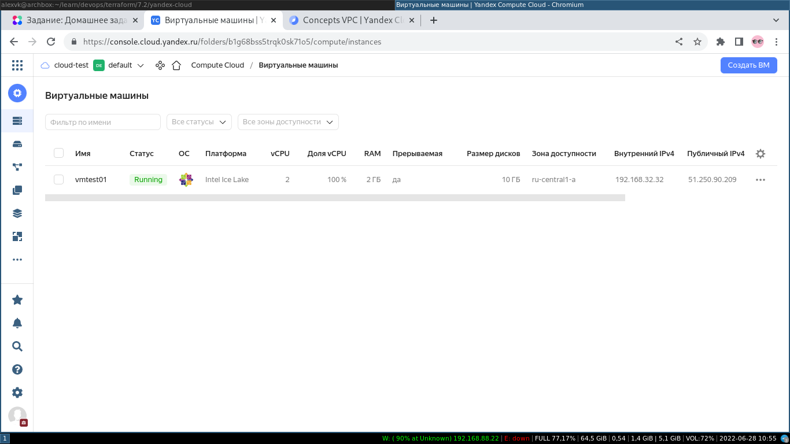

# Домашнее задание к занятию "7.2. Облачные провайдеры и синтаксис Terraform."


*Зачастую разбираться в новых инструментах гораздо интересней понимая то, как они работают изнутри. 
Поэтому в рамках первого *необязательного* задания предлагается завести свою учетную запись в AWS (Amazon Web Services) или Yandex.Cloud.
Идеально будет познакомится с обоими облаками, потому что они отличаются.* 

## Task 1

### Решение
Задача 1 (вариант с AWS) пропущена в связи с известными событиями и невозможностью создать даже бесплатный аккаунт в амазон облаке из-за 
наложенных амазоном санкций. Поэтому перехожу сразу к варианту с Яндекс облаком.  
Предварительно установлен из репозитория ОС terraform:
```
[alexvk@archbox yandex-cloud]$ terraform --version
Terraform v1.2.3
on linux_amd64
```

**Задача 1 (Вариант с Yandex.Cloud). Регистрация в ЯО и знакомство с основами (необязательно, но крайне желательно).**

1. *Подробная инструкция на русском языке содержится [здесь](https://cloud.yandex.ru/docs/solutions/infrastructure-management/terraform-quickstart).*
2. *Обратите внимание на период бесплатного использования после регистрации аккаунта.*
3. *Используйте раздел "Подготовьте облако к работе" для регистрации аккаунта. Далее раздел "Настройте провайдер" для подготовки
базового терраформ конфига.*
4. *Воспользуйтесь [инструкцией](https://registry.terraform.io/providers/yandex-cloud/yandex/latest/docs) на сайте терраформа, что бы 
не указывать авторизационный токен в коде, а терраформ провайдер брал его из переменных окружений.*

### Решение

Аккаунт для яндекс-облака (в дальнейшем "ЯО") был зарегистрирован ранее для выполнения заданий по теме 'Docker'. Для выполнения домашних работ 
получен промокод, позволяющий оплатить ресурсы ЯО.

После изучения инструкции написан конфигурационный файл **main.tf**. Чтобы не указывать авторизационный токен в конфигурационном файле, воспользовался переменной окружения, как указано в документации на terraform по ссылке выше. Чтобы Terraform обработал эту переменную как переменную окружения, поименовал ее как *TF_VAR_YCTOKEN*.
Затем ``export TF_VAR_YCTOKEN=xxxxxxxxxxxxxxxxx``, а в конфигурационном файле terraform уже была объявлена переменная YCTOKEN и ее значение присваивается переменной token для авторизации в ЯО.


После исполнения команды ``terraform init`` получаем вывод:
```
i[alexvk@archbox yandex-cloud]$ terraform init

Initializing the backend...

Initializing provider plugins...
- Finding yandex-cloud/yandex versions matching "0.75.0"...
- Installing yandex-cloud/yandex v0.75.0...
- Installed yandex-cloud/yandex v0.75.0 (self-signed, key ID E40F590B50BB8E40)

Partner and community providers are signed by their developers.
If you'd like to know more about provider signing, you can read about it here:
https://www.terraform.io/docs/cli/plugins/signing.html

Terraform has created a lock file .terraform.lock.hcl to record the provider
selections it made above. Include this file in your version control repository
so that Terraform can guarantee to make the same selections by default when
you run "terraform init" in the future.

Terraform has been successfully initialized!

You may now begin working with Terraform. Try running "terraform plan" to see
any changes that are required for your infrastructure. All Terraform commands
should now work.

If you ever set or change modules or backend configuration for Terraform,
rerun this command to reinitialize your working directory. If you forget, other
commands will detect it and remind you to do so if necessary.
```

## Задача 2. Создание aws ec2 или yandex_compute_instance через терраформ. 

1. *В каталоге `terraform` вашего основного репозитория, который был создан в начале курсе, создайте файл `main.tf` и `versions.tf`.*
2. *Зарегистрируйте провайдер*
   1. *для [aws](https://registry.terraform.io/providers/hashicorp/aws/latest/docs). В файл `main.tf` добавьте*
   блок `provider`, а в `versions.tf` блок `terraform` с вложенным блоком `required_providers`. Укажите любой выбранный вами регион 
   внутри блока `provider`.
   2. либо для [yandex.cloud](https://registry.terraform.io/providers/yandex-cloud/yandex/latest/docs). Подробную инструкцию можно найти 
   [здесь](https://cloud.yandex.ru/docs/solutions/infrastructure-management/terraform-quickstart).
3. Внимание! В гит репозиторий нельзя пушить ваши личные ключи доступа к аккаунту. Поэтому в предыдущем задании мы указывали
их в виде переменных окружения. 
4. В файле `main.tf` воспользуйтесь блоком `data "aws_ami` для поиска ami образа последнего Ubuntu.  
5. В файле `main.tf` создайте рессурс 
   1. либо [ec2 instance](https://registry.terraform.io/providers/hashicorp/aws/latest/docs/resources/instance).
   Постарайтесь указать как можно больше параметров для его определения. Минимальный набор параметров указан в первом блоке 
   `Example Usage`, но желательно, указать большее количество параметров.
   2. либо [yandex_compute_image](https://registry.terraform.io/providers/yandex-cloud/yandex/latest/docs/resources/compute_image).
6. Также в случае использования aws:
   1. Добавьте data-блоки `aws_caller_identity` и `aws_region`.
   2. В файл `outputs.tf` поместить блоки `output` с данными об используемых в данный момент: 
       * AWS account ID,
       * AWS user ID,
       * AWS регион, который используется в данный момент, 
       * Приватный IP ec2 инстансы,
       * Идентификатор подсети в которой создан инстанс.  
7. *Если вы выполнили первый пункт, то добейтесь того, что бы команда `terraform plan` выполнялась без ошибок.*

*В качестве результата задания предоставьте:*
1. *Ответ на вопрос: при помощи какого инструмента (из разобранных на прошлом занятии) можно создать свой образ ami?*
1. *Ссылку на репозиторий с исходной конфигурацией терраформа.*  

---

### Как cдавать задание

*Выполненное домашнее задание пришлите ссылкой на .md-файл в вашем репозитории.*

---

### Решение

С помощью команды ``yc compute image list --folder-id standard-images`` выберу образ для развертывания. Пусть это будет Centos 8.  
Выполняю планирование инфраструктуры (вычисление ресурсов) с помощью Terraform:


```
[alexvk@archbox yandex-cloud]$ terraform plan 

Terraform used the selected providers to generate the following execution plan. Resource actions are indicated with the following symbols:
  + create

Terraform will perform the following actions:

  # yandex_compute_instance.vmtest01 will be created
  + resource "yandex_compute_instance" "vmtest01" {
      + allow_stopping_for_update = true
      + created_at                = (known after apply)
      + folder_id                 = (known after apply)
      + fqdn                      = (known after apply)
      + hostname                  = "vmtest01.netology.test"
      + id                        = (known after apply)
      + metadata                  = {
          + "ssh-keys" = <<-EOT
                cloud-user:ssh-rsa AAAAB [skipped] = alexvk@archbox
            EOT
        }
      + name                      = "vmtest01"
      + network_acceleration_type = "standard"
      + platform_id               = "standard-v3"
      + service_account_id        = (known after apply)
      + status                    = (known after apply)
      + zone                      = "ru-central1-a"

      + boot_disk {
          + auto_delete = true
          + device_name = (known after apply)
          + disk_id     = (known after apply)
          + mode        = (known after apply)

          + initialize_params {
              + block_size  = (known after apply)
              + description = (known after apply)
              + image_id    = "fd80s5atj1quloqfr00f"
              + name        = "disk00"
              + size        = 10
              + snapshot_id = (known after apply)
              + type        = "network-nvme"
            }
        }

      + network_interface {
          + index              = (known after apply)
          + ip_address         = "192.168.32.32"
          + ipv4               = true
          + ipv6               = (known after apply)
          + ipv6_address       = (known after apply)
          + mac_address        = (known after apply)
          + nat                = true
          + nat_ip_address     = (known after apply)
          + nat_ip_version     = (known after apply)
          + security_group_ids = (known after apply)
          + subnet_id          = (known after apply)
        }

      + placement_policy {
          + host_affinity_rules = (known after apply)
          + placement_group_id  = (known after apply)
        }

      + resources {
          + core_fraction = 100
          + cores         = 2
          + memory        = 2
        }

      + scheduling_policy {
          + preemptible = true
        }
    }

  # yandex_vpc_network.default will be created
  + resource "yandex_vpc_network" "default" {
      + created_at                = (known after apply)
      + default_security_group_id = (known after apply)
      + folder_id                 = (known after apply)
      + id                        = (known after apply)
      + labels                    = (known after apply)
      + name                      = "netnet"
      + subnet_ids                = (known after apply)
    }

  # yandex_vpc_subnet.default will be created
  + resource "yandex_vpc_subnet" "default" {
      + created_at     = (known after apply)
      + folder_id      = (known after apply)
      + id             = (known after apply)
      + labels         = (known after apply)
      + name           = "subnetnet"
      + network_id     = (known after apply)
      + v4_cidr_blocks = [
          + "192.168.32.0/24",
        ]
      + v6_cidr_blocks = (known after apply)
      + zone           = "ru-central1-a"
    }

Plan: 3 to add, 0 to change, 0 to destroy.

Changes to Outputs:
  + external_ip_address_vmtest01 = (known after apply)
  + internal_ip_address_vmtest01 = "192.168.32.32"

───────────────────────────────────────────────────────────────────────────────────────────────────────────────────────────────────────────────────────────────────────

Note: You didn't use the -out option to save this plan, so Terraform can't guarantee to take exactly these actions if you run "terraform apply" now.
```

Теперь можно выполнить развертывание инфраструктуры:

```
[alexvk@archbox yandex-cloud]$ terraform apply --auto-approve

Terraform used the selected providers to generate the following execution plan. Resource actions are indicated with the following symbols:
  + create

Terraform will perform the following actions:

  # yandex_compute_instance.vmtest01 will be created
  + resource "yandex_compute_instance" "vmtest01" {
      + allow_stopping_for_update = true
      + created_at                = (known after apply)
      + folder_id                 = (known after apply)
      + fqdn                      = (known after apply)
      + hostname                  = "vmtest01.netology.test"
      + id                        = (known after apply)
      + metadata                  = {
          + "ssh-keys" = <<-EOT
                cloud-user:ssh-rsa AAAAB [skipped]= alexvk@archbox
            EOT
        }
      + name                      = "vmtest01"
      + network_acceleration_type = "standard"
      + platform_id               = "standard-v3"
      + service_account_id        = (known after apply)
      + status                    = (known after apply)
      + zone                      = "ru-central1-a"

      + boot_disk {
          + auto_delete = true
          + device_name = (known after apply)
          + disk_id     = (known after apply)
          + mode        = (known after apply)

          + initialize_params {
              + block_size  = (known after apply)
              + description = (known after apply)
              + image_id    = "fd80s5atj1quloqfr00f"
              + name        = "disk00"
              + size        = 10
              + snapshot_id = (known after apply)
              + type        = "network-nvme"
            }
        }

      + network_interface {
          + index              = (known after apply)
          + ip_address         = "192.168.32.32"
          + ipv4               = true
          + ipv6               = (known after apply)
          + ipv6_address       = (known after apply)
          + mac_address        = (known after apply)
          + nat                = true
          + nat_ip_address     = (known after apply)
          + nat_ip_version     = (known after apply)
          + security_group_ids = (known after apply)
          + subnet_id          = (known after apply)
        }

      + placement_policy {
          + host_affinity_rules = (known after apply)
          + placement_group_id  = (known after apply)
        }

      + resources {
          + core_fraction = 100
          + cores         = 2
          + memory        = 2
        }

      + scheduling_policy {
          + preemptible = true
        }
    }

  # yandex_vpc_network.default will be created
  + resource "yandex_vpc_network" "default" {
      + created_at                = (known after apply)
      + default_security_group_id = (known after apply)
      + folder_id                 = (known after apply)
      + id                        = (known after apply)
      + labels                    = (known after apply)
      + name                      = "netnet"
      + subnet_ids                = (known after apply)
    }

  # yandex_vpc_subnet.default will be created
  + resource "yandex_vpc_subnet" "default" {
      + created_at     = (known after apply)
      + folder_id      = (known after apply)
      + id             = (known after apply)
      + labels         = (known after apply)
      + name           = "subnetnet"
      + network_id     = (known after apply)
      + v4_cidr_blocks = [
          + "192.168.32.0/24",
        ]
      + v6_cidr_blocks = (known after apply)
      + zone           = "ru-central1-a"
    }

Plan: 3 to add, 0 to change, 0 to destroy.

Changes to Outputs:
  + external_ip_address_vmtest01 = (known after apply)
  + internal_ip_address_vmtest01 = "192.168.32.32"
yandex_vpc_network.default: Creating...
yandex_vpc_network.default: Creation complete after 1s [id=enpr4jkjj7gd558vglep]
yandex_vpc_subnet.default: Creating...
yandex_vpc_subnet.default: Creation complete after 0s [id=e9bicicetivd4kuku51i]
yandex_compute_instance.vmtest01: Creating...
yandex_compute_instance.vmtest01: Still creating... [10s elapsed]
yandex_compute_instance.vmtest01: Still creating... [20s elapsed]
yandex_compute_instance.vmtest01: Still creating... [30s elapsed]
yandex_compute_instance.vmtest01: Creation complete after 34s [id=fhmooa6t1kro1c3204ea]

Apply complete! Resources: 3 added, 0 changed, 0 destroyed.

Outputs:

external_ip_address_vmtest01 = "51.250.5.163"
internal_ip_address_vmtest01 = "192.168.32.32"
```

Проверяем логин на созданную машину:

```
[alexvk@archbox yandex-cloud]$ ssh cloud-user@51.250.5.163
The authenticity of host '51.250.5.163 (51.250.5.163)' can't be established.
ED25519 key fingerprint is SHA256:3xXuLfIiR+slAUr/Dwlile4YbTJnsqxsSoYIVxhGE44.
This key is not known by any other names
Are you sure you want to continue connecting (yes/no/[fingerprint])? yes
Warning: Permanently added '51.250.5.163' (ED25519) to the list of known hosts.
Enter passphrase for key '/home/alexvk/.ssh/id_rsa': 
[cloud-user@vmtest01 ~]$ cat /etc/centos-release
CentOS Linux release 8.5.2111
[cloud-user@vmtest01 ~]$ logout
Connection to 51.250.5.163 closed.
[alexvk@archbox yandex-cloud]$ 
```

Теперь необходимо уничтожить созданные ресурсы для экономии материальных средств:

```
[alexvk@archbox yandex-cloud]$ terraform destroy --auto-approve
yandex_vpc_network.default: Refreshing state... [id=enpr4jkjj7gd558vglep]
yandex_vpc_subnet.default: Refreshing state... [id=e9bicicetivd4kuku51i]
yandex_compute_instance.vmtest01: Refreshing state... [id=fhmooa6t1kro1c3204ea]

Terraform used the selected providers to generate the following execution plan. Resource actions are indicated with the following symbols:
  - destroy

Terraform will perform the following actions:

  # yandex_compute_instance.vmtest01 will be destroyed
  - resource "yandex_compute_instance" "vmtest01" {
      - allow_stopping_for_update = true -> null
      - created_at                = "2022-06-28T08:19:44Z" -> null
      - folder_id                 = "b1g68bss5trqk0sk71o5" -> null
      - fqdn                      = "vmtest01.netology.test" -> null
      - hostname                  = "vmtest01" -> null
      - id                        = "fhmooa6t1kro1c3204ea" -> null
      - labels                    = {} -> null
      - metadata                  = {
          - "ssh-keys" = <<-EOT
                cloud-user:ssh-rsa AAAAB [skipped]= alexvk@archbox
            EOT
        } -> null
      - name                      = "vmtest01" -> null
      - network_acceleration_type = "standard" -> null
      - platform_id               = "standard-v3" -> null
      - status                    = "running" -> null
      - zone                      = "ru-central1-a" -> null

      - boot_disk {
          - auto_delete = true -> null
          - device_name = "fhmqq8tnu661kcvuu7nm" -> null
          - disk_id     = "fhmqq8tnu661kcvuu7nm" -> null
          - mode        = "READ_WRITE" -> null

          - initialize_params {
              - block_size = 4096 -> null
              - image_id   = "fd80s5atj1quloqfr00f" -> null
              - name       = "disk00" -> null
              - size       = 10 -> null
              - type       = "network-ssd" -> null
            }
        }

      - network_interface {
          - index              = 0 -> null
          - ip_address         = "192.168.32.32" -> null
          - ipv4               = true -> null
          - ipv6               = false -> null
          - mac_address        = "d0:0d:18:c2:8d:d0" -> null
          - nat                = true -> null
          - nat_ip_address     = "51.250.5.163" -> null
          - nat_ip_version     = "IPV4" -> null
          - security_group_ids = [] -> null
          - subnet_id          = "e9bicicetivd4kuku51i" -> null
        }

      - placement_policy {
          - host_affinity_rules = [] -> null
        }

      - resources {
          - core_fraction = 100 -> null
          - cores         = 2 -> null
          - gpus          = 0 -> null
          - memory        = 2 -> null
        }

      - scheduling_policy {
          - preemptible = true -> null
        }
    }

  # yandex_vpc_network.default will be destroyed
  - resource "yandex_vpc_network" "default" {
      - created_at = "2022-06-28T08:19:43Z" -> null
      - folder_id  = "b1g68bss5trqk0sk71o5" -> null
      - id         = "enpr4jkjj7gd558vglep" -> null
      - labels     = {} -> null
      - name       = "netnet" -> null
      - subnet_ids = [
          - "e9bicicetivd4kuku51i",
        ] -> null
    }

  # yandex_vpc_subnet.default will be destroyed
  - resource "yandex_vpc_subnet" "default" {
      - created_at     = "2022-06-28T08:19:43Z" -> null
      - folder_id      = "b1g68bss5trqk0sk71o5" -> null
      - id             = "e9bicicetivd4kuku51i" -> null
      - labels         = {} -> null
      - name           = "subnetnet" -> null
      - network_id     = "enpr4jkjj7gd558vglep" -> null
      - v4_cidr_blocks = [
          - "192.168.32.0/24",
        ] -> null
      - v6_cidr_blocks = [] -> null
      - zone           = "ru-central1-a" -> null
    }

Plan: 0 to add, 0 to change, 3 to destroy.

Changes to Outputs:
  - external_ip_address_vmtest01 = "51.250.5.163" -> null
  - internal_ip_address_vmtest01 = "192.168.32.32" -> null
yandex_compute_instance.vmtest01: Destroying... [id=fhmooa6t1kro1c3204ea]
yandex_compute_instance.vmtest01: Still destroying... [id=fhmooa6t1kro1c3204ea, 10s elapsed]
yandex_compute_instance.vmtest01: Destruction complete after 19s
yandex_vpc_subnet.default: Destroying... [id=e9bicicetivd4kuku51i]
yandex_vpc_subnet.default: Still destroying... [id=e9bicicetivd4kuku51i, 10s elapsed]
yandex_vpc_subnet.default: Destruction complete after 10s
yandex_vpc_network.default: Destroying... [id=enpr4jkjj7gd558vglep]
yandex_vpc_network.default: Destruction complete after 0s

Destroy complete! Resources: 3 destroyed.
[alexvk@archbox yandex-cloud]$ 
```

В соответствии с ТЗ созданы файлы Terraform, выполнено развертывание инфраструктуры. Для развертывания тестовой виртуальной машины выбран образ CentOS 8. 
Скриншот консоли яндекс-облака:


 
