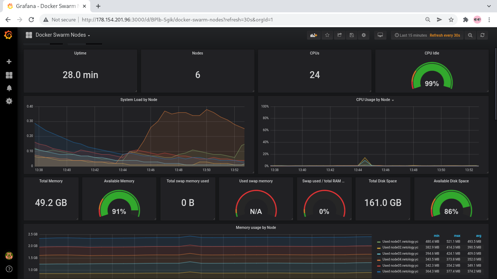
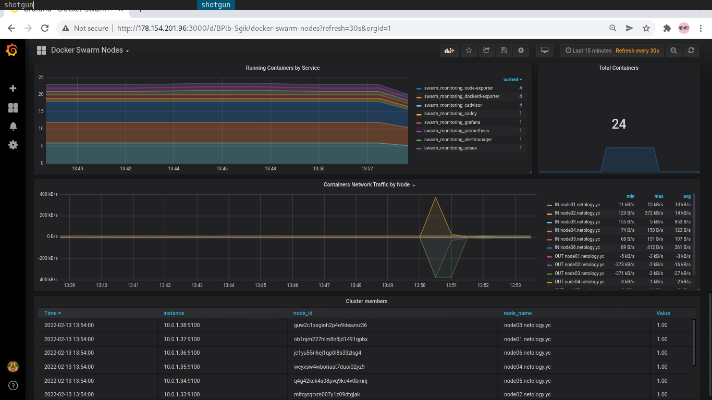

# Task 1

*Дайте письменные ответы на следующие вопросы:*

*- В чём отличие режимов работы сервисов в Docker Swarm кластере: replication и global?*  
*- Какой алгоритм выбора лидера используется в Docker Swarm кластере?*  
*- Что такое Overlay Network?*  

1. Сервис это некая группа задач, которые выполняются на управляющей или рабочей  ноде с docker.
Это основополагающая структура docker swarm и основной способ пользовательского взаимодействия с ним.  
При создании сервиса нужно указать, какой образ для контейнера использовать и какие команды выполнять внутри
запущенных контейнеров.  
В **реплицирующей** модели управляющая нода распространяет заданное количество реплик задач среди других нод, основываясь
на необходимом количестве задач. В случае падения ноды будет запущен сервис на другой ноде; то есть если необходимо иметь
5 запущенных nginx, то управляющая нода будет держать именно 5 сервисов nginx. Задача содержит контейнер docker и команды 
для запуска внутри контейнера. Это атомарная единица кластера. Управляющие ноды назначают задачи рабочим нодам в соответствие 
с количеством реплик, заданным в параметрах службы. Как только ноде  назначена задача, ее нельзя переместить на другую ноду. 
Задача может работать только на назначенной ноде или завершаться ошибкой.   
В **глобальном** режиме сервисы будут запущены на всех нодах, входящих в кластер. 
Таким образом, различие режимов **репликации** и **глобального** состоит в разном диапазоне охвата сервисами всех нод, 
входящих в кластер.  
2. В кластере docker swarm используется алгоритм Raft. Это консенсусный (согласительный) алгоритм, позволяющий вычислительным
машинам с управляющей ролью размещать данные на рабочих машинах в целостности. Имея целостные данные, управляющая машина в случае 
проблем с другими нодами может поднять сервисы и синхронизировать имеющиеся у нее данные. Если ответственная за синхронизацию 
задач машина-лидер неожиданно перестает отвечать на запросы, то оставшиеся управляющие машины забирают на себя ее задачи и 
перераспределяют их так, чтобы сохранить целостное состояние кластера.  
Raft устойчив к до (N-1)/2 отказов и требует большинства голосов на выборах в количестве (N/2)+1, где N - количество управляющих 
машин. Другими словами, если в кластере есть 5 управляющих машин и 3 из недоступны, то система более не сможет обрабатывать запросы. 
Текущее состояние кластера сохранится,  но шедулер не сможет перебалансировать задачи для борьбы с отказами.  
Реализация согласительного алгоритма в docker swarm обеспечивает следующие присущие распределенным системам свойства:
* целостность данных для отказоустойчивых систем; 
* взаимное исключение через процесс выбора лидера (критически важные задачи могут выполняться только на одном инстансе);
* управление процессом принадлежности машин к кластеру;
* глобально согласованная последовательность объектов (обеспечение  целостности данных на всех машинах кластера) путем использования 
CAS-примитивов (CAS:"compares-and-swap").  
Ноды доверяют лидеру; если лидер перестает отвечать (либо система только инициализирована), то проводятся выборы лидера. Выборы это произвольный период времени, 
в течение которого должен быть выбран лидер. Если выборы не состоялись, назначаются новый период выборов. Выборы лидера начинает нода-кандидат. Нода становится 
кандидатом, если не получает от лидера ответа в течение определенного промежутка времени. Тогда кандидат увеличивает счетчик выборов, рассылает всем остальным 
нодам сообщение о выборах и голосует за себя. Остальные ноды голосуют за или против. Простое большинство решает судьбу кандидата. Если выборы не состоялись, 
назначаются новые выборы.  
Raft использует рандомизацию, выделяя время для выборов так, чтобы проблема с разделением голосов решалась как можно быстрее. В этом случае несколько нод 
не станут кандидатами одновременно, вероятность этого минимизируется. Тогда один сервер выигрывает выборы и рассылает остальными сообщение о том, 
что они могут стать кандидатами.
3. Overlay Network служит для управления взаимодействием между docker-демонами, состоящими в кластере docker swarm. Эта сеть находится на самом верхнем уровне
всех хост-сетей (служит оверлеем для них). Docker-демон прозрачно выполняет рутинг пакетов внутрь и наружу сети так, чтобы пакеты доставлялись соответствующему
контейнеру. Оверлейная сеть ingress содержит управляющий траффик и данные для docker swarm; мост docker_gwbridge подключает индивидуальные докер-демоны к другим 
демонам в составе docker swarm.  
Overlay network создается также, как и пользовательские сети для единственного контейнера, после чего к этим сетям можно подключать необходимые сервисы для создания 
межсервисного взаимодействия. Чтобы создать такую сеть, нужно использовать overlay драйвер.

```
$ docker network create \
--driver overlay \
my-network
```
Без указания дополительных параметров сеть будет создана с дефолтными параметрами.  
Для подключения сервиса к оверлейном сети к ``$ docker service create`` нужно добавить флаг ``--network``, или к 
``$ docker service update`` добавить ``--network-add``.
```
$ docker service create \
--replicas 3 \
--name my-web \
--network my-network \
nginx
```
Gossip протокол, применяемый для общения докер-демонов в оверлейной сети по схеме точка-точка, называется "эпидемическим" и работает по принципу распространия эпидемий в обществе. В качестве менее устрашающего примера можно указать распространение слухов. Рассказанный одному слух быстро становится достоянием всех друзей и знакомых того, кто этот слух передает; и в свою очередь узнавшие слух распространяют его дальше. В компьютерных системах для выбора собеседника используется рандомизация.  
Протокол этот быстр и устойчив к большим нагрузкам. Gossip широковещательный протокол. Как только в сети появляется новый контейнер или сервис, об этом сообщается по оверлейной сети всем другим контейнерам. 

# Task 2

*Создать ваш первый Docker Swarm кластер в Яндекс.Облаке*

*Для получения зачета, вам необходимо предоставить скриншот из терминала (консоли), с выводом команды:*  
*docker node ls*

Для выполнения задания воспользуюсь готовыми конфигурациями из кааталога src/. Прежде всего необходимо создать образ
операционной системы, который будет использоваться для развертывания виртуальных машин. Для это использую packer. Конфигурационный
файл centos-7-base.json редактирую соответственно своими параметрами облака.  
Создаю облачную сеть и подсеть.
```
[alexvk@archbox packer]$ yc vpc network create --name=net --labels my-label=netology --description "my test network"
id: enp9ajcilpa91c7v4cmp
folder_id: b1g68bss5trqk0sk71o5
created_at: "2022-02-10T07:23:15Z"
name: net
description: my test network
labels:
  my-label: netology

[alexvk@archbox packer]$  yc vpc subnet create --name my-subnet-a --zone ru-central1-a --range 10.1.2.0/24 --network-name net --description "test subnet"
id: e9bj0dgc47ag6pao10fn
folder_id: b1g68bss5trqk0sk71o5
created_at: "2022-02-10T07:23:59Z"
name: my-subnet-a
description: test subnet
network_id: enp9ajcilpa91c7v4cmp
zone_id: ru-central1-a
v4_cidr_blocks:
- 10.1.2.0/24
```
Далее собираю образ:
```
[alexvk@archbox packer]$ packer validate centos-7-base.json 
The configuration is valid.
[alexvk@archbox packer]$ packer build centos-7-base.json 
yandex: output will be in this color.

==> yandex: Creating temporary RSA SSH key for instance...
==> yandex: Using as source image: fd8gdnd09d0iqdu7ll2a (name: "centos-7-v20220207", family: "centos-7")
==> yandex: Use provided subnet id e9bj0dgc47ag6pao10fn
==> yandex: Creating disk...
==> yandex: Creating instance...

[..excessive output skipped..]

Build 'yandex' finished after 2 minutes 14 seconds.

==> Wait completed after 2 minutes 14 seconds

==> Builds finished. The artifacts of successful builds are:
--> yandex: A disk image was created: centos-7-base (id: fd8shmduk0d172d4i2i2) with family name centos
```
После чего удаляю подсеть и сеть.  
Теперь пришла пора воспользоваться terraform. Добавлю данные о своем облаке в файл *vairables.tf*. Выполняю
terraform init, terraform plan, terrafrom apply.  
Terraform, в свою очередь, после развертывания кластера docker swarm выполняет ansible playbook и устанавливает
указанные там сервисы (микросервисный стек мониторинга на базе Prometheus и Grafana).  
По окончаниия работы terraform получаю длинный вывод (весь не привожу), только окончание:
```
[skipped]

Apply complete! Resources: 13 added, 0 changed, 0 destroyed.

Outputs:

external_ip_address_node01 = "51.250.2.77"
external_ip_address_node02 = "178.154.201.165"
external_ip_address_node03 = "178.154.201.8"
external_ip_address_node04 = "178.154.204.221"
external_ip_address_node05 = "178.154.201.96"
external_ip_address_node06 = "178.154.202.216"
internal_ip_address_node01 = "192.168.101.11"
internal_ip_address_node02 = "192.168.101.12"
internal_ip_address_node03 = "192.168.101.13"
internal_ip_address_node04 = "192.168.101.14"
internal_ip_address_node05 = "192.168.101.15"
internal_ip_address_node06 = "192.168.101.16"
```

Логинюсь на первую ноду по ssh, выполняю требуемое по заданию действие: 
```
[alexvk@archbox terraform]$ ssh centos@51.250.2.77
[centos@node01 ~]$ sudo -i
[root@node01 ~]# docker node ls
ID                            HOSTNAME             STATUS    AVAILABILITY   MANAGER STATUS   ENGINE VERSION
ob1njm227hlm8n8jd1491qpbx *   node01.netology.yc   Ready     Active         Leader           20.10.12
mifqyrqrxrn007y1z09dtgjak     node02.netology.yc   Ready     Active         Reachable        20.10.12
guw2c1xsgioh2p4o9deazvz36     node03.netology.yc   Ready     Active         Reachable        20.10.12
weyxsw4wboriaat7duoi02yz9     node04.netology.yc   Ready     Active                          20.10.12
q4g42kck4s08pvq9kc4v0bmnj     node05.netology.yc   Ready     Active                          20.10.12
jc1yu55n6ej1qp0l8s33zlsg4     node06.netology.yc   Ready     Active                          20.10.12
```
Видим ноду-лидер, на которую осуществлен логин (node01); две управляющих ноды-кандидата (node02 и node03), и
рабочие ноды node04,node05 и node06. Для эксперимента выполню логин на управляющую ноду node02:
```
[centos@node01 ~]$ logout
Connection to 51.250.2.77 closed.
[alexvk@archbox terraform]$ ssh centos@178.154.201.165
[centos@node02 ~]$ sudo  docker node ls
ID                            HOSTNAME             STATUS    AVAILABILITY   MANAGER STATUS   ENGINE VERSION
ob1njm227hlm8n8jd1491qpbx     node01.netology.yc   Ready     Active         Leader           20.10.12
mifqyrqrxrn007y1z09dtgjak *   node02.netology.yc   Ready     Active         Reachable        20.10.12
guw2c1xsgioh2p4o9deazvz36     node03.netology.yc   Ready     Active         Reachable        20.10.12
weyxsw4wboriaat7duoi02yz9     node04.netology.yc   Ready     Active                          20.10.12
q4g42kck4s08pvq9kc4v0bmnj     node05.netology.yc   Ready     Active                          20.10.12
jc1yu55n6ej1qp0l8s33zlsg4     node06.netology.yc   Ready     Active                          20.10.12
``` 
И  с рабочей ноды node06:
```
[alexvk@archbox terraform]$ ssh centos@178.154.202.216
[centos@node06 ~]$ sudo docker node ls
Error response from daemon: This node is not a swarm manager. Worker nodes can't be used to view or modify cluster state. Please run this command on a manager node or promote the current node to a manager.
```
Получаю ожидаемый ответ о том, что с рабочей ноды нельзя просматривать состояние кластера.


# Task 3

Стек микросервисов мониторинга на базе Prometheus и Grafana установлен в docker swarm с помощью ansible playbook 
по уже готовому сценарию из каталога src/ к заданию.  
По заданию требуется выполнить следующее: 

```
[alexvk@archbox terraform]$ ssh centos@51.250.2.77
[centos@node01 ~]$ sudo docker service ls
ID             NAME                                MODE         REPLICAS   IMAGE                                          PORTS
mkyfbqeqae4u   swarm_monitoring_alertmanager       replicated   1/1        stefanprodan/swarmprom-alertmanager:v0.14.0    
nm9g8hb2lrxc   swarm_monitoring_caddy              replicated   1/1        stefanprodan/caddy:latest                      *:3000->3000/tcp, *:9090->9090/tcp, *:9093-9094->9093-9094/tcp
nlbg2o3hx784   swarm_monitoring_cadvisor           global       6/6        google/cadvisor:latest                         
mpg6pqgno60d   swarm_monitoring_dockerd-exporter   global       6/6        stefanprodan/caddy:latest                      
m5lrmez8wpqk   swarm_monitoring_grafana            replicated   1/1        stefanprodan/swarmprom-grafana:5.3.4           
kg5yvcnvpgxd   swarm_monitoring_node-exporter      global       6/6        stefanprodan/swarmprom-node-exporter:v0.16.0   
gkz6957l9lyw   swarm_monitoring_prometheus         replicated   1/1        stefanprodan/swarmprom-prometheus:v2.5.0       
4oji7hhyq615   swarm_monitoring_unsee              replicated   1/1        cloudflare/unsee:v0.8.0                        
```
Теперь посмотрю список сервисов на ноде node02:
```
[alexvk@archbox terraform]$ ssh centos@178.154.201.165
[centos@node02 ~]$ sudo docker service ls
ID             NAME                                MODE         REPLICAS   IMAGE                                          PORTS
mkyfbqeqae4u   swarm_monitoring_alertmanager       replicated   1/1        stefanprodan/swarmprom-alertmanager:v0.14.0    
nm9g8hb2lrxc   swarm_monitoring_caddy              replicated   1/1        stefanprodan/caddy:latest                      *:3000->3000/tcp, *:9090->9090/tcp, *:9093-9094->9093-9094/tcp
nlbg2o3hx784   swarm_monitoring_cadvisor           global       6/6        google/cadvisor:latest                         
mpg6pqgno60d   swarm_monitoring_dockerd-exporter   global       6/6        stefanprodan/caddy:latest                      
m5lrmez8wpqk   swarm_monitoring_grafana            replicated   1/1        stefanprodan/swarmprom-grafana:5.3.4           
kg5yvcnvpgxd   swarm_monitoring_node-exporter      global       6/6        stefanprodan/swarmprom-node-exporter:v0.16.0   
gkz6957l9lyw   swarm_monitoring_prometheus         replicated   1/1        stefanprodan/swarmprom-prometheus:v2.5.0       
4oji7hhyq615   swarm_monitoring_unsee              replicated   1/1        cloudflare/unsee:v0.8.0                        
[centos@node02 ~]$ 
```
Видно, что список сервисов аналогичен списку на ноде node01.  
Можно также посмотреть список контейнеров на ноде node01:
```
[alexvk@archbox terraform]$ ssh centos@51.250.2.77
[centos@node01 ~]$ sudo docker container ls
CONTAINER ID   IMAGE                                          COMMAND                  CREATED          STATUS          PORTS      NAMES
340d290a88f1   stefanprodan/swarmprom-node-exporter:v0.16.0   "/etc/node-exporter/…"   24 minutes ago   Up 24 minutes   9100/tcp   swarm_monitoring_node-exporter.ob1njm227hlm8n8jd1491qpbx.td7ufjvjfkkixbj9kikbzshrs
446f119998ab   stefanprodan/swarmprom-alertmanager:v0.14.0    "/etc/alertmanager/d…"   25 minutes ago   Up 24 minutes   9093/tcp   swarm_monitoring_alertmanager.1.iq5jplji5qjwmgjhtcy9gkm4n
65c3465d7f24   google/cadvisor:latest                         "/usr/bin/cadvisor -…"   25 minutes ago   Up 25 minutes   8080/tcp   swarm_monitoring_cadvisor.ob1njm227hlm8n8jd1491qpbx.igipjgwyvo26nskj0djrn45p9
a65d4dddbbf8   stefanprodan/caddy:latest                      "/sbin/tini -- caddy…"   25 minutes ago   Up 25 minutes              swarm_monitoring_dockerd-exporter.ob1njm227hlm8n8jd1491qpbx.mfeg18nqgonh1odwxpe7lx5zv
2de3f35a9478   stefanprodan/swarmprom-prometheus:v2.5.0       "/etc/prometheus/doc…"   25 minutes ago   Up 25 minutes   9090/tcp   swarm_monitoring_prometheus.1.zlcm5fv6qhzd6jdn8xmr2ar8e
```
И, наконец, посмотрю на работу стека мониторинга:


# Task 4

*Выполнить на лидере Docker Swarm кластера команду (указанную ниже) и дать письменное описание её функционала, что она делает и зачем она нужна:*

*# см.документацию: https://docs.docker.com/engine/swarm/swarm_manager_locking/*
*docker swarm update --autolock=true*

Выполню логин на node01 (leader) и введу требуемую команду:
```
[alexvk@archbox terraform]$ ssh centos@51.250.2.77
[centos@node01 ~]$ sudo docker swarm update --autolock=true
Swarm updated.
To unlock a swarm manager after it restarts, run the `docker swarm unlock`
command and provide the following key:

    SWMKEY-1-FUznlKGfgLsXeHQXmtIvMkAsXy9cVes/IgthfcS/fQ8

Please remember to store this key in a password manager, since without it you
will not be able to restart the manager.
```
Перезапускаю лидера:
```
[centos@node01 ~]$ sudo shutdown -r now
Connection to 51.250.2.77 closed by remote host.
Connection to 51.250.2.77 closed.
```
Выполняю логин после перезагрузки и проверяю список нод:
```
[alexvk@archbox terraform]$ ssh centos@51.250.2.77
[centos@node01 ~]$ sudo docker node ls                             
Error response from daemon: Swarm is encrypted and needs to be unlocked before it can be used. Please use "docker swarm unlock" to unlock it.
```
Кластер заблокирован и для управления им необходима разблокировка. Выполняю, введя ключ для разблокировки:
```
[centos@node01 ~]$ sudo docker node ls
Error response from daemon: Swarm is encrypted and needs to be unlocked before it can be used. Please use "docker swarm unlock" to unlock it.
[centos@node01 ~]$ sudo docker swarm unlock
Please enter unlock key: 
```
Проверяю доступность кластера:
```
[centos@node01 ~]$ sudo docker node ls     
ID                            HOSTNAME             STATUS    AVAILABILITY   MANAGER STATUS   ENGINE VERSION
ob1njm227hlm8n8jd1491qpbx *   node01.netology.yc   Ready     Active         Reachable        20.10.12
mifqyrqrxrn007y1z09dtgjak     node02.netology.yc   Ready     Active         Leader           20.10.12
guw2c1xsgioh2p4o9deazvz36     node03.netology.yc   Ready     Active         Reachable        20.10.12
weyxsw4wboriaat7duoi02yz9     node04.netology.yc   Ready     Active                          20.10.12
q4g42kck4s08pvq9kc4v0bmnj     node05.netology.yc   Ready     Active                          20.10.12
jc1yu55n6ej1qp0l8s33zlsg4     node06.netology.yc   Ready     Active                          20.10.12
```
Ура, работает!  
При этом обращаю внимания, что роль лидера теперь у node2.  
Документация по ссылке сообщает, что данные конфигурации (Raft логи), используемые управляющими нодами docker swarm, по умолчанию зашифрованы. Когда docker перезапускается, то ключ TLS, используемый для шифрования связи между узлами, и ключ, используемый для шифрования и расшифровки логов, загружаются в память каждого узла. Docker может защитить оба ключа, зашифровав их. Но при этом требуется ручная разблокировка управляющих нод, предоставляющих ключ разблокировки. Эта функция и называется автоблокировкой и введена она для защиты логов Raft от атакующих систему. Как этой фичей управлять показано на практическом примере выше.  
Для изменения ключа автоблокировки используется ``docker swarm unlock-key --rotate``, для выключения автоблокировки ``docker swarm update --autolock=false``.
